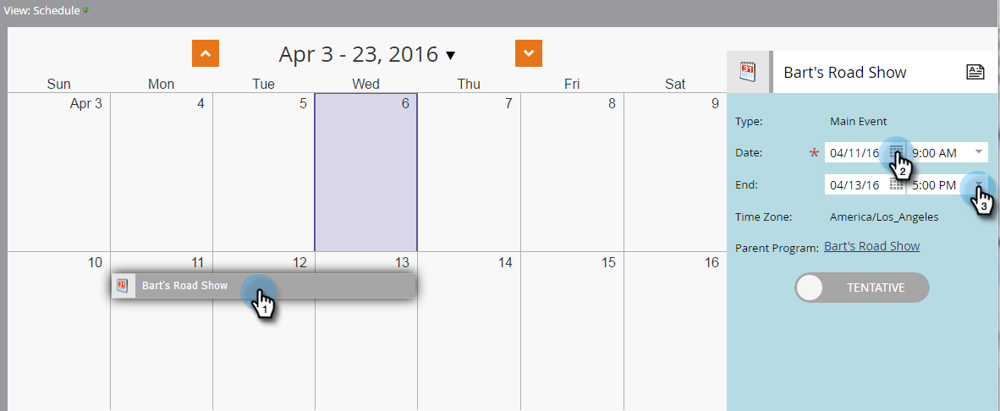
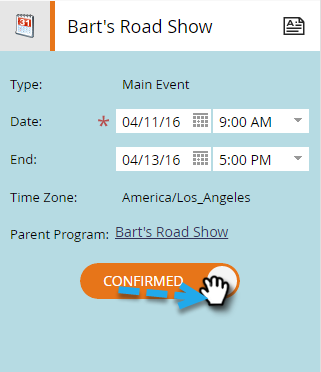
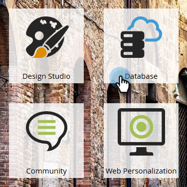
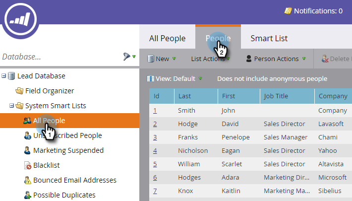
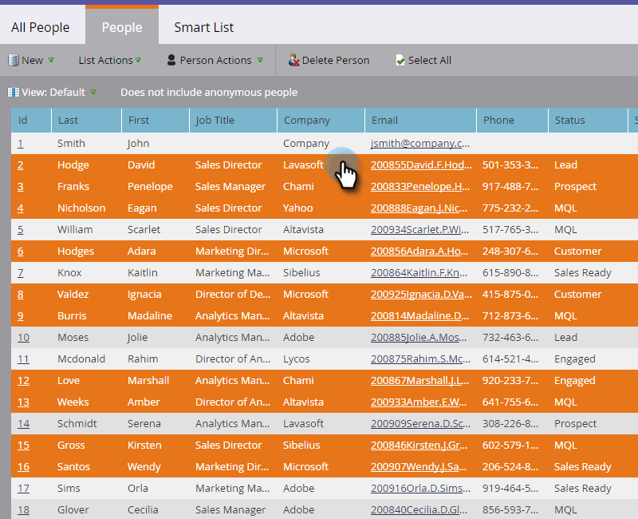
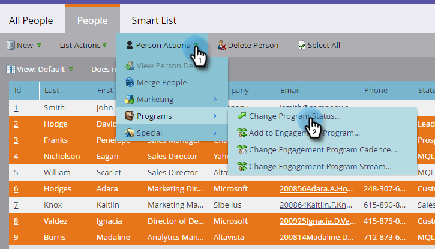
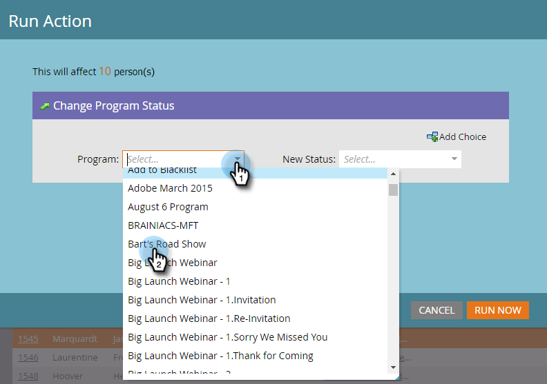
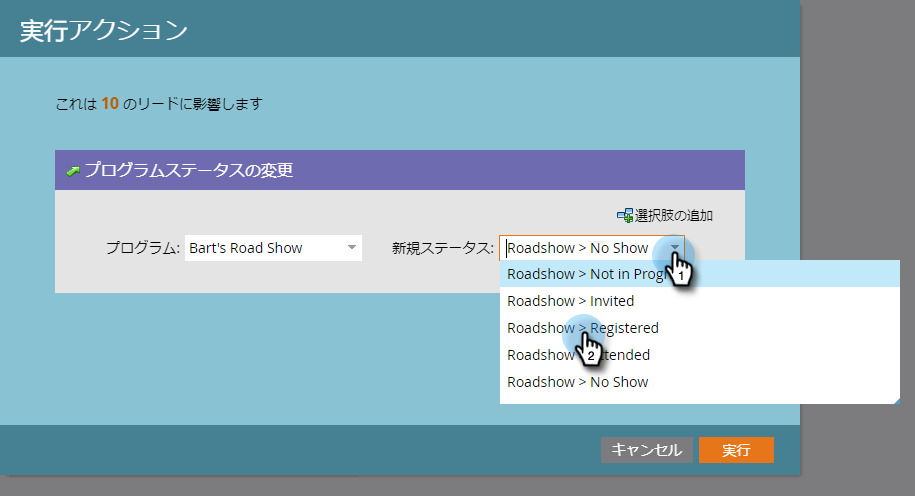
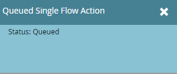
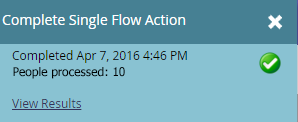

# イベントの準備 {#prepare-for-your-event}

イベントの準備をするためには、必要なことがいくつかあります。

>[!IMPORTANT]
>
>2023年10月2日（PT）に、アドビは Marketo イベントアプリをすべてのアプリストアから削除しました。 タブレット／モバイルデバイスにアプリが既にインストールされている場合は、その間に引き続き使用できます。 Marketo Engage インスタンスが Marketo の認証の Adobe ID に移行されると、アプリにアクセスできなくなります。 [詳細情報](https://nation.marketo.com/t5/product-discussions/marketo-events-app-and-marketo-moments-app-end-of-life/m-p/340712/highlight/true#M193869){target="_blank"}。

## 新しい Marketo の役割の作成 {#create-a-new-marketo-role}

Marketo には、イベントチェックインアプリ用の特別なユーザーの役割があります。 [&#x200B; モバイルアプリケーションにアクセスする権限を持つ[!DNL iPad]または[!DNL Android] ユーザー向けに、新しいMarketo ロール &#x200B;](/help/marketo/product-docs/core-marketo-concepts/mobile-apps/event-check-in/grant-users-access-to-the-check-in-app.md)を作成します。

## 新しいタブレットユーザーのイベントへの招待 {#invite-new-tablet-users-to-the-event}

[新しいタブレットユーザーをイベントに招待](/help/marketo/product-docs/core-marketo-concepts/mobile-apps/event-check-in/grant-users-access-to-the-check-in-app.md)し、新しい役割を割り当てます。

## 新しい Marketo イベントプログラムの作成 {#create-a-new-marketo-event-program}

[新しい Marketo イベントプログラムを作成](/help/marketo/product-docs/demand-generation/events/understanding-events/create-a-new-event-program.md)して、様々なステージを進むユーザーのステータスを把握し、マーケティングイニシアチブの ROI を正確に測定します。

## イベントの日付の指定 {#specify-the-event-dates}

イベント日の設定は容易です。

1. スケジュールのイベントをクリックし、開始日時と終了日時を設定します。

   

1. 「**[!UICONTROL 仮]**」から「**[!UICONTROL 確定]**」に変更します。

   

   >[!CAUTION]
   >
   >イベントの日付が現在の日付の 1 週間前または 1 週間後以降の場合、イベントはアプリに表示されません。 **ヒント**：テストするには、日付を一時的に、今日から 1 週間以内に設定します。 テスト後は、必ず正しい日付にイベントを返してください。

## イベントにユーザーを追加 {#add-people-to-your-event}

_when_&#x200B;を理解したので、_who_&#x200B;を追加します。

1. 既にユーザーのリストがある場合は、「マイ Marketo」で、「**[!UICONTROL データベース]**」タイルをクリックします。

   

1. ユーザーを含むリストを選択し、「**[!UICONTROL ユーザー]**」タブをクリックします。

   

1. リストからイベントのユーザーを選択します。 複数のユーザーをクリックするには、**[!UICONTROL Ctrl]**（Mac の場合は **[!UICONTROL Command]**）を使用します。すべてのユーザーをマークするには、「**[!UICONTROL すべて]**」を選択します。

   

1. 「**[!UICONTROL ユーザーのアクション]**」をクリックし、「**[!UICONTROL プログラム]**」の上にマウスポインターを置いて、「**[!UICONTROL プログラムステータスを変更]**」を選択します。

   

1. 「**[!UICONTROL プログラム]**」ドロップダウンリストをクリックし、イベントを選択します。

   

1. 「**[!UICONTROL 新規ステータス]**」ドロップダウンをクリックし、**[!UICONTROL Roadshow] > [!UICONTROL Registered]**」を選択します。 「**[!UICONTROL 今すぐ実行]**」をクリックします。

   

1. 小さなウィンドウに進行状況が表示され...

   

1. ...タスクが完了したら表示されます。

   

   これで選択したユーザーがイベントに参加し、トレードショーフロアでタブレットアプリを使用してチェックインする準備が整いました。
