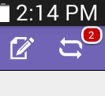

# iPadまたは Android タブレットのセットアップ {#set-up-the-ipad-or-android-tablet}

イベント日をスムーズに体験できるように、iPadまたは Android タブレットを準備し、イベントの前にMarketo Events アプリをテストします。

Marketoでイベントを作成すると、ログイン時にMarketo Events iPadまたは Android アプリに読み込まれます（以下の場合）。

* アカウントはデータベースにアクセスできます
* イベントは、1 週間前から 1 週間後までの期間に、現在の日付の 1 週間後に終了する日付にスケジュールされます
* イベントが適切なチャネル（例：ロードショー）で作成された。

>[!NOTE]
>
>アプリをダウンロードするには、インターネットに接続する必要があります。

## Marketo Events iPadアプリのダウンロードとインストール {#download-and-install-the-marketo-events-ipad-app}

iPadにMarketo Events アプリがまだインストールされていない場合は、次の方法でアプリを入手できます。

1. iPadを開き、App Storeを起動します。

   

1. 検索ボックスに、 **Marketo** 「サーチクエリ」で、をタップします。 **marketo イベント**.

   

1. 手順に従って、アプリをダウンロードし、iPadにインストールします。

## Marketo Events Android アプリのダウンロードとインストール {#download-and-install-the-marketo-events-android-app}

Android タブレットにMarketo Events アプリがまだインストールされていない場合は、次の方法を使用します。

1. タブレットを開き、 **Google Play Store** アプリの
1. 「検索」ボックスに、 **Marketo** をタップします。 **戻り値**.
1. 検索結果で、 **Marketo Events** アプリの

   

1. 手順に従って、アプリをダウンロードし、タブレットにインストールします。

## iPadおよびタブレットユーザーのログイン資格情報の確認 {#confirm-login-credentials-for-ipad-and-tablet-users}

iPad またはタブレットをトレードショースタッフに割り当てる前に、それらが正しく動作し、アプリのホーム画面にイベントが表示されることを確認します。

1. iPadまたはタブレットでログイン手順に従ってログインします。
1. ホーム画面にイベントが表示されることを確認します。 日付が現在の日付の 1 週間前から 1 週間後の場合にのみ表示されます。

   

   >[!NOTE]
   >
   >新しいイベントを作成してから、iPadまたはタブレットアプリに表示されるまでに数分かかる場合があります。 表示されない場合は、 **ログアウト** ホーム画面で、数分待ってから、もう一度ログインします。

## イベントへの入力アプリの同期 {#sync-the-app-to-populate-the-event}

同期を実行して、追加したユーザーがそこにいることを確認します。

1. iPadまたは Android アプリでイベントを開きます。
1. 人々を探して。 表示されない場合は、をタップします。 **同期** をクリックして、アプリを同期し、「イベント」ユーザーリストをリロードします。

   **iPad**

   

   **Android**

   

## チェックインが機能していることを確認 {#confirm-check-ins-are-working}

イベントの前に、必ずiPadまたはタブレットからチェックインが機能していることを確認してください。

1. アプリで、 [～のテストリードを調べる](/help/marketo/product-docs/core-marketo-concepts/mobile-apps/event-check-in/check-people-into-your-event-from-your-tablet.md).
1. をタップします。 **同期** アイコンをクリックして、アプリを同期します。
1. Marketoで、イベントを開き、「 **メンバー**.

   

1. ユーザーのステータスが **出席** 「 」と「 」が選択され、「 」が選択されます。

   

   >[!TIP]
   >
   >自分をテスト担当者にしてください。
