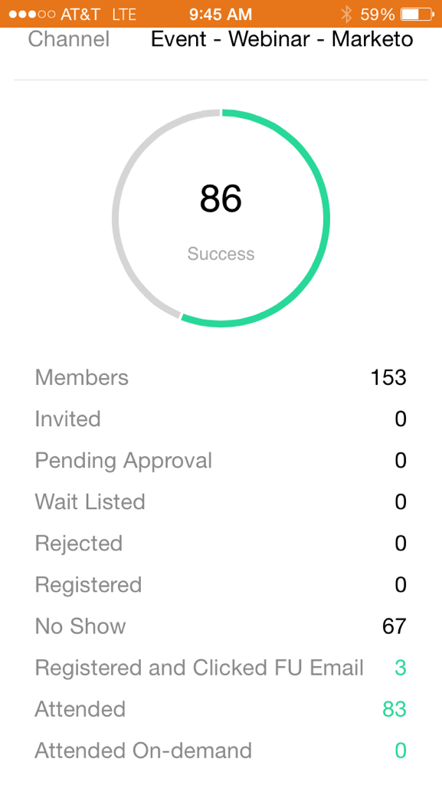

# イベントカードについて {#understanding-event-cards}

携帯電話または iPad からイベントプログラムを表示するには、Marketo Moments を使用します。

>[!IMPORTANT]
>
>2023年10月2日（PT）に、アドビは Marketo モーメントアプリをすべてのアプリストアから削除しました。 タブレット／モバイルデバイスにアプリが既にインストールされている場合は、その間に引き続き使用できます。 Marketo Engage インスタンスが Marketo の認証の Adobe ID に移行されると、アプリにアクセスできなくなります。 [詳細情報](https://nation.marketo.com/t5/product-discussions/marketo-events-app-and-marketo-moments-app-end-of-life/m-p/340712/highlight/true#M193869){target="_blank"}。

メールプログラムカードをタップすると、次の操作を実行できます。

* [イベントをお気に入りに追加](/help/marketo/product-docs/core-marketo-concepts/mobile-apps/marketo-moments/working-with-moments/creating-a-favorite.md)
* [イベントを完了としてマーク](/help/marketo/product-docs/core-marketo-concepts/mobile-apps/marketo-moments/working-with-moments/marking-it-done.md)
* [イベントモーメントカードを共有](/help/marketo/product-docs/core-marketo-concepts/mobile-apps/marketo-moments/working-with-moments/sharing-a-moment.md)

イベントカードは 2 枚あります。 イベントの数時間前に送信された[!UICONTROL  オンデッキ ] カードには、サインアップした人数が表示されます。 後で送信された[!UICONTROL Results] カードには、実際に参加した人数が表示されます。

>[!MORELIKETHIS]
>
>* [Marketo Moments について](/help/marketo/product-docs/core-marketo-concepts/mobile-apps/marketo-moments/understanding-moments/understanding-marketo-moments.md)
>* [メールプログラムカードについて](/help/marketo/product-docs/core-marketo-concepts/mobile-apps/marketo-moments/understanding-moments/understanding-email-program-cards.md)
>* [イベントプログラムについて](/help/marketo/product-docs/demand-generation/events/understanding-events/understanding-event-programs.md)
