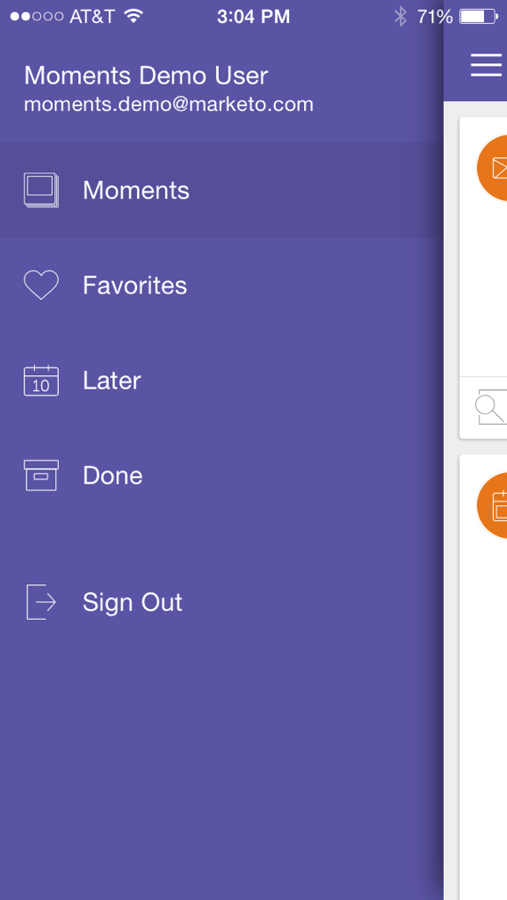
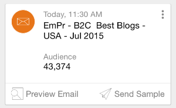
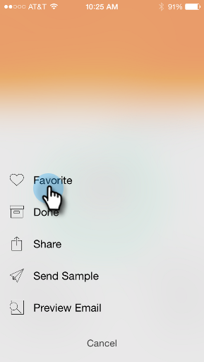
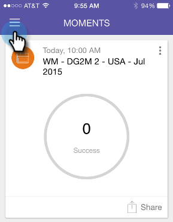
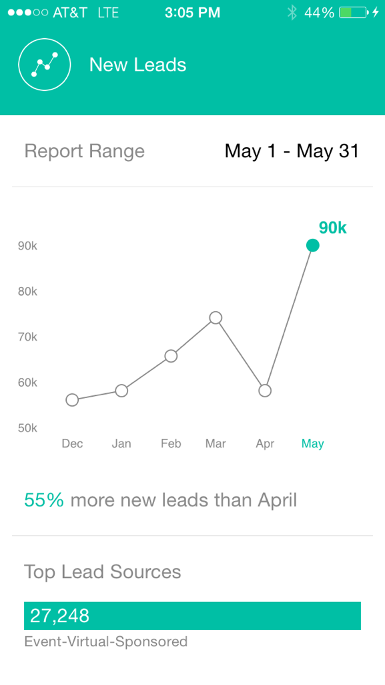

# Marketo Moments について {#understanding-marketo-moments}

Marketoのパワーを手に入れましょう。 携帯電話やiPadから直接、メールのプレビューやスケジュールの変更を行うことができます。

>[!IMPORTANT]
>
>2023年10月2日（PT）に、アドビは Marketo モーメントアプリをすべてのアプリストアから削除しました。 タブレット／モバイルデバイスにアプリが既にインストールされている場合は、その間に引き続き使用できます。 Marketo Engage インスタンスが Marketo の認証の Adobe ID に移行されると、アプリにアクセスできなくなります。 [詳細情報](https://nation.marketo.com/t5/product-discussions/marketo-events-app-and-marketo-moments-app-end-of-life/m-p/340712/highlight/true#M193869){target="_blank"}。

>[!NOTE]
>
>_モバイルアプリへのアクセス_&#x200B;権限が必要です。 Marketo 管理者に問い合わせて、[自分の役割を更新](/help/marketo/product-docs/administration/users-and-roles/managing-user-roles-and-permissions.md)してください。

## ストリーム {#streams}

Moments の様々なストリームを次に示します。

>[!NOTE]
>
>**定義**
>
>* [!UICONTROL  モーメント ]：実行したばかりの、または実行しようとしているすべてがここに表示されます。
>* [!UICONTROL お気に入り]：お気に入りを作ったすべてがここに入ります。
>* [!UICONTROL 後]：この瞬間よりも後で行われるものはここに入ります。
>* [!UICONTROL 完了]：実行が完了したか、完了とマークされたすべてがここに表示されます。

スマホでのMarketoの瞬間を見てみましょう。

## 3 種類のカード {#three-kinds-of-cards}

Marketo Moments には、メールの進行状況に応じた 3 種類のカードが用意されています。

**[!UICONTROL オンデッキ]** - メールはもうすぐ送信されます。 プレビュー、サンプルの送信、必要に応じてキャンセルする最後のチャンスです。

**[!UICONTROL ハートビート]** – このメールは現在、統計を含めて配信されています。 チームと共有します。

**[!UICONTROL 結果]** – 電子メールのパフォーマンスを示します。 メールの実行が終了すると、結果カードにエンゲージメントスコアおよびその他の統計が表示されます。

## モーメントストリーム {#moments-stream}

アプリを初めて開くとき、またはメニューの&#x200B;**[!UICONTROL モーメント]**&#x200B;をタップすると、関連するカードが最初に表示されます。 それぞれに、その特定のマーケティング施策と全体的なパフォーマンスに関する情報が含まれます。

カードをタップすると、詳細画面が開きます。

>[!NOTE]
>
>オレンジ色のカードは確認済みで、灰色のカードは暫定的です。

3 つのドットをタップすると、カードのアクションメニューが開きます。

次のいずれかをタップしてアクションを実行します。

>[!NOTE]
>
>**定義**
>
>* [!UICONTROL お気に入り]：最もタイムリーで重要なアイテムをお気に入りに入れることで、簡単に注意を払うことができます。
>* [!UICONTROL 完了]：完了すると、Marketoのモーメントビューから削除されます（ただし、Marketoでは安全かつ健全な状態になります）。
>* [!UICONTROL 共有]：チームのモチベーションを高めるか、チームを祝福するための画像を送信します。
>* [!UICONTROL  サンプルを送信] （電子メールのみ）：この機能を使用すると、電子メールを送信する前に、他のユーザーが電子メールの外観を確認できます。
>* [!UICONTROL 電子メールをプレビュー] （電子メールのみ）：事前に電子メールを確認することをお勧めします。

## 今後のモーメント {#later-moments}

「後で」のセクションでは、今後のアクティビティが表示されます。

1. まず、ハンバーガーメニューをタップします。

   

1. 「**[!UICONTROL 後で]**」をタップします。

   

   今後のアクティビティのリストを確認できます。

   

## メールプログラムカード {#email-program-cards}

メールプログラムカードには、昼食時でも、スケジュール、オーディエンス、ステータス、その他の有益な情報などの主要な詳細情報が表示されます。

## イベントカード {#event-cards}

イベントの場合、カードにはメンバーの合計数とそのステータスが表示されます。

## 分析カード {#analytics-cards}

分析モーメントカードでは、過去 6 か月間の電子メールおよびイベントの月々のパフォーマンスを確認できます。以下に例を示します。

1. 獲得したリード
1. 新規リード
1. 登録解除

## スマートキャンペーン実行カード {#smart-campaign-run-cards}

スマートキャンペーンカードは、1 回のキャンペーン実行を表します。 スマートキャンペーンが実行されるたびに、新しいカードが表示されます。 タップして、使用されたスマートリストフィルター、キャンペーンフローおよびキャンペーンで使用された各メールを表示します。

## アクションの確認またはキャンセル {#confirm-or-cancel-an-action}

各手順で、アクションを確認またはキャンセルできます。 気が変わった場合は、「**[!UICONTROL 気にする必要はありません]**」をタップします。

## サポートされているバージョン {#supported-versions}

Marketo Moments では、次のオペレーティングシステムバージョンをサポートしています。

* [!DNL Apple] iOS 8.0以降。
* [!DNL Android] バージョン 4.1以降。

>[!MORELIKETHIS]
>
>* [メールプログラムカードについて](/help/marketo/product-docs/core-marketo-concepts/mobile-apps/marketo-moments/understanding-moments/understanding-email-program-cards.md)
>* [イベントカードについて](/help/marketo/product-docs/core-marketo-concepts/mobile-apps/marketo-moments/understanding-moments/understanding-event-cards.md)
>* [分析カードについて](/help/marketo/product-docs/core-marketo-concepts/mobile-apps/marketo-moments/understanding-moments/understanding-analytics-cards.md)
>* [スマートキャンペーンカードについて](/help/marketo/product-docs/core-marketo-concepts/mobile-apps/marketo-moments/understanding-moments/understanding-smart-campaign-cards.md)
