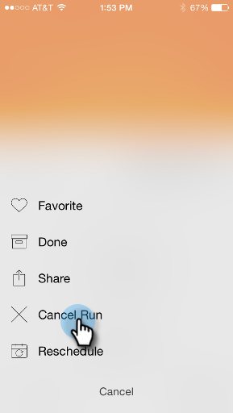

# スマートキャンペーンカードについて{#understanding-smart-campaign-cards}

「Marketing Moments」を使用して、スマートフォンまたはiPadからスマートキャンペーンの各実行を表示します。 Marketo Momentsスマートキャンペーンカードは、キャンペーンの1回の実行を表します。スマートキャンペーンが実行されるたびに、新しいカードが表示されます。 スマートキャンペーンカードには、左上に電球が付いています。

スケジュール済みでまだ実行されていない将来のスマートキャンペーンの場合、Marketo Momentsカードには、キャンペーンの統計はまだ表示されません。 今後のリリースで表示される予定です。

## スマートキャンペーンカード{#smart-campaign-cards}

1. カードをタップして、詳細カードを開きます。

   

1. 詳細カードを使用すると、スマートリストフィルター、フロー、電子メールサマリに関する情報にアクセスできます。

1. 「**スマートリスト**」をタップします。

   

1. スマートリストが使用するフィルターは次のとおりです。

   

1. 「**フロー**」をタップします。

   

1. スマートキャンペーンの流れを見てみましょう このキャンペーンには1つのフローステップしかありませんが、複数のフローステップがある場合もあります。

   

1. 「**電子メールの概要**」をクリックします。

   

1. これで、各電子メールに対する受信者の反応を数と割合で表示できます。

   

1. 下の2つの点が見えますか？ このスマートキャンペーンに2通の電子メールが接続されていることを示します。 他の電子メールの結果を表示するには、画面を左にスワイプします。 2番目の電子メールの結果を次に示します。

   

   >[!NOTE]
   >
   >もう1つの点がハイライト表示されます。

## 電子メールのサンプルとプレビューの作成{#creating-email-samples-and-previews}

メールが出る前にメールを見てみるのが良い考えです。 別の人にサンプルを送って見てもらうか。

1. 電子メールの3ドットアクションメニューをタップします。

   

1. 「[サンプルを送信](/help/marketo/product-docs/core-marketo-concepts/mobile-apps/marketo-moments/working-with-moments/sending-a-sample.md)」または「[プレビューの電子メール](/help/marketo/product-docs/core-marketo-concepts/mobile-apps/marketo-moments/working-with-moments/previewing-an-email.md)」をタップします（詳しくはこれらのリンクをクリックしてください）。

   

## スマートキャンペーン実行の確認{#confirming-a-smart-campaign-run}

未確認のスマートキャンペーン用のカードは、確認するまでグレーで表示されます。 そして、オレンジ色に変わります。

1. 未確認のスマートキャンペーンカードを確認するには、3ドットアクションメニューをタップします。

   

1. 「**確認**」をタップします。

   

1. 「**確認**」をタップしてジョブを終了します。「**気にしない**」をタップしてジョブを終了します。

   

   >[!NOTE]
   >
   >カードがオレンジに変わる！

## スマートキャンペーンの実行{#canceling-a-smart-campaign-run}を取り消し中

確認済みの、スケジュール済みのスマートキャンペーンの実行をキャンセルできます。

1. 3つのドットアクションメニューをタップします。

   

1. 「**実行をキャンセル**」をタップします。

   

1. 「**実行をキャンセル**」をタップします。 最後の1分で実行をキャンセルしない場合は、**「気にしない」**&#x200B;をタップすると、スマートキャンペーンがスケジュールどおりに実行されます。

   

## スマートキャンペーンの再スケジュール{#rescheduling-a-smart-campaign}

まだ実行されていない、確認済みのスマートキャンペーンを再スケジュールできます。

1. 3つのドットアクションメニューをタップします。

   

1. 「**再スケジュール**」をタップします。

   

1. カレンダーで日付を選択し、「**再スケジュール**」をタップします。

   

   ケーキ切れ！

## その他のスマートキャンペーン操作{#other-smart-campaign-actions}

他のMarketo Momentsカードと同様に、スマートキャンペーンカードまたは詳細カードの3つのドットをタップすると、次のことができます。

* [お気に入りにする](/help/marketo/product-docs/core-marketo-concepts/mobile-apps/marketo-moments/working-with-moments/creating-a-favorite.md)
* [終わったと記す](/help/marketo/product-docs/core-marketo-concepts/mobile-apps/marketo-moments/working-with-moments/marking-it-done.md)
* [共有](/help/marketo/product-docs/core-marketo-concepts/mobile-apps/marketo-moments/working-with-moments/sharing-a-moment.md)

>[!NOTE]
>
>また、共有するスマートキャンペーンカードの&#x200B;**共有**&#x200B;アイコンをタップし、詳細カードの&#x200B;**完了**&#x200B;アイコンと&#x200B;**お気に入り**&#x200B;アイコンをタップして共有することもできます。

## スマートキャンペーンカードの迅速な削除{#quickly-delete-a-smart-campaign-card}

不要になったカード（テストに使用したカードなど）がある場合は、左右にスワイプするだけで削除できます。
