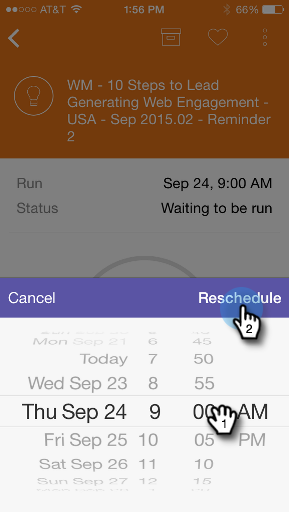

# スマートキャンペーンカードについて {#understanding-smart-campaign-cards}

Marketo Moments を使用して、スマートフォンまたは iPad からスマートキャンペーンの各実行を表示します。Marketo Moments スマートキャンペーンカードは、1 回のキャンペーン実行を表します。スマートキャンペーンが実行されるたびに新しいカードが表示されます。スマートキャンペーンカードの左上に電球が表示されます。

>[!IMPORTANT]
>
>2023年10月2日（PT）に、アドビは Marketo モーメントアプリをすべてのアプリストアから削除しました。タブレット／モバイルデバイスにアプリが既にインストールされている場合は、その間に引き続き使用できます。Marketo Engage インスタンスが Marketo の認証の Adobe ID に移行されると、アプリにアクセスできなくなります。[詳細情報](https://nation.marketo.com/t5/product-discussions/marketo-events-app-and-marketo-moments-app-end-of-life/m-p/340712/highlight/true#M193869){target="_blank"}。

スケジュール済みでまだ実行されていない将来のスマートキャンペーンの場合、Marketo Moments カードには、まだキャンペーン統計が表示されません。今後のリリースで提供される予定です。

## スマートキャンペーンカード {#smart-campaign-cards}

1. カードをタップして、詳細カードを開きます。

   

1. 詳細カードを使用すると、[!UICONTROL スマートリスト]フィルター、[!UICONTROL フロー]、[!UICONTROL メールの概要]に関する情報にアクセスできます。

1. 「**[!UICONTROL スマートリスト]**」をタップします。

   

1. スマートリストで使用されるフィルターを次に示します。

   

1. 「**[!UICONTROL フロー]**」をタップします。

   

1. 次に、スマートキャンペーンのフローを確認します。このキャンペーンには 1 つのフローステップしかありませんが、複数のフローステップが存在する場合があります。

   

1. 「**[!UICONTROL メールの概要]**」をクリックします。

   

1. これで、各メールに対する受信者の反応を、数と割合で表示できます。

   

1. 下の 2 つのドットが見えますか？このスマートキャンペーンに 2 通のメールが接続されていることを示しています。他のメールの結果を表示するには、画面を左にスワイプします。2 番目のメールの結果は次のとおりです。

   

   >[!NOTE]
   >
   >もう一方のドットがハイライト表示されました。

## メールサンプルとプレビューの作成 {#creating-email-samples-and-previews}

送信する前にメールを確認することをお勧めします。または、別の人にサンプルを送って、別の目で確認してもらいましょう。

1. メールの 3 ドットアクションメニューをタップします。

   

1. 「[[!UICONTROL サンプルを送信]](/help/marketo/product-docs/core-marketo-concepts/mobile-apps/marketo-moments/working-with-moments/sending-a-sample.md)」または「[[!UICONTROL メールをプレビュー]](/help/marketo/product-docs/core-marketo-concepts/mobile-apps/marketo-moments/working-with-moments/previewing-an-email.md)」をタップします（詳しくは、リンクをクリックしてください）。

   

## スマートキャンペーン実行の確認 {#confirming-a-smart-campaign-run}

未確認のスマートキャンペーンのカードは、確認するまで灰色で表示されます。確認後、オレンジ色に変わります。

1. 未確認のスマートキャンペーンカードを確認するには、3 ドットアクションメニューをタップします。

   

1. 「**[!UICONTROL 確認]**」をタップします。

   

1. 「**[!UICONTROL 確認]**」をタップして作業を終了するか、または「**[!UICONTROL 気にしない]**」をタップします。

   

   >[!NOTE]
   >
   >カードがオレンジ色に変わります。

## スマートキャンペーン実行のキャンセル {#canceling-a-smart-campaign-run}

確認済みのスケジュール済みスマートキャンペーン実行をキャンセルできます。

1. 3 ドットアクションメニューをタップします。

   

1. 「**[!UICONTROL 実行をキャンセル]**」をタップします。

   

1. 「**実行をキャンセル**」をタップします。実行をキャンセルしないことにした場合は、「**気にしない**」をタップすると、スマートキャンペーンはスケジュールどおりに実行されます。

   

## スマートキャンペーンの再スケジュール {#rescheduling-a-smart-campaign}

まだ実行されていない確認済みのスマートキャンペーンを再スケジュールできます。

1. 3 ドットアクションメニューをタップします。

   

1. 「**[!UICONTROL 再スケジュール]**」をタップします。

   

1. カレンダーで日付を選択し、「**[!UICONTROL 再スケジュール]**」をタップします。

   

   簡単でしたね。

## スマートキャンペーンのその他のアクション {#other-smart-campaign-actions}

他の Marketo Moments カードと同様に、任意のスマートキャンペーンカードまたは詳細カードの 3 ドットをタップして、以下を実行できます。

* [お気に入りにする](/help/marketo/product-docs/core-marketo-concepts/mobile-apps/marketo-moments/working-with-moments/creating-a-favorite.md)
* [完了としてマーク](/help/marketo/product-docs/core-marketo-concepts/mobile-apps/marketo-moments/working-with-moments/marking-it-done.md)
* [共有する](/help/marketo/product-docs/core-marketo-concepts/mobile-apps/marketo-moments/working-with-moments/sharing-a-moment.md)

>[!NOTE]
>
>また、共有するスマートキャンペーンカードの「**[!UICONTROL 共有]**」アイコンと、詳細カードの「**[!UICONTROL 完了]**」アイコンおよび「**[!UICONTROL お気に入り]**」アイコンもタップできます。

## スマートキャンペーンカードの迅速な削除 {#quickly-delete-a-smart-campaign-card}

不要になったカード（テストに使用したカードなど）がある場合は、左右に素早くスワイプすることで削除できます。
