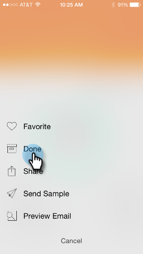
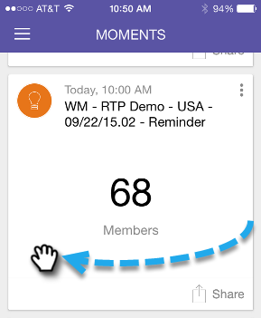

# 完了としてマーク {#marking-it-done}

メールプログラム、イベント、または分析カードを[!UICONTROL 完了]とマークして、ストリームから削除します。 これを行う方法は 2 つあります。

>[!IMPORTANT]
>
>2023年10月2日（PT）に、アドビは Marketo モーメントアプリをすべてのアプリストアから削除しました。 タブレット／モバイルデバイスにアプリが既にインストールされている場合は、その間に引き続き使用できます。 Marketo Engage インスタンスが Marketo の認証の Adobe ID に移行されると、アプリにアクセスできなくなります。 [詳細情報](https://nation.marketo.com/t5/product-discussions/marketo-events-app-and-marketo-moments-app-end-of-life/m-p/340712/highlight/true#M193869){target="_blank"}。

1. アクションメニューをタップします。

   

1. 「**[!UICONTROL 完了]**」をタップします。

   

1. または、いずれかの方向にカードをスワイプします。

   

   >[!NOTE]
   >
   >カードを「完了」としてマークしても、メール、イベント、スマートキャンペーンは削除されません。 モーメント／後でストリームから、完了ストリームに移動するだけです。
