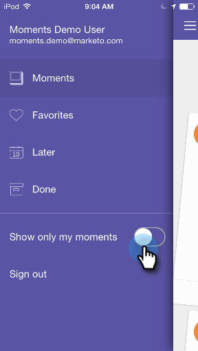

# マーケティングの場面のパーソナライズ{#personalizing-marketo-moments}

マーケティングプログラムやスマートキャンペーンが多い場合は、すべてを見るのは素晴らしいことですが、自分の仕事に集中したい場合もあります。

**自分の電子メールプログラムとスマートキャンペーンのみを表示する場合は、「自分の瞬間のみを表示**」を有効にします。

または、**自分の場面**&#x200B;のみを表示して、アクセス権のあるすべてのスマートキャンペーンと電子メールプログラムを表示します。

