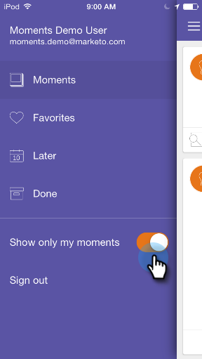
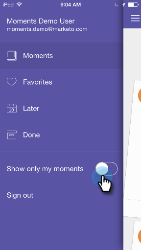

# Marketo Moments のパーソナライズ {#personalizing-marketo-moments}

多くのマーケティングプログラムやスマートキャンペーンが実施されている場合、自分の作業のみに集中することをお勧めします。

>[!IMPORTANT]
>
>2023年10月2日（PT）に、アドビは Marketo Moments App をすべてのアプリストアから削除しました。 タブレット／モバイルデバイスにアプリが既にインストールされている場合は、当面の間引き続き使用できます。 Marketo Engage インスタンスが、Marketo の認証に Adobe Identity を使用するように移行されると、アプリにアクセスできなくなります。 [詳細情報](https://nation.marketo.com/t5/product-discussions/marketo-events-app-and-marketo-moments-app-end-of-life/m-p/340712/highlight/true#M193869){target="_blank"}。

「**[!UICONTROL 自分のモーメントのみを表示]**」を有効にして、独自のメールプログラムとスマートキャンペーンのみを表示します。

または、「**[!UICONTROL 自分のモーメントのみを表示]**」を無効にして、アクセス権のあるすべてのスマートキャンペーンとメールプログラムを表示します。

