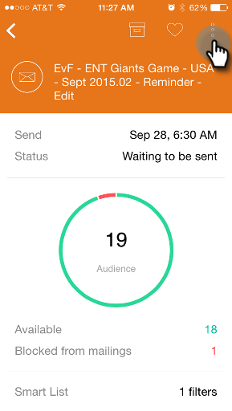

# メールのプレビュー {#previewing-an-email}

メールカードのトリガーをプルする前に、メールカードを右クリックしてプレビューします。

>[!IMPORTANT]
>
>2023年10月2日（PT）に、アドビは Marketo モーメントアプリをすべてのアプリストアから削除しました。タブレット／モバイルデバイスにアプリが既にインストールされている場合は、その間に引き続き使用できます。Marketo Engage インスタンスが Marketo の認証の Adobe ID に移行されると、アプリにアクセスできなくなります。[詳細情報](https://nation.marketo.com/t5/product-discussions/marketo-events-app-and-marketo-moments-app-end-of-life/m-p/340712/highlight/true#M193869){target="_blank"}。

1. メールカードで、3 ドットのアクションメニューをタップします。

   

1. 「**[!UICONTROL メールのプレビュー]**」をタップします。

   

1. お使いのデバイスでメールを表示できます。

   

   >[!NOTE]
   >
   >メールのプレビューページからサンプルを直接送信するには、右上の紙飛行機のアイコンをタップします。
