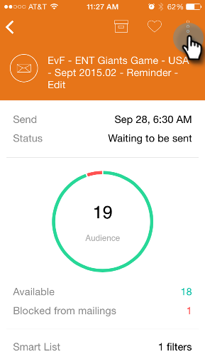

# 電子メールのプレビュー {#previewing-an-email}

電子メールカードを右クリックしてプレビューし、トリガーを引く前に実行します。

1. 電子メールカードで、3つのドットアクションメニューをタップします。

   

1. 「 **プレビューの電子メール**」をタップします。

   

1. 電子メールをデバイスに表示できます。\
   

   >[!NOTE]
   >
   >電子メールプレビューページから直接サンプルを送信するには、右上の紙機アイコンをタップします。

   素晴らしい！

