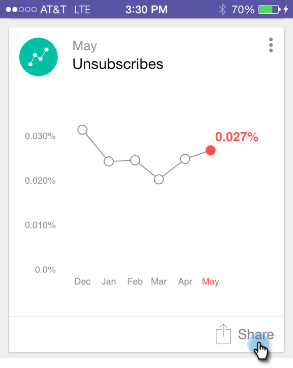
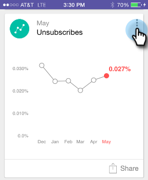
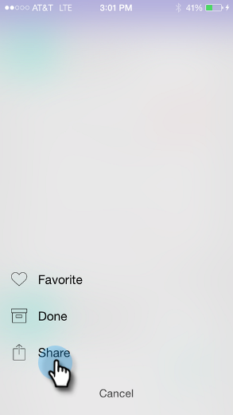
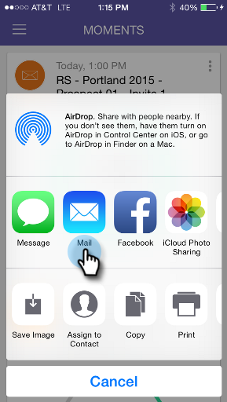
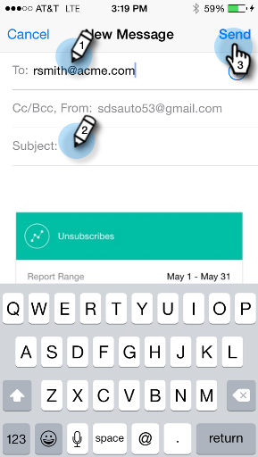

# モーメントの共有 {#sharing-a-moment}

時間を共有する方法は2つあります。

>[!IMPORTANT]
>
>2023年10月2日（PT）に、アドビは Marketo Moments App をすべてのアプリストアから削除しました。 タブレット／モバイルデバイスにアプリが既にインストールされている場合は、当面の間引き続き使用できます。 Marketo Engage インスタンスが、Marketo の認証に Adobe Identity を使用するように移行されると、アプリにアクセスできなくなります。 [詳細情報](https://nation.marketo.com/t5/product-discussions/marketo-events-app-and-marketo-moments-app-end-of-life/m-p/340712/highlight/true#M193869){target="_blank"}。

1. カードの「**[!UICONTROL 共有]**」アイコンをクリックします。

   

1. カードメニューをタップし、「**[!UICONTROL 共有]**」をクリックします。

   

   

1. 共有する方法を選択します。 この例では、電子メールが選択されています。

   >[!NOTE]
   >
   >共有は、携帯電話にインストールされているアプリによって異なります。 [!DNL Facebook]がインストールされていない場合、モーメントには表示されません。

   

1. 受信者のアドレスと件名を入力し、「**[!UICONTROL 送信]**」をタップします。

   
