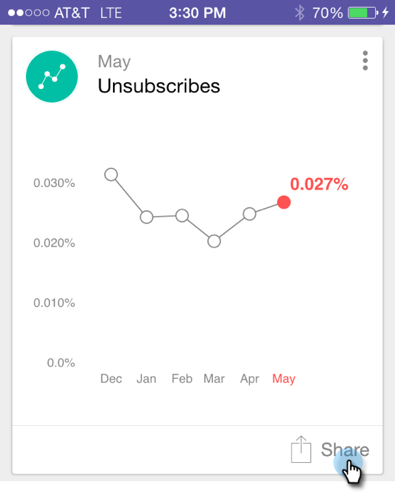

# モーメントの共有 {#sharing-a-moment}

チームにアップデートを提供する場合、共有を選択するには、次の 2 つの方法があります。

>[!IMPORTANT]
>
>2023 年 10 月 2 日（PT）に、AdobeはすべてのアプリストアからMarketo Moments アプリを削除しました。 タブレット/モバイルデバイスにアプリが既にインストールされている場合は、当面の間そのアプリを使用し続けることができます。 Marketoの認証のためにMarketo Engage インスタンスがAdobe ID に移行されると、アプリにアクセスできなくなります。 [詳細情報](https://nation.marketo.com/t5/product-discussions/marketo-events-app-and-marketo-moments-app-end-of-life/m-p/340712/highlight/true#M193869){target="_blank"}

1. カードの「**[!UICONTROL 共有]**」アイコンをクリックします。

   

1. カードメニューをタップし、「**[!UICONTROL 共有]**」をクリックします。

   

   

1. 共有する方法を選択します。メールで送信しましょう。

   >[!NOTE]
   >
   >共有は、携帯電話にインストールされているアプリによって異なります。そのため、[!DNL Facebook] がない場合、Moments では表示されません。

   

1. 受信者のアドレスと件名を入力し、「**[!UICONTROL 送信]**」をタップします。

   
