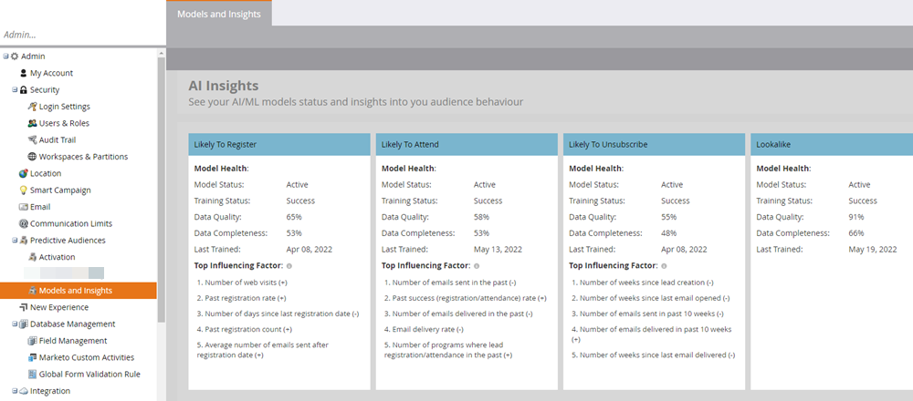

# モデルとインサイト {#models-and-insights}

モデルの効果は、入力データの品質と完全性に応じて異なります。 それぞれの可能性 AI モデルに対して、最も影響を及ぼした要因を確認します。 また、イベントの登録数が多い/少ない、イベントに参加する、または登録解除につながる主な要因も参照してください。

>[!NOTE]
>
>（+）が付いた行動は予測に肯定的に影響します（逆も同様です）。

モデルの健全性を評価するには、次の手順に従います。

Marketo Engageの&#x200B;**[!UICONTROL 管理者]** エリアの&#x200B;**[!UICONTROL 予測オーディエンス]**&#x200B;の下の&#x200B;**[!UICONTROL モデルとデータヘルス]** セクションに移動します。 すべてのモデルとそのステータスがここに表示されます。

* **トレーニングステータス**：モデルが積極的にトレーニング（予測の改善）を実施しているかどうかを示します。 トレーニングは2週間ごとに自動的に行われます。 _処理中_&#x200B;のモデルは、完了までに最大24時間かかる場合があります。 _失敗_&#x200B;したモデルについては、[Marketo サポート ](https://nation.marketo.com/t5/Support/ct-p/Support){target="_blank"}にお問い合わせください。
* **スコアリングステータス**：モデルがプログラムメンバーの予測（可能性の割合）を積極的に計算しているかどうかを示します。
* **パフォーマンス**: データの完全性とデータ品質に基づくモデルの正常性の分類（以下を参照）。
* **データの完全性**：存在／完了しているデータ属性の割合。
* **データ品質**：良好で使用可能なデータを含む属性の割合。
* **最終学習日**：現在のモデルと、2週間ごとに学習する新しいモデルとの間の評価の中で最も優れているモデルの日付。
