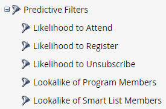

# 予測フィルター {#predictive-filters}

Marketo は、予測オーディエンスの一部として、スマートリストに AI/ML ベースのフィルターグループを提供します。

>[!NOTE]
>
>「出席の可能性が高い」および「登録の可能性が高い」フィルターは、イベントまたはメールプログラムでのみ使用できます。「登録解除の可能性」、「プログラムメンバーの類似」、「スマートリストメンバーの類似」は、すべてのプログラムタイプで使用できます。

## 出席の可能性が高い

このフィルターは、オーディエンスを効果的に絞り込むために使用します。これにより、オンラインセミナーまたはイベントに&#x200B;**出席**&#x200B;する、より高い可能性を持つリードをターゲティングして招待できます。なお、「プログラムに出席する可能性が高い」は、現在のイベントプログラムになります。

## 登録の可能性が高い

_出席の可能性が高い_&#x200B;フィルターと同様に、このフィルターを使用してオーディエンスを絞り込み、オンラインセミナーやイベントに&#x200B;**登録**&#x200B;する、より高い可能性を持つリードをターゲティングします。

## 登録解除の可能性

これにより、次の 2 週間に登録解除される可能性が高いか低いかによってオーディエンスをフィルタリングします。これを使用して、高疲労リードを異なる方法でより効果的にターゲット設定できます。登録解除しきい値は、データベース内のリードタイムやリードアクティビティなど、複数の属性を考慮した AI モデルによって動的に決定されます。

>[!NOTE]
>
>参加／登録／登録解除の可能性フィルターは、他の標準フィルターと組み合わせて使用する必要があります。

## プログラムメンバーの類似／スマートリストメンバーの類似

この 2 つのフィルターは、別のプログラムまたはスマートリストのメンバーに類似した追加のリードをターゲティングすることで、現在のオーディエンスを拡大するのに役立ちます。類似フィルターは、リード属性、メールアクティビティ、web アクティビティ、エンゲージメントを含む 50 以上の要因を考慮します。

「**[!UICONTROL 制約を追加]**」をクリックして、選択したプログラムのメンバーの達成条件を選択します。

「**+**」アイコンを使用して、複数のプログラム／スマートリストを 1 つのフィルターに簡単に追加できます。

