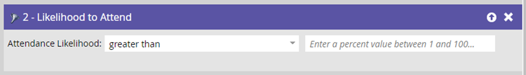
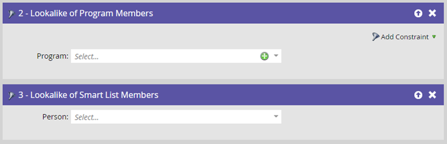

# 予測フィルター {#predictive-filters}

Marketo は、予測オーディエンスの一部として、スマートキャンペーン内のスマートリストに AI／ML ベースのフィルターのグループを提供します。

>[!NOTE]
>
>「出席する可能性がある」フィルターと「登録する可能性がある」フィルターは、イベントプログラムでのみ使用できます。 「登録解除の可能性」、「プログラムメンバーの類似」、「スマートリストメンバーの類似」は、すべてのプログラムタイプで使用できます。

## 出席の可能性が高い {#likelihood-to-attend}

このフィルターは、オーディエンスを効果的に絞り込むために使用します。 これにより、オンラインセミナーまたはイベントに&#x200B;**出席**&#x200B;する、より高い可能性を持つリードをターゲットにして招待できます。 なお、「プログラムに出席する可能性が高い」は、現在のイベントプログラムになります。

## 登録の可能性が高い {#likelihood-to-register}

_出席の可能性が高い_&#x200B;フィルターと同様に、このフィルターを使用してオーディエンスを絞り込み、ウェビナーやイベントに&#x200B;**登録**&#x200B;する可能性のより高いリードをターゲットにします。

## 登録解除の可能性 {#likelihood-to-unsubscribe}

これにより、次の 2 週間に登録解除される可能性が高いか低いかによってオーディエンスをフィルタリングします。 これを使用して、高疲労リードを異なる方法でより効果的にターゲット設定できます。 登録解除しきい値は、データベース内のリードタイムやリードアクティビティなど、複数の属性を考慮した AI モデルによって動的に決定されます。

>[!NOTE]
>
>出席／登録／登録解除の可能性フィルターは、他の標準フィルターと組み合わせて使用する必要があります。

## プログラムメンバーの類似／スマートリストメンバーの類似 {#lookalike-of-members}

この 2 つのフィルターは、別のプログラムまたはスマートリストのメンバーに類似した追加のリードをターゲティングすることで、現在のオーディエンスを拡大するのに役立ちます。 類似フィルターは、リード属性、メールアクティビティ、web アクティビティ、エンゲージメントを含む 50 以上の要因を考慮します。

「**[!UICONTROL 制約を追加]**」をクリックして、選択したプログラムのメンバーの成功基準を選択します。

**+** アイコンをクリックして、複数のプログラム/スマートリストを1つのフィルターに追加します。

## 注意事項 {#things-to-note}

* 予測フィルターが有効になる前に親プログラムが作成されている場合でも、スマートキャンペーンに予測フィルターを適用できます。
* 予測フィルターは、トリガーキャンペーンでは使用できません。
* 予測フィルターを含むキャンペーンのクローン作成または移動はサポートされていません。
* スマート・リストには、最大 5 つの予測フィルタを使用できます。
* Marketo Engageで予測フィルターの評価でエラーが発生した場合、キャンペーン実行は自動的に中止され、通知がMarketo通知センターに送信されます。
* 予測フィルターには現在、100 万人の認定済みユーザーの入力制限があります。
* 予測フィルターを使用して、最大 50 個のアクティブなプログラムを設定できます。
