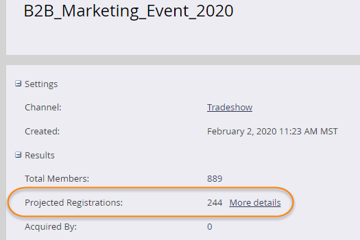
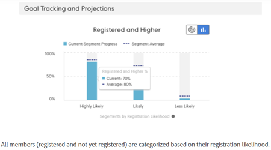

# 目標のトラッキングと予測登録について {#understanding-goal-tracking-and-projected-registrations}

ここでは、目標の進行状況をトラックし、Marketo の予測を理解する方法について説明します。

>[!PREREQUISITES]
>
>これらの機能の大部分にアクセスするには、イベントプログラムの[次世代切替スイッチ](/help/marketo/product-docs/marketo-engage-modern-ux/toggle-switch.md){target=&quot;_blank&quot;}を有効にします。

>[!NOTE]
>
>Marketo Classic エクスペリエンスでイベントプログラムが作成されると、現在、イベント開始日にはイベント作成日がデフォルトで設定されます。予測登録ではイベントの開始日までの時間が考慮されるので、（意図的に設定されていない限り）開始日と作成日が同じ場合は、これらの数値が正確でない可能性があります。

## 目標のトラッキングと予測登録

1. 目標のトラッキングの詳細を確認するには、「**[!UICONTROL レポート]**」タブをクリックします。この例では、これまでに 150 人の登録メンバーが存在し、目標の 200 人の 75%を達成しています。

   

また、「**[!UICONTROL 予測]**」登録も確認できます。情報アイコンにポインタを合わせると、可能性セグメント別に分類された数値が表示されます。

>[!NOTE]
>
>出席グラフと上位グラフは、イベント日まで空のままです。

切替スイッチを有効にしていない場合、Marketo Class UI での表示方法を次に示します。

1. 「グラフ」切替スイッチをクリックして、メンバーを登録の可能性別に分類します。過去のプログラムでのセグメントの平均割合に対する、各セグメントの現在の登録の割合が表示されます。

   

すべてのメンバー（登録済み、未登録）は、登録可能性に基づいて分類されます。 情報アイコンの上にマウスポインターを置くと、これらの可能性カテゴリの定義方法が表示されます。

>[!NOTE]
>
>予測数値は、イベント日まで 24 時間ごとに更新されます。「_処理中_」としてリストアップされているメンバーが、次の計算サイクルに含まれます。

## 類似プログラム

過去に類似のプログラムがどのように実行されたかを確認することで、現在のイベントに関するインサイトを得ることができます。このセクションには、過去 6 か月間に最大 5 つの類似プログラムと、_登録済み_&#x200B;以上のメンバーの数値／割合が表示されます。

類似の計算には、以下の要因が含まれます。

* プログラムタイプ
* プログラムチャネル
* オーディエンスの規模
* プログラムタグ
* イベント作成からイベント開始までの期間
* イベント期間

   

## レコメンデーション

レポートページの上部に、進行状況に基づく AI/ML を活用したレコメンデーションが表示されます。定期的に確認して、ヒントやインサイトを役立ててください。

## 個人レベルの予測

「**[!UICONTROL メンバー]**」タブをクリックして、すべてのプログラムメンバーを表示します。「**[!UICONTROL 登録可能性]**」バーまたは「**[!UICONTROL 出席可能性]**」バーにポインタを合わせると、正確な割合と分類を確認できます。その後、特定のカテゴリのメンバー（例えば、登録する「可能性が低い」カテゴリの全員）に対してアクションを実行し、登録数を押し上げるためにターゲットを絞ることができます。

>[!NOTE]
>
>個人の可能性では、プロファイル属性、人物アクティビティ、過去の招待／登録／出席済みアクティビティなど、人物について 40 以上の要因が考慮されます。

## よくある質問

**Q：セグメントとは何ですか？**

A：登録の可能性は、0～100 の値です。イベントプログラムのメンバー全員に、0～100 の可能性の値が割り当てられます。

可能性の値は、次の 3 つのセグメントに分かれます。

* 登録の可能性が 50%より大きい = 可能性の高いセグメント
* 登録の可能性が 25%より大きく 50%未満 = 可能性のあるセグメント
* 登録の可能性が 25%未満 = 可能性の低いセグメント

ある人に登録する可能性が生じると、予測はこれらのセグメントの 1 つに分類されます（プログラムのメンバー全員が、いずれか 1 つに分類されます）。例えば、イベントプログラムに、可能性予測に基づいて 1,000 人のメンバーがいる場合、その 1,000 人は&#x200B;_可能性が高い_、_可能性がある_&#x200B;または&#x200B;_可能性が低い_&#x200B;セグメントに分類されます。

したがって、「可能性が高い」セグメントに分類された人物は、イベントに登録する可能性が高くなります。

登録のコンバージョンは、登録したセグメント内の人数を、そのセグメントに該当する人数で割った値です（例えば、100 人が「可能性が高い」セグメントに該当し、そのうち 60 人が登録した場合、コンバージョン率は 60%です）。

登録のコンバージョンの割合は、次のパターンに従います。可能性が高い > 可能性がある > 可能性が低い。

**Q：インサイトはどのように使用するのでしょうか？**

A：ベストプラクティスには、以下が含まれます。

i. プログラムを作成し、スマートキャンペーンで「X より大きい」を含む予測フィルターを使用すると、一定量の人物（例：1,000）が生成されるので、キャンペーンを実行します。

ii.24 時間後、「[!UICONTROL レポート]」タブには、現在招待されている全員の、登録する可能性の値に基づいて計算した予測登録数が表示されます。

iii.予測登録数が目標より少ない場合は、より多くの人を招待する必要があります。この時点で、過去のプログラムで成功したしきい値を示すインサイトを確認できます。

iv.しきい値を使用して新しいスマートキャンペーンを作成し、より多くの人を招待できます。

v. 任意の時点で、予測数が表示される理由を理解したい場合は、セグメント間のオーディエンスの分布、過去のコンバージョン率を表示するように切り替え、そのコンバージョン率を現在のオーディエンスに適用します（下のスクリーンショットを参照）。

**Q：登録別セグメントグラフとは何ですか？**

A：それぞれがセグメントを表す 3 つのバー（「可能性が高い」、「可能性がある」、「可能性が低い」）です。

**紫色の点線：**&#x200B;過去の類似プログラムに基づく、そのセグメントでの登録に対する平均コンバージョン率。

**青いバー：**&#x200B;そのセグメント内のすべての人の登録率。

例えば、登録する可能性が 50％より高い 100 人がいて、そのうち 60 人が登録したとします。「可能性が高い」セグメントのコンバージョン率は 60%になります。プログラムに追加された全メンバーが、登録する可能性の値を基にセグメントに分類され、各セグメントで登録した人数に従ってコンバージョン率が計算されます。

**Q：「登録済みおよび上位」とはどういう意味ですか？**

A：登録済み、または同じかそれ以上のステップ番号を持つその他のステータスとしてリストされている人のことです。

イベントプログラムに対して新しい進行状況ステータスを作成できますが、そのステータスは標準のステータスにマッピングされます。ある人物が招待済みからリマインド済みに移される場合を考えてみましょう。これは登録よりも高いステップです。この人物も登録済みと見なされ、目標のトラッキングに表示されます。

**Q：予測登録はどのように計算されますか？**

A：以下を参照してください。

