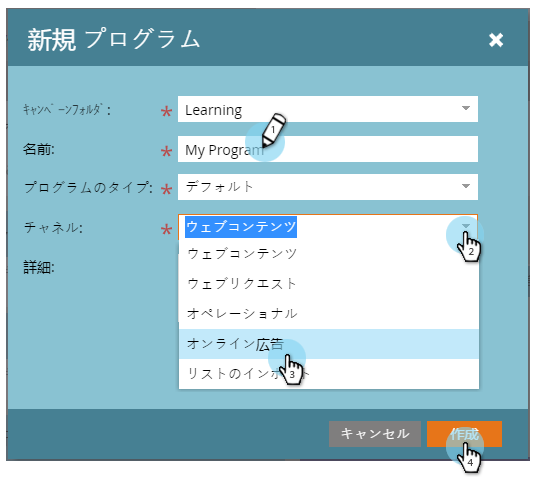

# プログラムの作成{#create-a-program}

プログラムは、マーケティングにおける最も重要な要素の1つです。 よく使うぞ！

1. **マーケティングアクティビティに移動します。**

   

1. 新しいプログラムのフォルダを選択します。 「**新規**」を選択し、「**新規プログラム**」をクリックします。

   

1. 「**名前**」を入力し、ドロップダウンリストで&#x200B;**[チャネル](http://docs.marketo.com/display/DOCS/Create+a+Program+Channel)**&#x200B;を選択して、「**作成**」をクリックします。

   

>[!MORELIKETHIS]
>
>[プログラムの理解](/help/marketo/product-docs/core-marketo-concepts/programs/creating-programs/understanding-programs.md)。
