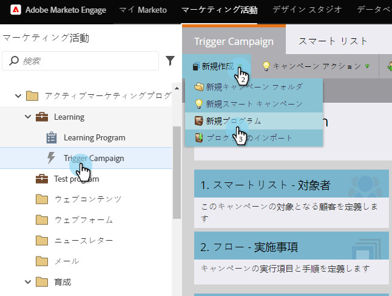
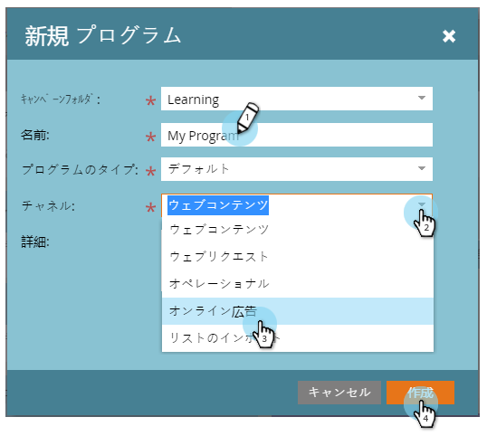

# プログラムの作成 {#create-a-program}

プログラムは、Marketo の最も重要な要素の 1 つです。 これからたくさん使用するでしょう。

1. **[!UICONTROL マーケティングアクティビティ]**&#x200B;に移動します。

   

1. 新しいプログラムのフォルダーを選択します。 「**[!UICONTROL 新規]**」を選択し、「**[!UICONTROL 新規プログラム]**」をクリックします。

   

1. **[!UICONTROL 名前]**&#x200B;を入力し、ドロップダウンで&#x200B;**[[!UICONTROL チャネル]](/help/marketo/product-docs/administration/tags/create-a-program-channel.md){target="_blank"}**&#x200B;を選択して、**[!UICONTROL 作成]**&#x200B;をクリックします。

   

>[!MORELIKETHIS]
>
>[プログラムについて](/help/marketo/product-docs/core-marketo-concepts/programs/creating-programs/understanding-programs.md){target="_blank"}。
