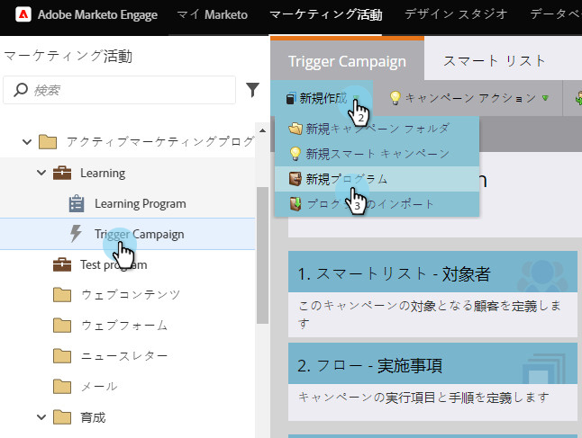

# プログラムの作成 {#create-a-program}

プログラムは、Marketo の最も重要な要素の 1 つです。これからたくさん使用するでしょう。

1. 「**マーケティング活動**」に移動します。

   

1. 新しいプログラムのフォルダーを選択します。「**新規**」を選択し、「**新規プログラム**」をクリックします。

   

1. 「**名前**」を入力し、ドロップダウンから&#x200B;**[チャネル](https://docs.marketo.com/display/DOCS/Create+a+Program+Channel)**&#x200B;を選択して、「**作成**」をクリックします。

   

>[!MORELIKETHIS]
>
>[プログラムについて](/help/marketo/product-docs/core-marketo-concepts/programs/creating-programs/understanding-programs.md)。
