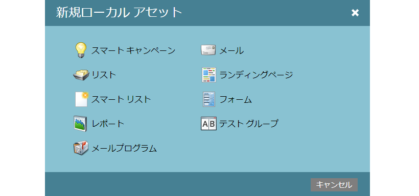

# プログラム内のローカルアセットについて {#understanding-local-assets-in-a-program}

ローカルアセットは、プログラムを構成するコンテンツです。 アセットはカスタマイズ可能で、自動化されたマーケティングイニシアチブを構築できます。 以下に、プログラムで作成できるローカルアセットの大部分を示します。

>[!NOTE]
>
>すべての顧客が利用可能なすべてのアセットにアクセスできるわけではありません。 詳しくは、アカウント担当者にお問い合わせください。

* [スマートキャンペーン](http://docs.marketo.com/display/docs/smart+campaigns)
* [リスト](../../../../product-docs/core-marketo-concepts/smart-lists-and-static-lists/static-lists/understanding-static-lists.md)
* [スマートリストと静的リスト](http://docs.marketo.com/display/docs/smart+lists+and+static+lists)
* [レポート](http://docs.marketo.com/display/docs/basic+reporting)
* [電子メールプログラム](http://docs.marketo.com/display/docs/email+programs)
* [電子メール](../../../../product-docs/email-marketing/email-programs/email-program-actions/create-an-email-for-an-email-program.md)
* [プッシュ通知](http://docs.marketo.com/display/docs/push+notifications)
* [ランディングページ](http://docs.marketo.com/display/docs/landing+pages)
* [Forms](http://docs.marketo.com/display/docs/forms)
* [テストグループ](../../../../product-docs/demand-generation/landing-pages/understanding-landing-pages/landing-page-test-groups.md)
* [ソーシャルボタン](../../../../product-docs/demand-generation/landing-pages/free-form-landing-pages/add-a-social-button-to-a-free-form-landing-page.md)
* [Youtubeビデオ](../../../../product-docs/demand-generation/social/social-functions/add-a-video.md)
* [投票](../../../../product-docs/demand-generation/social/creating-a-poll/create-a-poll.md)
* [照会オファー](../../../../product-docs/demand-generation/social/referral-offers/create-a-referral-offer.md)
* [懸賞](../../../../product-docs/demand-generation/social/sweepstakes/create-sweepstakes.md)
* [SMSメッセージを表示する](http://docs.marketo.com/display/docs/vibes+sms+messages)

