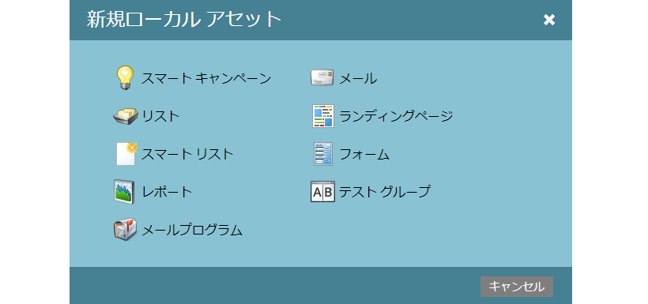

# プログラムのローカルアセットの理解 {#understanding-local-assets-in-a-program}

ローカルアセットは、プログラムを構成するコンテンツです。 アセットはカスタマイズ可能で、自動化されたマーケティング施策を構築できます。 プログラムで作成できるローカルアセットのほとんどは次のとおりです。

>[!NOTE]
>
>利用可能なすべてのアセットに、全員がアクセスできるわけではありません。 詳しくは、アドビのアカウントチーム（担当のアカウントマネージャー）にお問い合わせください。

* [スマートキャンペーン](/help/marketo/product-docs/core-marketo-concepts/smart-campaigns/creating-a-smart-campaign/understanding-batch-and-trigger-smart-campaigns.md){target="_blank"}
* [リスト](/help/marketo/product-docs/core-marketo-concepts/smart-lists-and-static-lists/static-lists/understanding-static-lists.md){target="_blank"}
* [スマートリスト](/help/marketo/product-docs/core-marketo-concepts/smart-lists-and-static-lists/creating-a-smart-list/create-a-smart-list.md){target="_blank"}
* [レポート](/help/marketo/product-docs/reporting/basic-reporting/report-types/report-type-overview.md){target="_blank"}
* [メールプログラム](/help/marketo/product-docs/email-marketing/email-programs/creating-an-email-program/understanding-email-programs.md){target="_blank"}
* [メール](/help/marketo/product-docs/email-marketing/email-programs/email-program-actions/create-an-email-for-an-email-program.md){target="_blank"}
* [プッシュ通知](/help/marketo/product-docs/mobile-marketing/push-notifications/understanding-push-notifications.md){target="_blank"}
* [ランディングページ](/help/marketo/product-docs/demand-generation/landing-pages/understanding-landing-pages/understanding-free-form-vs-guided-landing-pages.md){target="_blank"}
* [フォーム](/help/marketo/product-docs/demand-generation/forms/creating-a-form/create-a-form.md){target="_blank"}
* [テストグループ](/help/marketo/product-docs/demand-generation/landing-pages/understanding-landing-pages/landing-page-test-groups.md){target="_blank"}
* [Vibes SMS メッセージ](/help/marketo/product-docs/mobile-marketing/vibes-sms-messages/create-an-sms-message.md){target="_blank"}
