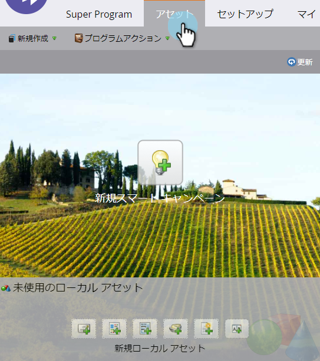
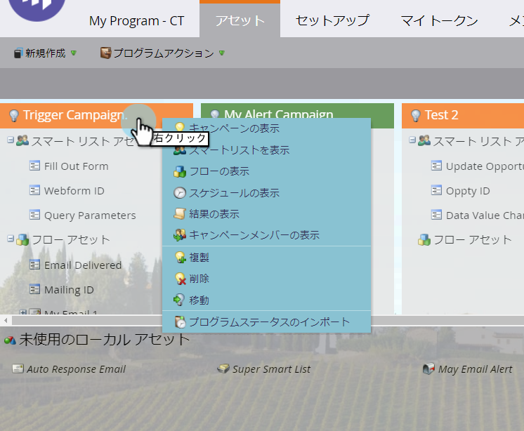
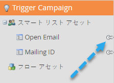

# 「アセット」タブの使用{#using-the-assets-tab}

アセットキャンバスは、プログラムを視覚的に表します。 ローカルアセットを追加したり、既存のアセットを操作したりできます。

## アセットの追加{#adding-assets}

「**マーケティングアクティビティ**」領域で、「**アセット**」タブをクリックします。 以下のアセットのいずれかを選択し、プログラムに追加します。

## プログラムの管理{#manage-your-program}

プログラムにアセットがある場合は、ここに表示されます。

| オレンジ | トリガキャンペーン |
|---|---|
| 緑 | バッチキャンペーン |

アセットを操作する場合は、ヘッダーを右クリックします。

>[!TIP]
>
>アセットの列を並べ替えるには、ドラッグ&amp;ドロップします。

プログラムーにローカルでないアセットは、次のようになります。 

アセットタブは、プログラム内で参照され、すべてを表す非常に小さなダッシュボードです。
