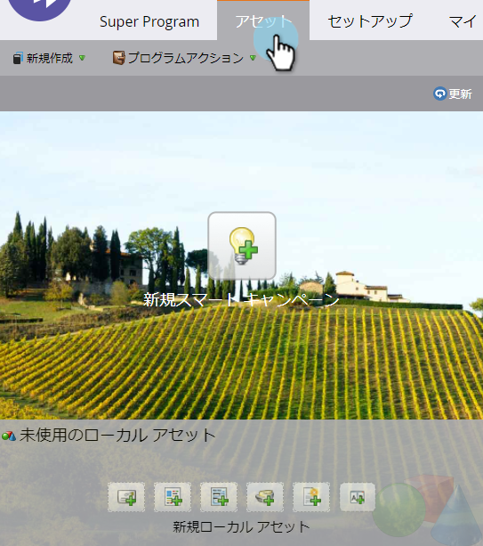
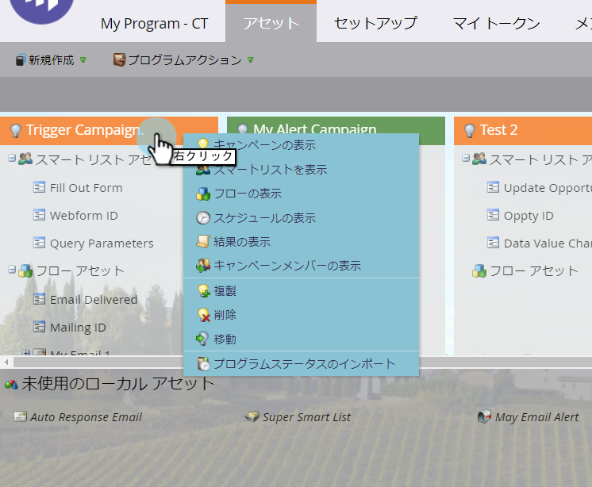
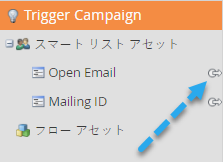

# 「アセット」タブの使用 {#using-the-assets-tab}

アセットキャンバスは、デフォルトまたはイベントのプログラムを視覚的に表現したものです。 ローカルアセットを追加したり、既存のアセットを操作したりするために使用できます。

## アセットの追加 {#adding-assets}

目的のプログラムで「**[!UICONTROL Assets]**」タブをクリックします。 下に並んでいるアセットを選択し、プログラムに追加します。

## プログラムの管理  {#manage-your-program}

プログラムにアセットが含まれる場合は、ここにリスト表示されます。

| オレンジ | トリガーキャンペーン |
|---|---|
| グリーン | バッチキャンペーン |

アセットに関する操作を行うには、そのアセットのヘッダーを右クリックします。

>[!TIP]
>
>アセットの列を左右にドラッグ＆ドロップすると、読みやすい位置に移動できます。

プログラムのローカルではないアセットは、このように表示されます。

「アセット」タブは、プログラム内部あるいはプログラムで参照されるものすべてを扱える便利な小型のダッシュボードです。
