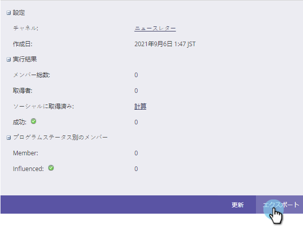
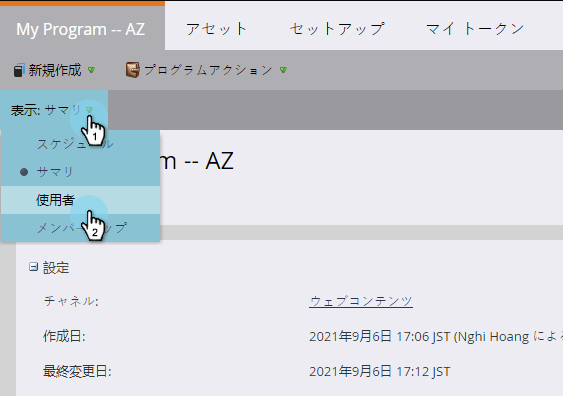
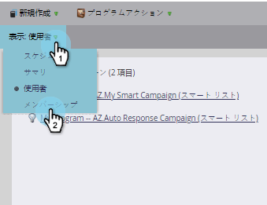
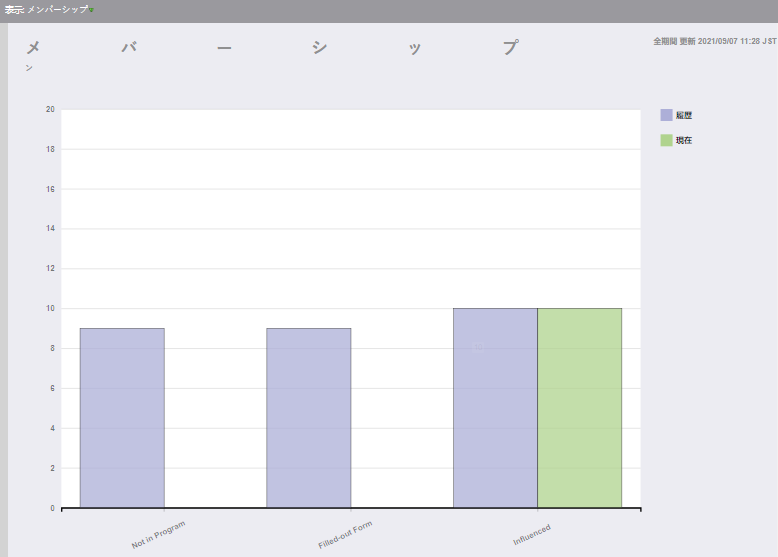

# プログラムのホームタブ{#using-the-program-home-tab}を使用

[プログラムホーム]タブでは、プログラムで起こっていることを高レベルで表示できます。

## 概要表示{#summary-view}

1. **マーケティングアクティビティ**&#x200B;に移動します。

   

1. プログラムを選択します。

   

   >[!NOTE]
   >
   >これはデフォルトの表示です。 設定、スケジュール、結果、およびメンバーのプログラムステータスに関する情報が提供されます。

   下線付きの要素をクリックして、変更や表示を行います。

   

   サマリの下部にある「エクスポート」をクリックして、レポートをダウンロードします。

   

## 表示が使用{#used-by-view}

1. マーケティングアクティビティで、プログラムを選択します。

   

1. **表示**&#x200B;ドロップダウンをクリックします。 「**使用者**」を選択します。

   

   この表示は、使用中のスマートキャンペーンを示します。

   

## メンバーシップ表示{#membership-view}

1. マーケティングアクティビティで、プログラムを選択します。

   

1. **表示**&#x200B;ドロップダウンをクリックします。 「**メンバーシップ**」を選択します。

   

   メンバーがプログラムのステータスを移動する際の位置を示すグラフが表示されます。

   

   >[!NOTE]
   >
   >**** 歴史的には、プログラムを経験したことのある人を指し、 **** Currentonlyには現在プログラムにいる人のみが含まれています。

   >[!NOTE]
   >
   >**関連記事**
   >
   >    
   >    
   >    * [プログラムメンバーシップについて](understanding-program-membership.md)

