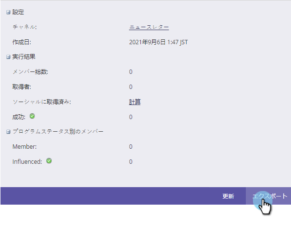
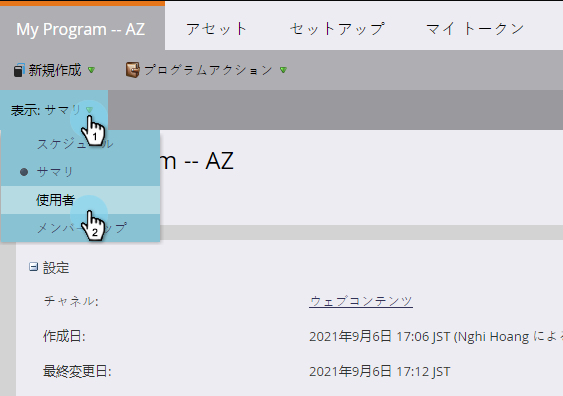
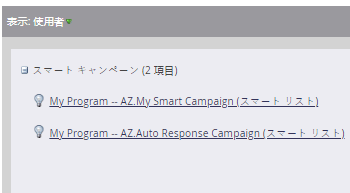
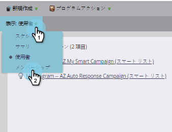
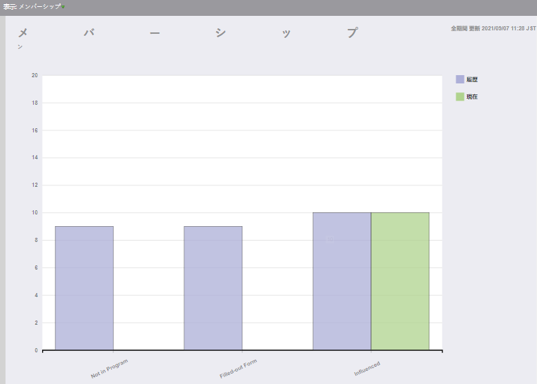

# 「プログラムホーム」タブの使用 {#using-the-program-home-tab}

「プログラムホーム」タブを使用すると、プログラムの状況を大まかに確認できます。

## 概要の表示 {#summary-view}

1. **[!UICONTROL マーケティングアクティビティ]**&#x200B;に移動します。

   

1. プログラムを選択します。

   

   >[!NOTE]
   >
   >これがデフォルトの表示です。 設定、スケジュール、結果およびメンバープログラムのステータスに関する情報が表示されます。

1. 下線付きの要素をクリックして、変更を加えたり、詳細情報を表示したりします。

   

1. 概要の下部にある「**[!UICONTROL エクスポート]**」をクリックして、レポートをダウンロードします。

   

## 使用者の表示 {#used-by-view}

1. **[!UICONTROL マーケティング活動]**&#x200B;で、プログラムを選択します。

   

1. 「**[!UICONTROL 表示]**」ドロップダウンをクリックします。 「**[!UICONTROL 使用者]**」を選択します。

   

   このビューでは、スマートキャンペーンの使用状況を確認できます。

   

## メンバーシップの表示 {#membership-view}

1. **[!UICONTROL マーケティング活動]**&#x200B;で、プログラムを選択します。

   

1. 「**[!UICONTROL 表示]**」ドロップダウンをクリックします。 「**[!UICONTROL メンバーシップ]**」を選択します。

   

   メンバーがプログラムステータス間を移動するときに、居場所を示すグラフが表示されます。

   

   >[!NOTE]
   >
   >「**[!UICONTROL 履歴]**」は、プログラムを通ったことのある人を示し、「**[!UICONTROL 現在]**」には、現在プログラムに存在する人のみが含まれます。

   >[!MORELIKETHIS]
   >
   >[プログラムメンバーシップについて](/help/marketo/product-docs/core-marketo-concepts/programs/creating-programs/understanding-program-membership.md){target="_blank"}
