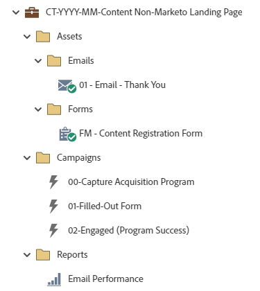

# CT-YYYY-MM-Marketo ランディングページ以外のコンテンツ {#ct-yyyy-mm-content-non-marketo-landing-page}

これは、Marketo Engageのデフォルトプログラムを使用してMarketo Engage以外のランディングページのコンテンツをダウンロードするための、Marketo Engage フォームを含むコンテンツプログラムの例です。 このプログラムは、Web サイトに埋め込まれたMarketo Engage フォームで動作することを目的としています。 オファー/コンテンツへのリンクは、お礼メールで送信できます。

詳細な方法に関するサポートや、プログラムのカスタマイズに関するヘルプについては、Adobe アカウントチームに問い合わせるか、[Adobe Professional Services](https://business.adobe.com/jp/customers/consulting-services/main.html){target="_blank"} のページを参照してください。

## チャネルサマリ {#channel-summary}

<table style="table-layout:auto">
 <tbody>
  <tr>
   <th>チャネル</th>
   <th>メンバーシップのステータス</th>
   <th>アナリティクス動作</th>
   <th>プログラムのタイプ</th>
  </tr>
  <tr>
   <td>Web コンテンツ</td>
   <td>01 – メンバー
 02-Engaged-Success</td>
   <td>包含</td>
   <td>デフォルト</td>
  </tr>
 </tbody>
</table>

## プログラムには、次のAssetsが含まれています {#program-contains-the-following-assets}

<table style="table-layout:auto">
 <tbody>
  <tr>
   <th>タイプ</th>
   <th>テンプレート名</th>
   <th>アセット名</th>
  </tr>
  <tr>
   <td>メール</td>
   <td><a href="/help/marketo/product-docs/core-marketo-concepts/programs/program-library/quick-start-email-template.md" target="_blank">クイックスタートメールテンプレート</a></td>
   <td>01-Email-Thank You</td>
  </tr>
  <tr>
   <td>Form</td>
   <td> </td>
   <td>FM コンテンツ登録フォーム （Design Studio のグローバルアセット）</td>
  </tr>
  <tr>
   <td>ローカル報告書</td>
   <td> </td>
   <td>メールの効果</td>
  </tr>
  <tr>
   <td>スマートキャンペーン</td>
   <td> </td>
   <td>00-Capture Acquisition Program</td>
  </tr>
  <tr>
   <td>スマートキャンペーン</td>
   <td> </td>
   <td>01 入力済みフォーム</td>
  </tr>
  <tr>
   <td>スマートキャンペーン</td>
   <td> </td>
   <td>02 – エンゲージメント （プログラム成功）</td>
  </tr>
  <tr>
   <td>フォルダー</td>
   <td> </td>
   <td>Assets – すべてのクリエイティブアセットを格納します。
  （メールとランディングページのサブフォルダー）  </td>
  </tr>
  <tr>
   <td>フォルダー</td>
   <td> </td>
   <td>キャンペーン – すべてのスマートキャンペーンを格納します。</td>
  </tr>
  <tr>
   <td>フォルダー</td>
   <td> </td>
   <td>レポート</td>
  </tr>
 </tbody>
</table>

## 含まれるマイトークン {#my-tokens-included}

<table style="table-layout:auto">
 <tbody>
  <tr>
   <th>トークンのタイプ</th>
   <th>トークン名</th>
   <th>値</th>
  </tr>
  <tr>
   <td>テキスト</td>
   <td><code>{{my.Content-Title}}</code></td>
   <td><code><--My Content Title Here--></code></td>
  </tr>
  <tr>
   <td>テキスト</td>
   <td><code>{{my.Content-Type}}</code></td>
   <td><code><--My Content Type Here--></code></td>
  </tr>
  <tr>
   <td>テキスト</td>
   <td><code>{{my.Content-URL}}</code></td>
   <td>my.ContentURL?without=http://</td>
  </tr>
  <tr>
   <td>テキスト</td>
   <td><code>{{my.Email-FromAddress}}</code></td>
   <td>PlaceholderFrom.email@mydomain.com</td>
  </tr>
  <tr>
   <td>テキスト</td>
   <td><code>{{my.Email-FromName}}</code></td>
   <td><code><--My From Name Here--></code></td>
  </tr>
  <tr>
   <td>テキスト</td>
   <td><code>{{my.Email-ReplyToAddress}}</code></td>
   <td>reply-to.email@mydomain.com</td>
  </tr>
 </tbody>
</table>

## 競合ルール {#conflict-rules}

* **プログラムタグ**
   * このサブスクリプションにタグを作成 – _推奨_
   * 無視

* **同じ名前のランディングページテンプレート**
   * 元のテンプレートのコピー
   * 宛先テンプレートの使用 – _推奨_

* **同じ名前の画像**
   * どちらのファイルも保持する
   * このサブスクリプションの項目を置き換える – _推奨_

* **同じ名前のメールテンプレート**
   * どちらのテンプレートも保持する
   * 既存のテンプレートを置換 – _推奨_

## ベストプラクティス {#best-practices}

* コンテンツプログラムを読み込んだ後、フォームをローカルアセットから Design Studio にあるグローバルアセットに移動します。
   * フォームの数を減らし、Design Studio からより多くのグローバルアセットを利用することで、プログラムの設計と管理ガバナンスの拡張性が向上します。 また、フィールド、オプトイン言語など、定期的にコンプライアンスを更新する柔軟性も備えています。

* 読み込んだプログラムでテンプレートを更新して現在のブランドのテンプレートを利用するか、スニペットまたは適切なロゴ/フッター情報を追加して、新しく読み込んだテンプレートを更新し、ブランドを反映させることを検討してください。

* 命名規則に合わせるために、このプログラムの例の命名規則を更新することを検討してください。

>[!NOTE]
>
>必要に応じて、プログラムテンプレートとプログラムを使用するたびにマイトークン値を必ず更新してください。

>[!TIP]
>
>成功をトラッキングするには、「02-Engaged」キャンペーンを必ずアクティブ化してください。 フォームがライブになり、メールが送信される _前に_ これを行います。
