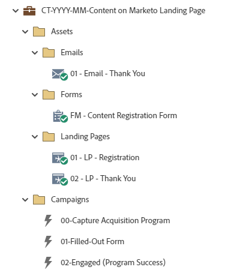

# CT-YYYY-MM-Marketo ランディングページのコンテンツ {#ct-yyyy-mm-content-on-marketo-landing-page}

この例は、Marketo Engageのデフォルトプログラムを利用するMarketo Engageフォームを持つMarketo Engageランディングページを利用するコンテンツプログラムであるように設計されています。 フォームは、コンテンツ/オファーにアクセスするためのものです。 オファーへのリンクは、「ありがとうございます」ページに表示したり、「ありがとうございます」E メールに送信したり、両方に送信したりできます。

戦略に関するサポートやプログラムのカスタマイズについては、Adobeアカウントチームにお問い合わせいただくか、 [Adobe Professional Services](https://business.adobe.com/customers/consulting-services/main.html){target="_blank"} ページに貼り付けます。

## チャネルサマリ {#channel-summary}

<table style="table-layout:auto"> 
 <tbody> 
  <tr> 
   <th>チャネル</th> 
   <th>メンバーシップステータス</th>
   <th>アナリティクス動作</th>
   <th>プログラムのタイプ</th>
  </tr> 
  <tr> 
   <td>Web コンテンツ</td> 
   <td>01 — メンバー 
 02-Engaged-Success</td>
   <td>包含</td>
   <td>デフォルト</td>
  </tr>
 </tbody> 
</table>

## プログラムに次のアセットが含まれています {#program-contains-the-following-assets}

<table style="table-layout:auto"> 
 <tbody> 
  <tr> 
   <th>タイプ</th> 
   <th>テンプレート名</th>
   <th>アセット名</th>
  </tr> 
  <tr> 
   <td>メール</td> 
   <td><a href="/help/marketo/product-docs/core-marketo-concepts/programs/program-library/quick-start-email-template.md" target="_blank">クイックスタートメールテンプレート</a></td>
   <td>01-Email-Thank You</td>
  </tr>
  <tr> 
   <td>ランディングページ</td> 
   <td><a href="/help/marketo/product-docs/core-marketo-concepts/programs/program-library/quick-start-landing-page-template.md" target="_blank">クイックスタート LP テンプレート</a></td>
   <td>01 - LP — 登録</td>
  </tr>
  <tr> 
   <td>ランディングページ</td> 
   <td><a href="/help/marketo/product-docs/core-marketo-concepts/programs/program-library/quick-start-landing-page-template.md" target="_blank">クイックスタート LP テンプレート</a></td>
   <td>02 - LP — ありがとうございます</td>
  </tr>
  <tr> 
   <td>フォーム</td> 
   <td> </td>
   <td>FM — コンテンツ登録フォーム</td>
  </tr>
  <tr> 
   <td>ローカルレポート</td> 
   <td> </td>
   <td>メールの効果</td>
  </tr>
  <tr> 
   <td>ローカルレポート</td> 
   <td> </td>
   <td>ランディングページの効果</td>
  </tr>
   <tr> 
   <td>スマートキャンペーン</td> 
   <td> </td>
   <td>00 — 取得プログラムの取得</td>
  </tr>
  <tr> 
   <td>スマートキャンペーン</td> 
   <td> </td>
   <td>01 — 入力済みフォーム</td>
  </tr>
  <tr> 
   <td>スマートキャンペーン</td> 
   <td> </td>
   <td>02 — エンゲージ済み（プログラム成功）</td>
  </tr>
  <tr> 
   <td>フォルダー</td> 
   <td> </td>
   <td>アセット — すべてのクリエイティブアセットを格納します。 
 ( メール、ランディングページ、Formsのサブフォルダー )  </td>
  </tr>
  <tr> 
   <td>フォルダー</td> 
   <td> </td>
   <td>キャンペーン — すべてのスマートキャンペーンを格納</td>
  </tr>
  <tr> 
   <td>フォルダー</td> 
   <td> </td>
   <td>レポート</td>
  </tr>
 </tbody> 
</table>

## 含まれるマイトークン {#my-tokens-included}

<table style="table-layout:auto"> 
 <tbody> 
  <tr> 
   <th>トークンのタイプ</th> 
   <th>トークン名</th>
   <th>値</th>
  </tr> 
  <tr> 
   <td>リッチテキスト</td> 
   <td><code>{{my.Content-Description}}</code></td>
   <td>ダブルクリックして詳細を表示  
 <code><--My Content Description Here--></code> 
 このコンテンツの説明は、プログラムレベルの「マイトークン」タブで編集します。 
 学習内容： 
<li>箇条書き 1</li>
<li>箇条書き 2</li>
<li>箇条書き 3</li></td>
  </tr>
  <tr> 
   <td>テキスト</td> 
   <td><code>{{my.Content-Title}}</code></td>
   <td><code><--My Content Title Here--></code></td>
  </tr>
  <tr> 
   <td>テキスト</td> 
   <td><code>{{my.Content-Type}}</code></td>
   <td><code><--My Content Type Here--></code></td>
  </tr>
  <tr> 
   <td>テキスト</td> 
   <td><code>{{my.Content-URL}}</code></td>
   <td>my.ContentURL?without=http://</td>
  </tr>
  <tr> 
   <td>テキスト</td> 
   <td><code>{{my.Email-FromAddress}}</code></td>
   <td>PlaceholderFrom.email@mydomain.com</td>
  </tr>
  <tr> 
   <td>テキスト</td> 
   <td><code>{{my.Email-FromName}}</code></td>
   <td><code><--My From Name Here--></code></td>
  </tr>
  <tr> 
   <td>テキスト</td> 
   <td><code>{{my.Email-ReplyToAddress}}</code></td>
   <td>reply-to.email@mydomain.com</td>
  </tr>
  <tr> 
   <td>テキスト</td> 
   <td><code>{{my.PageURL-ThankYou}}</code></td>
   <td>My.ThankYouPageURL?http://</td>
  </tr>
 </tbody> 
</table>

## 競合ルール {#conflict-rules}

* **プログラムタグ**
   * この配信登録にタグを作成 — _推奨_
   * 無視する

* **同じ名前のランディングページテンプレート**
   * 元のテンプレートのコピー
   * インポート先のテンプレートの使用 - _推奨_

* **同じ名前の画像**
   * どちらのファイルも保持する
   * この配信登録内アイテムの置換 - _推奨_

* **同じ名前のメールテンプレート**
   * どちらのテンプレートも保持する
   * 既存のテンプレートを置換 — _推奨_

## ベストプラクティス {#best-practices}

* コンテンツプログラムを読み込んだ後、フォームをローカルアセットから Design Studio 内のグローバルアセットに移動します。
   * フォームの数を減らし、Design Studio からより多くのグローバルアセットを利用することで、プログラムのデザインと管理ガバナンスにおけるスケーラビリティを高めることができます。 また、フィールド、オプトイン言語などに対する定期的なコンプライアンス更新を柔軟におこなうこともできます。

* 現在ブランド化されているテンプレートを利用するには、読み込んだプログラムでテンプレートを更新することを検討するか、スニペットまたは適切なロゴ/フッター情報を追加して、新しく読み込んだテンプレートをブランドに合わせて更新します。

* 命名規則に合わせて、このプログラム例の命名規則を更新することを検討してください。

>[!NOTE]
>
>必要に応じて、プログラムテンプレートのマイトークンの値を更新し、プログラムを使用するたびに値を更新してください。

>[!TIP]
>
>成功を追跡するための「02-Engaged」キャンペーンを忘れずに有効化してください。 これを実行 _前_ フォームがライブになり、電子メールが送信されます。

>[!IMPORTANT]
>
>URL を参照する My Tokens にhttp://やhttps://を含めることはできません。含めないと、リンクがアセット内で適切に機能しません。
