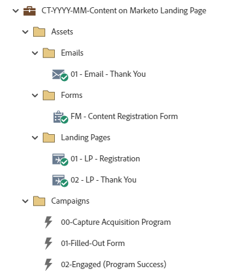

# CT-YYYY-MM-Marketo ランディングページのコンテンツ {#ct-yyyy-mm-content-on-marketo-landing-page}

この例は、Marketo Engageのデフォルトプログラムを使用して、Marketo Engage ランディングページとMarketo Engage フォームを活用するコンテンツプログラムを想定しています。 フォームは、コンテンツ/オファーにアクセスするためのものです。 オファーへのリンクは、サンキューページ、サンキューメールで送信、またはその両方に表示できます。

詳しい戦略支援またはプログラムのカスタマイズについては、Adobe アカウントチームにお問い合わせいただくか、[Adobe Professional Services](https://business.adobe.com/customers/consulting-services/main.html){target="_blank"} ページをご覧ください。

## チャネルサマリ {#channel-summary}

<table style="table-layout:auto">
 <tbody>
  <tr>
   <th>チャネル</th>
   <th>メンバーシップステータス</th>
   <th>アナリティクス動作</th>
   <th>プログラムのタイプ</th>
  </tr>
  <tr>
   <td>Web コンテンツ</td>
   <td>01 – メンバー
 02-Engaged-Success</td>
   <td>包含</td>
   <td>デフォルト</td>
  </tr>
 </tbody>
</table>

## プログラムには、次のAssetsが含まれています {#program-contains-the-following-assets}

<table style="table-layout:auto">
 <tbody>
  <tr>
   <th>タイプ</th>
   <th>テンプレート名</th>
   <th>アセット名</th>
  </tr>
  <tr>
   <td>メール</td>
   <td><a href="/help/marketo/product-docs/core-marketo-concepts/programs/program-library/quick-start-email-template.md" target="_blank">クイックスタートメールテンプレート</a></td>
   <td>01-Email-Thank You</td>
  </tr>
  <tr>
   <td>ランディングページ</td>
   <td><a href="/help/marketo/product-docs/core-marketo-concepts/programs/program-library/quick-start-landing-page-template.md" target="_blank">クイックスタート LP テンプレート</a></td>
   <td>01 - LP – 登録</td>
  </tr>
  <tr>
   <td>ランディングページ</td>
   <td><a href="/help/marketo/product-docs/core-marketo-concepts/programs/program-library/quick-start-landing-page-template.md" target="_blank">クイックスタート LP テンプレート</a></td>
   <td>02 - LP - サンキュー</td>
  </tr>
  <tr>
   <td>Form</td>
   <td> </td>
   <td>FM - コンテンツ登録フォーム</td>
  </tr>
  <tr>
   <td>ローカルレポート</td>
   <td> </td>
   <td>メールの効果</td>
  </tr>
  <tr>
   <td>ローカルレポート</td>
   <td> </td>
   <td>ランディングページの効果</td>
  </tr>
   <tr>
   <td>スマートキャンペーン</td>
   <td> </td>
   <td>00 - キャプチャ取得プログラム</td>
  </tr>
  <tr>
   <td>スマートキャンペーン</td>
   <td> </td>
   <td>01 – 記入されたフォーム</td>
  </tr>
  <tr>
   <td>スマートキャンペーン</td>
   <td> </td>
   <td>02 - エンゲージメント（プログラムの成功）</td>
  </tr>
  <tr>
   <td>フォルダー</td>
   <td> </td>
   <td>Assets – すべてのクリエイティブアセットを格納
  （メール、ランディングページ、Formsのサブフォルダー）  </td>
  </tr>
  <tr>
   <td>フォルダー</td>
   <td> </td>
   <td>Campaigns – すべてのスマートキャンペーンを格納します</td>
  </tr>
  <tr>
   <td>フォルダー</td>
   <td> </td>
   <td>レポート</td>
  </tr>
 </tbody>
</table>

## マイトークンが含まれています {#my-tokens-included}

<table style="table-layout:auto">
 <tbody>
  <tr>
   <th>トークンのタイプ</th>
   <th>トークン名</th>
   <th>値</th>
  </tr>
  <tr>
   <td>リッチテキスト</td>
   <td><code>{{my.Content-Description}}</code></td>
   <td>詳細はダブルクリック
 <code><--My Content Description Here--></code>
 このコンテンツの説明をプログラムレベルの「マイトークン」タブで編集します。
 次の項目について学習します。
<li>箇条書き1</li>
<li>箇条書き2</li>
<li>箇条書き3</li></td>
  </tr>
  <tr>
   <td>テキスト</td>
   <td><code>{{my.Content-Title}}</code></td>
   <td><code><--My Content Title Here--></code></td>
  </tr>
  <tr>
   <td>テキスト</td>
   <td><code>{{my.Content-Type}}</code></td>
   <td><code><--My Content Type Here--></code></td>
  </tr>
  <tr>
   <td>テキスト</td>
   <td><code>{{my.Content-URL}}</code></td>
   <td>my.ContentURL?without=http://</td>
  </tr>
  <tr>
   <td>テキスト</td>
   <td><code>{{my.Email-FromAddress}}</code></td>
   <td>PlaceholderFrom.email@mydomain.com</td>
  </tr>
  <tr>
   <td>テキスト</td>
   <td><code>{{my.Email-FromName}}</code></td>
   <td><code><--My From Name Here--></code></td>
  </tr>
  <tr>
   <td>テキスト</td>
   <td><code>{{my.Email-ReplyToAddress}}</code></td>
   <td>reply-to.email@mydomain.com</td>
  </tr>
  <tr>
   <td>テキスト</td>
   <td><code>{{my.PageURL-ThankYou}}</code></td>
   <td>My.ThankYouPageURL?without the http://</td>
  </tr>
 </tbody>
</table>

## 競合ルール {#conflict-rules}

* **プログラムタグ**
   * このサブスクリプションでタグを作成 – _おすすめ_
   * 無視

* **同じ名前のランディングページテンプレート**
   * 元のテンプレートのコピー
   * 宛先テンプレートを使用 – _おすすめ_

* **同じ名前の画像**
   * どちらのファイルも保持する
   * このサブスクリプションのアイテムを置き換える – _推奨_

* **同じ名前のメールテンプレート**
   * どちらのテンプレートも保持する
   * 既存のテンプレートを置き換える – _推奨_

## ベストプラクティス {#best-practices}

* コンテンツプログラムを読み込んだら、フォームをローカルアセットからDesign Studioにあるグローバルアセットに移動します。
   * フォーム数を減らし、Design Studioからより多くのグローバルアセットを活用することで、プログラムの設計と管理ガバナンスにおいて、よりスケーラビリティを高めることができます。 また、フィールドやオプトイン言語など、定期的なコンプライアンス更新の柔軟性も提供します。

* インポートしたプログラムのテンプレートを更新して、現在ブランド化されているテンプレートを利用するか、新しくインポートしたテンプレートを更新して、スニペットや適切なロゴ/フッター情報を追加することで、ブランドを反映させることを検討してください。

* 命名規則に合わせて、このプログラムの例の命名規則を更新することを検討してください。

>[!NOTE]
>
>必要に応じて、プログラムテンプレートおよびプログラムを使用するたびに、マイトークン値を更新することを忘れないでください。

>[!TIP]
>
>フォームがライブになり、メールが送信される前に、成功を追跡するために「02 エンゲージ」キャンペーンをアクティブにします。

>[!IMPORTANT]
>
>URLを参照するマイトークンにhttp://またはhttps://を含めることはできません。そうしないと、アセット内でリンクが適切に機能しません。
