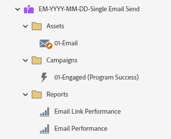

# EM-YYYY-MM-DD-シングルメール送信 {#em-yyyy-mm-dd-single-email-send}

この例では、Marketo Engage メールプログラムを使用して1通のメールを送信します。 メールには、A/B テストを含めることも、含めないこともできます。

詳しい戦略支援またはプログラムのカスタマイズについては、Adobe アカウントチームにお問い合わせいただくか、[Adobe Professional Services](https://business.adobe.com/jp/customers/consulting-services/main.html){target="_blank"} ページをご覧ください。

## チャネルサマリ {#channel-summary}

<table style="table-layout:auto">
 <tbody>
  <tr>
   <th>チャネル</th>
   <th>メンバーシップステータス</th>
   <th>アナリティクス動作</th>
   <th>プログラムのタイプ</th>
  </tr>
  <tr>
   <td>メール</td>
   <td>01 – メンバー
 02-Engaged-Success</td>
   <td>包含</td>
   <td>メール</td>
  </tr>
 </tbody>
</table>

## プログラムには、次のAssetsが含まれています {#program-contains-the-following-assets}

<table style="table-layout:auto">
 <tbody>
  <tr>
   <th>タイプ</th>
   <th>テンプレート名</th>
   <th>アセット名</th>
  </tr>
  <tr>
   <td>メール</td>
   <td><a href="/help/marketo/product-docs/core-marketo-concepts/programs/program-library/quick-start-email-template.md" target="_blank">クイックスタートメールテンプレート</a></td>
   <td>01-Email-Thank You</td>
  </tr>
  <tr>
   <td>ローカルレポート</td>
   <td> </td>
   <td>メールの効果</td>
  </tr>
  <tr>
   <td>ローカルレポート</td>
   <td> </td>
   <td>メールリンクの効果</td>
  </tr>
  <tr>
  <tr>
   <td>スマートキャンペーン</td>
   <td> </td>
   <td>01 エンゲージ（プログラムの成功）</td>
  </tr>
  <tr>
   <td>フォルダー</td>
   <td> </td>
   <td>Assets – すべてのクリエイティブアセットを格納
  （メールとランディングページのサブフォルダー）  </td>
  </tr>
  <tr>
   <td>フォルダー</td>
   <td> </td>
   <td>Campaigns – すべてのスマートキャンペーンを格納</td>
  </tr>
  <tr>
   <td>フォルダー</td>
   <td> </td>
   <td>レポート</td>
  </tr>
 </tbody>
</table>

## マイトークンが含まれています {#my-tokens-included}

<table style="table-layout:auto">
 <tbody>
  <tr>
   <th>トークンのタイプ</th>
   <th>トークン名</th>
   <th>値</th>
  </tr>
  <tr>
   <td>テキスト</td>
   <td><code>{{my.Email-FromAddress}}</code></td>
   <td>PlaceholderFrom.email@mydomain.com</td>
  </tr>
  <tr>
   <td>テキスト</td>
   <td><code>{{my.Email-FromName}}</code></td>
   <td><code><--My From Name Here--></code></td>
  </tr>
  <tr>
   <td>テキスト</td>
   <td><code>{{my.Email-ReplyToAddress}}</code></td>
   <td>reply-to.email@mydomain.com</td>
  </tr>
 </tbody>
</table>

## 競合ルール {#conflict-rules}

* **プログラムタグ**
   * このサブスクリプションでタグを作成 – _おすすめ_
   * 無視

* **同じ名前のランディングページテンプレート**
   * 元のテンプレートのコピー
   * 宛先テンプレートを使用 – _おすすめ_

* **同じ名前の画像**
   * どちらのファイルも保持する
   * このサブスクリプションのアイテムを置き換える – _推奨_

* **同じ名前のメールテンプレート**
   * どちらのテンプレートも保持する
   * 既存のテンプレートを置き換える – _推奨_

## ベストプラクティス {#best-practices}

* インポートしたプログラムのテンプレートを更新して、現在ブランド化されているテンプレートを利用するか、新しくインポートしたテンプレートを更新して、スニペットや適切なロゴ/フッター情報を追加することで、ブランドを反映させることを検討してください。

* 命名規則に合わせて、このプログラムの例の命名規則を更新することを検討してください。

>[!NOTE]
>
>必要に応じて、プログラムテンプレートおよびプログラムを使用するたびに、マイトークン値を更新することを忘れないでください。

>[!TIP]
>
>フォームがライブになり、メールが送信される前に成功を追跡するために、「01 エンゲージ」キャンペーンをアクティブ化します。
