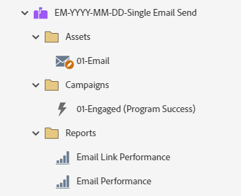

# EM-YYYY-MM-DD-シングルメール送信 {#em-yyyy-mm-dd-single-email-send}

この例では、Marketo Engage メールプログラムを使用して 1 つのメールを送信します。 メールには、A/B テストを含めることも、含めないこともできます。

詳細な方法に関するサポートや、プログラムのカスタマイズに関するヘルプについては、Adobe アカウントチームに問い合わせるか、[Adobe Professional Services](https://business.adobe.com/customers/consulting-services/main.html){target="_blank"} のページを参照してください。

## チャネルサマリ {#channel-summary}

<table style="table-layout:auto">
 <tbody>
  <tr>
   <th>チャネル</th>
   <th>メンバーシップのステータス</th>
   <th>アナリティクス動作</th>
   <th>プログラムのタイプ</th>
  </tr>
  <tr>
   <td>メール</td>
   <td>01 – メンバー
 02-Engaged-Success</td>
   <td>包含</td>
   <td>メール</td>
  </tr>
 </tbody>
</table>

## プログラムには、次のAssetsが含まれています {#program-contains-the-following-assets}

<table style="table-layout:auto">
 <tbody>
  <tr>
   <th>タイプ</th>
   <th>テンプレート名</th>
   <th>アセット名</th>
  </tr>
  <tr>
   <td>メール</td>
   <td><a href="/help/marketo/product-docs/core-marketo-concepts/programs/program-library/quick-start-email-template.md" target="_blank">クイックスタートメールテンプレート</a></td>
   <td>01-Email-Thank You</td>
  </tr>
  <tr>
   <td>ローカル報告書</td>
   <td> </td>
   <td>メールの効果</td>
  </tr>
  <tr>
   <td>ローカル報告書</td>
   <td> </td>
   <td>メールリンクの効果</td>
  </tr>
  <tr>
  <tr>
   <td>スマートキャンペーン</td>
   <td> </td>
   <td>01 – エンゲージメント （プログラム成功）</td>
  </tr>
  <tr>
   <td>フォルダー</td>
   <td> </td>
   <td>Assets – すべてのクリエイティブアセットが格納されています
  （メールおよびランディングページ用のサブフォルダー）  </td>
  </tr>
  <tr>
   <td>フォルダー</td>
   <td> </td>
   <td>キャンペーン – すべてのスマートキャンペーンを格納します。</td>
  </tr>
  <tr>
   <td>フォルダー</td>
   <td> </td>
   <td>レポート</td>
  </tr>
 </tbody>
</table>

## 含まれるマイトークン {#my-tokens-included}

<table style="table-layout:auto">
 <tbody>
  <tr>
   <th>トークンのタイプ</th>
   <th>トークン名</th>
   <th>値</th>
  </tr>
  <tr>
   <td>テキスト</td>
   <td><code>{{my.Email-FromAddress}}</code></td>
   <td>PlaceholderFrom.email@mydomain.com</td>
  </tr>
  <tr>
   <td>テキスト</td>
   <td><code>{{my.Email-FromName}}</code></td>
   <td><code><--My From Name Here--></code></td>
  </tr>
  <tr>
   <td>テキスト</td>
   <td><code>{{my.Email-ReplyToAddress}}</code></td>
   <td>reply-to.email@mydomain.com</td>
  </tr>
 </tbody>
</table>

## 競合ルール {#conflict-rules}

* **プログラムタグ**
   * このサブスクリプションにタグを作成 – _推奨_
   * 無視

* **同じ名前のランディングページテンプレート**
   * 元のテンプレートのコピー
   * 宛先テンプレートの使用 – _推奨_

* **同じ名前の画像**
   * どちらのファイルも保持する
   * このサブスクリプションの項目を置き換える – _推奨_

* **同じ名前のメールテンプレート**
   * どちらのテンプレートも保持する
   * 既存のテンプレートを置換 – _推奨_

## ベストプラクティス {#best-practices}

* 読み込んだプログラムでテンプレートを更新して現在のブランドのテンプレートを利用するか、スニペットまたは適切なロゴ/フッター情報を追加して、新しく読み込んだテンプレートを更新し、ブランドを反映させることを検討してください。

* 命名規則に合わせて、このプログラムの例の命名規則を更新することを検討してください。

>[!NOTE]
>
>必要に応じて、プログラムテンプレートとプログラムを使用するたびにマイトークン値を必ず更新してください。

>[!TIP]
>
>成功トラッキングのために、「01-Engaged」キャンペーンをアクティブ化することを忘れないでください。 フォームがライブになり、メールが送信される _前に_ これを行います。
