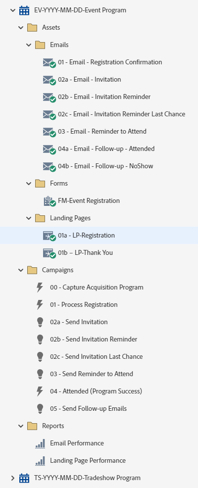

# EV-YYYY-MM-DD-イベントプログラム {#ev-yyyy-mm-dd-event-program}

これは、登録ページ、3通の招待状、Marketo Engageイベントプログラムを活用したフォローアップメールを含むイベントプログラムの例です。 ロードショー、ランチ、ディナー、展示会でのプレゼンテーションなど、登録が必要なすべてのイベントに適しています。

詳しい戦略支援またはプログラムのカスタマイズについては、Adobe アカウントチームにお問い合わせいただくか、[Adobe Professional Services](https://business.adobe.com/jp/customers/consulting-services/main.html){target="_blank"} ページをご覧ください。

## チャネルサマリ {#channel-summary}

<table style="table-layout:auto">
 <tbody>
  <tr>
   <th>チャネル</th>
   <th>メンバーシップステータス</th>
   <th>アナリティクス動作</th>
   <th>プログラムのタイプ</th>
  </tr>
  <tr>
   <td>イベント</td>
   <td>01招待
 02 – キャンセル待ち
 03-Registered
 04 – 表示なし
 05-Attended-Success</td>
   <td>包含</td>
   <td>イベント</td>
  </tr>
 </tbody>
</table>

## プログラムには、次のAssetsが含まれています {#program-contains-the-following-assets}

<table style="table-layout:auto">
 <tbody>
  <tr>
   <th>タイプ</th>
   <th>テンプレート名</th>
   <th>アセット名</th>
  </tr>
  <tr>
   <td>メール</td>
   <td><a href="/help/marketo/product-docs/core-marketo-concepts/programs/program-library/quick-start-email-template.md" target="_blank">クイックスタートメールテンプレート</a></td>
   <td>01-Email-Thank You</td>
  </tr>
   <tr>
   <td>メール</td>
   <td><a href="/help/marketo/product-docs/core-marketo-concepts/programs/program-library/quick-start-email-template.md" target="_blank">クイックスタートメールテンプレート</a></td>
   <td>02a- メール – 招待</td>
  </tr>
  <tr>
   <td>メール</td>
   <td><a href="/help/marketo/product-docs/core-marketo-concepts/programs/program-library/quick-start-email-template.md" target="_blank">クイックスタートメールテンプレート</a></td>
   <td>02b - メール – 招待リマインダー</td>
  </tr>
  <tr>
   <td>メール</td>
   <td><a href="/help/marketo/product-docs/core-marketo-concepts/programs/program-library/quick-start-email-template.md" target="_blank">クイックスタートメールテンプレート</a></td>
   <td>02c - メール – 招待リマインダーの最後のチャンス</td>
  </tr>
  <tr>
   <td>メール</td>
   <td><a href="/help/marketo/product-docs/core-marketo-concepts/programs/program-library/quick-start-email-template.md" target="_blank">クイックスタートメールテンプレート</a></td>
   <td>03 – 電子メール – 出席のリマインダー</td>
  </tr>
  <tr>
   <td>メール</td>
   <td><a href="/help/marketo/product-docs/core-marketo-concepts/programs/program-library/quick-start-email-template.md" target="_blank">クイックスタートメールテンプレート</a></td>
   <td>04a - メール – フォローアップ – 出席</td>
  </tr>
  <tr>
   <td>メール</td>
   <td><a href="/help/marketo/product-docs/core-marketo-concepts/programs/program-library/quick-start-email-template.md" target="_blank">クイックスタートメールテンプレート</a></td>
   <td>04b - メール – フォローアップ - NoShow</td>
  </tr>
  <tr>
   <td>ランディングページ</td>
   <td><a href="/help/marketo/product-docs/core-marketo-concepts/programs/program-library/quick-start-landing-page-template.md" target="_blank">クイックスタート LP テンプレート</a></td>
   <td>01a - LP – 登録</td>
  </tr>
  <tr>
   <td>ランディングページ</td>
   <td><a href="/help/marketo/product-docs/core-marketo-concepts/programs/program-library/quick-start-landing-page-template.md" target="_blank">クイックスタート LP テンプレート</a></td>
   <td>01b - LP – ありがとうございます</td>
  </tr>
  <tr>
   <td>Form</td>
   <td> </td>
   <td>FM-Event登録</td>
  </tr>
  <tr>
   <td>ローカルレポート</td>
   <td> </td>
   <td>メールの効果</td>
  </tr>
  <tr>
   <td>ローカルレポート</td>
   <td> </td>
   <td>ランディングページの効果</td>
  </tr>
  <tr>
   <td>スマートキャンペーン</td>
   <td> </td>
   <td>00 - キャプチャ取得プログラム</td>
  </tr>
  <tr>
   <td>スマートキャンペーン</td>
   <td> </td>
   <td>01 - プロセス登録</td>
  </tr>
   <tr>
   <td>スマートキャンペーン</td>
   <td> </td>
   <td>02a – 招待を送信</td>
  </tr>
   <tr>
   <td>スマートキャンペーン</td>
   <td> </td>
   <td>02b – 招待リマインダーを送信</td>
  </tr>
   <tr>
   <td>スマートキャンペーン</td>
   <td> </td>
   <td>02c – 招待状の最終回を送信</td>
  </tr>
   <tr>
   <td>スマートキャンペーン</td>
   <td> </td>
   <td>03 – 参加リマインダーを送信</td>
  </tr>
   <tr>
   <td>スマートキャンペーン</td>
   <td> </td>
   <td>04 – 参加済み（プログラムの成功）</td>
  </tr>
   <tr>
   <td>スマートキャンペーン</td>
   <td> </td>
   <td>05 - フォローアップメールの送信</td>
  </tr>
  <tr>
   <td>フォルダー</td>
   <td> </td>
   <td>Assets – すべてのクリエイティブアセットを格納
  （メールとランディングページのサブフォルダー）</td>
  </tr>
  <tr>
   <td>フォルダー</td>
   <td> </td>
   <td>Campaigns – すべてのスマートキャンペーンを格納</td>
  </tr>
  <tr>
   <td>フォルダー</td>
   <td> </td>
   <td>レポート</td>
  </tr>
 </tbody>
</table>

## マイトークンが含まれています {#my-tokens-included}

<table style="table-layout:auto">
 <tbody>
  <tr>
   <th>トークンのタイプ</th>
   <th>トークン名</th>
   <th>値</th>
  </tr>
  <tr>
   <td>カレンダーファイル</td>
   <td><code>{{my.AddToCalendar}}</code></td>
   <td>ダブルクリックして詳細を表示</td>
  </tr>
  <tr>
   <td>テキスト</td>
   <td><code>{{my.Email-FromAddress}}</code></td>
   <td>PlaceholderFrom.email@mydomain.com</td>
  </tr>
  <tr>
   <td>テキスト</td>
   <td><code>{{my.Email-FromName}}</code></td>
   <td><code><--My From Name Here--></code></td>
  </tr>
  <tr>
   <td>テキスト</td>
   <td><code>{{my.Email-ReplyToAddress}}</code></td>
   <td>reply-to.email@mydomain.com</td>
  </tr>
  <tr>
   <td>テキスト</td>
   <td><code>{{my.Event-Date}}</code></td>
   <td><code><--My Event Date--></code></td>
  </tr>
   <tr>
   <td>リッチテキスト</td>
   <td><code>{{my.Content-Description}}</code></td>
   <td>詳細はダブルクリック
 <code><--My Content Description Here--></code>
 このコンテンツの説明をプログラムレベルの「マイトークン」タブで編集します。
 次の項目について学習します。
<li>箇条書き1</li>
<li>箇条書き2</li>
<li>箇条書き3</li></td>
  </tr>
  <tr>
   <td>テキスト</td>
   <td><code>{{my.Event-Location-Line1}}</code></td>
   <td><code><--XYZ Hotel--></code></td>
  </tr>
   <tr>
   <td>テキスト</td>
   <td><code>{{my.Event-Location-Line2}}</code></td>
   <td><code><--ABC Room--></code></td>
  </tr>
   <tr>
   <td>テキスト</td>
   <td><code>{{my.Event-Location-Line3}}</code></td>
   <td><code><--1234 Anystreet--></code></td>
  </tr>
  <tr>
   <td>テキスト</td>
   <td><code>{{my.Event-Location-Line4}}</code></td>
   <td><code><--Anytown, ZZ 99999--></code></td>
  </tr>
  <tr>
   <td>テキスト</td>
   <td><code>{{my.Event-Time}}</code></td>
   <td><code><--My Event Time + TimeZone--></code></td>
  </tr>
  <tr>
   <td>テキスト</td>
   <td><code>{{my.Event-Title}}</code></td>
   <td><code><--My Event Title Here--></code></td>
  </tr>
  <tr>
   <td>テキスト</td>
   <td><code>{{my.Event-Type}}</code></td>
   <td>ライブイベント</td>
  </tr>
  <tr>
   <td>テキスト</td>
   <td><code>{{my.PageURL-Download}}</code></td>
   <td>my.DownloadURL?without=http://</td>
  </tr>
  <tr>
   <td>テキスト</td>
   <td><code>{{my.PageURL-Registration}}</code></td>
   <td>my.RegistrationPageURL?without=http://</td>
  </tr>
  <tr>
   <td>テキスト</td>
   <td><code>{{my.PageURL-ThankYou}}</code></td>
   <td>my.ThankYouPageURL?without=http://</td>
  </tr>
  <tr>
   <td>テキスト</td>
   <td><code>{{my.Speaker1-Name}}</code></td>
   <td><code><--Speaker Name Here--></code></td>
  </tr>
  <tr>
   <td>テキスト</td>
   <td><code>{{my.Speaker1-Title}}</code></td>
   <td><code><--Speaker Title Here--></code></td>
  </tr>
  <tr>
   <td>テキスト</td>
   <td><code>{{my.Speaker2-Name}}</code></td>
   <td><code><--Speaker Name Here--></code></td>
  </tr>
  <tr>
   <td>テキスト</td>
   <td><code>{{my.Speaker2-Title}}</code></td>
   <td><code><--Speaker Title Here--></code></td>
  </tr>
  <tr>
   <td>テキスト</td>
   <td><code>{{my.Speaker3-Name}}</code></td>
   <td><code><--Speaker Name Here--></code></td>
  </tr>
 <tr>
   <td>テキスト</td>
   <td><code>{{my.Speaker3-Title}}</code></td>
   <td><code><--Speaker Title Here--></code></td>
  </tr>
 </tbody>
</table>

## 競合ルール {#conflict-rules}

* **プログラムタグ**
   * このサブスクリプションでタグを作成 – _おすすめ_
   * 無視

* **同じ名前のランディングページテンプレート**
   * 元のテンプレートのコピー
   * 宛先テンプレートを使用 – _おすすめ_

* **同じ名前の画像**
   * どちらのファイルも保持する
   * このサブスクリプションのアイテムを置き換える – _推奨_

* **同じ名前のメールテンプレート**
   * どちらのテンプレートも保持する
   * 既存のテンプレートを置き換える – _推奨_

## ベストプラクティス {#best-practices}

* ウェビナープログラムを読み込んだら、フォームをローカルアセットからDesign Studioにあるグローバルアセットに移動します。
   * フォーム数を減らし、Design Studioからより多くのグローバルアセットを活用することで、プログラムの設計と管理ガバナンスにおいて、よりスケーラビリティを高めることができます。 また、フィールドやオプトイン言語など、定期的なコンプライアンス更新の柔軟性も提供します。

* インポートしたプログラムのテンプレートを更新して、現在ブランド化されているテンプレートを利用するか、新しくインポートしたテンプレートを更新して、スニペットや適切なロゴ/フッター情報を追加することで、ブランドを反映させることを検討してください。

* 命名規則に合わせて、このプログラムの例の命名規則を更新することを検討してください。

>[!NOTE]
>
>必要に応じて、プログラムテンプレートおよびプログラムを使用するたびに、マイトークン値を更新することを忘れないでください。

>[!TIP]
>
>フォームがライブになり、メールが送信される前に成功を追跡するために、「06-Attended （Program Success）」キャンペーンをアクティブにします。

>[!IMPORTANT]
>
>URLを参照するマイトークンにhttp://またはhttps://を含めることはできません。そうしないと、アセット内でリンクが適切に機能しません。
