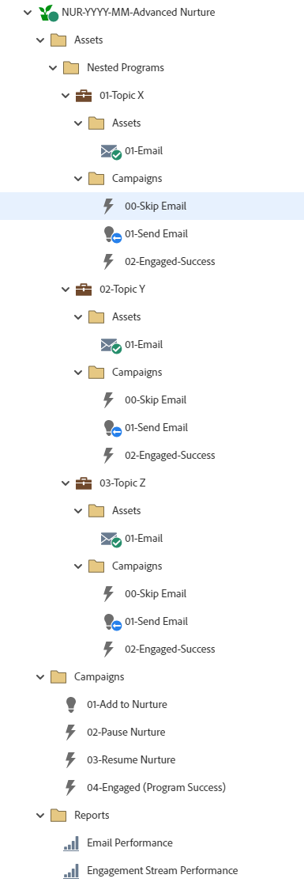

# NUR-YYYY-MM-高度な育成 {#nur-yyyy-mm-advanced-nurture}

ここでは、Marketo Engageエンゲージメントプログラムを活用した高度なナーチャリングプログラムの例を紹介します。 ネストされたメールプログラムは、利用者が既に利用したコンテンツを受信することを防ぎ、各ストリームで利用するコンテンツの種類を制御します。 アトリビューションレポートは、ネストされた各メールプログラムに対して実行できます。 チャネル：「ナーチャリング」と、ネストされたメールプログラム専用の「ナーチャリングメール」チャネルは、Marketo Engage メールプログラムを使用して1つのニュースレターメールを送信します。 メールには、A/B テストを含めることも、含めないこともできます。

詳しい戦略支援またはプログラムのカスタマイズについては、Adobe アカウントチームにお問い合わせいただくか、[Adobe Professional Services](https://business.adobe.com/jp/customers/consulting-services/main.html){target="_blank"} ページをご覧ください。

## チャネルサマリ {#channel-summary}

<table style="table-layout:auto">
 <tbody>
  <tr>
   <th>チャネル</th>
   <th>メンバーシップステータス</th>
   <th>アナリティクス動作</th>
   <th>プログラムのタイプ</th>
  </tr>
  <tr>
   <td>ナーチャリング</td>
   <td>01 - メンバー
 02 - エンゲージ – 成功</td>
   <td>包含</td>
   <td>エンゲージメント</td>
  </tr>
  <tr>
   <td>ナーチャリングメール</td>
   <td>01 - スキップ
 02 – 送信
 03 - エンゲージ – 成功</td>
   <td>包含</td>
   <td>デフォルト</td>
  </tr>
 </tbody>
</table>

## プログラムには、次のAssetsが含まれています {#program-contains-the-following-assets}

<table style="table-layout:auto">
 <tbody>
  <tr>
   <th>タイプ</th>
   <th>テンプレート名</th>
   <th>アセット名</th>
  </tr>
   <tr>
   <td>ネストされたプログラム</td>
   <td> </td>
   <td>01 - トピック X</td>
  </tr>
  <tr>
   <td>ネストされたプログラム</td>
   <td> </td>
   <td>02 - トピック Y</td>
  </tr>
  <tr>
   <td>ネストされたプログラム</td>
   <td> </td>
   <td>03 - トピック Z</td>
  </tr>
  <tr>
   <td>メール</td>
   <td><a href="/help/marketo/product-docs/core-marketo-concepts/programs/program-library/quick-start-email-template.md" target="_blank">クイックスタートメールテンプレート</a></td>
   <td>01 – 電子メール（ネストされたプログラムでライブ）</td>
  </tr>
   <tr>
   <td>メール</td>
   <td><a href="/help/marketo/product-docs/core-marketo-concepts/programs/program-library/quick-start-email-template.md" target="_blank">クイックスタートメールテンプレート</a></td>
   <td>02 – 電子メール（ネストされたプログラムでライブ）</td>
  </tr>
   <tr>
   <td>メール</td>
   <td><a href="/help/marketo/product-docs/core-marketo-concepts/programs/program-library/quick-start-email-template.md" target="_blank">クイックスタートメールテンプレート</a></td>
   <td>03 – 電子メール（ネストされたプログラムでライブ）</td>
  </tr>
  <tr>
   <td>ローカルレポート</td>
   <td> </td>
   <td>メールの効果</td>
  </tr>
  <tr>
   <td>ローカルレポート</td>
   <td> </td>
   <td>メールリンクの効果</td>
  </tr>
  <tr>
  <tr>
   <td>スマートキャンペーン</td>
   <td> </td>
   <td>01 - ナーチャリングに追加</td>
  </tr>
  <tr>
   <td>スマートキャンペーン</td>
   <td> </td>
   <td>02 - ナーチャリングを一時停止</td>
  </tr>
  <tr>
   <td>スマートキャンペーン</td>
   <td> </td>
   <td>03 - ナーチャリングの再開</td>
  </tr>
  <tr>
   <td>スマートキャンペーン</td>
   <td> </td>
   <td>04 - エンゲージメント（プログラムの成功）</td>
  </tr>
  <tr>
   <td>スマートキャンペーン</td>
   <td> </td>
   <td>00 - メールをスキップ （ネストされた各プログラムに配置）</td>
  </tr>
  <tr>
   <td>スマートキャンペーン</td>
   <td> </td>
   <td>01 - メールの送信（ネストされた各プログラムに配置）</td>
  </tr>
  <tr>
   <td>スマートキャンペーン</td>
   <td> </td>
   <td>02 - Engaged-Success （ネストされた各プログラムに配置）</td>
  </tr>
  <tr>
   <td>フォルダー</td>
   <td> </td>
   <td>Assets（ネストされたプログラムを含む）およびアセットフォルダーは、メールを含むネストされたプログラムにも存在します）</td>
  </tr>
  <tr>
   <td>フォルダー</td>
   <td> </td>
   <td>ネストされたプログラム（Assets フォルダーの下に存在）</td>
  </tr>
  <tr>
   <td>フォルダー</td>
   <td> </td>
   <td>キャンペーン – 親ナーチャリングプログラムのすべてのスマートキャンペーンとキャンペーンフォルダーも、ネストされた各プログラムに配置されます</td>
  </tr>
  <tr>
   <td>フォルダー</td>
   <td> </td>
   <td>レポート</td>
  </tr>
 </tbody>
</table>

## マイトークンが含まれています {#my-tokens-included}

<table style="table-layout:auto">
 <tbody>
  <tr>
   <th>トークンのタイプ</th>
   <th>トークン名</th>
   <th>値</th>
  </tr>
  <tr>
   <td>テキスト</td>
   <td><code>{{my.Email-FromAddress}}</code></td>
   <td>PlaceholderFrom.email@mydomain.com</td>
  </tr>
  <tr>
   <td>テキスト</td>
   <td><code>{{my.Email-FromName}}</code></td>
   <td><code><--My From Name Here--></code></td>
  </tr>
  <tr>
   <td>テキスト</td>
   <td><code>{{my.Email-ReplyToAddress}}</code></td>
   <td>reply-to.email@mydomain.com</td>
  </tr>
 </tbody>
</table>

## 競合ルール {#conflict-rules}

* **プログラムタグ**
   * このサブスクリプションでタグを作成 – _おすすめ_
   * 無視

* **同じ名前のランディングページテンプレート**
   * 元のテンプレートのコピー
   * 宛先テンプレートを使用 – _おすすめ_

* **同じ名前の画像**
   * どちらのファイルも保持する
   * このサブスクリプションのアイテムを置き換える – _推奨_

* **同じ名前のメールテンプレート**
   * どちらのテンプレートも保持する
   * 既存のテンプレートを置き換える – _推奨_

## ベストプラクティス {#best-practices}

* インポートしたプログラムのテンプレートを更新して、現在ブランド化されているテンプレートを利用するか、新しくインポートしたテンプレートを更新して、スニペットや適切なロゴ/フッター情報を追加することで、ブランドを反映させることを検討してください。

* 命名規則に合わせて、このプログラムの例の命名規則を更新することを検討してください。

* ナーチャリングの頻度を一時停止および再開するルールを設定していることを確認します。 これらのスマートキャンペーンは、エンゲージメントプログラムがアクティブ化される前に、アクティブ化またはスケジュール化する必要があります。

>[!NOTE]
>
>必要に応じて、プログラムテンプレートおよびプログラムを使用するたびに、マイトークン値を更新することを忘れないでください。

>[!TIP]
>
>メールが送信される前に、成功を追跡するために「04 - Engaged （Program Success）」キャンペーンをアクティブにします。
