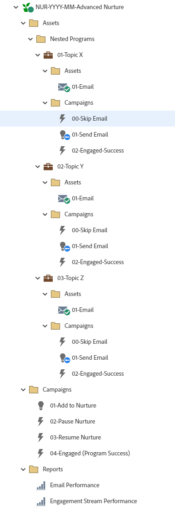

# NUR-YYYY-MM-Advanced Nurture {#nur-yyyy-mm-advanced-nurture}

これは、「育成エンゲージメントプログラム」を利用した高度な育成Marketo Engageの例です。 ネストされた電子メールプログラムは、既に消費したコンテンツを受け取ったり、各ストリームで消費するコンテンツのタイプを制御したりするのを防ぎます。 属性レポートは、ネストされた個々の電子メールプログラムに対して実行できます。 チャネル：「育成」と、ネストされたメールプログラム用の専用の「育成メール」チャネルは、Marketo Engageのメールプログラムを利用して 1 つのニュースレターメールを送信します。 A/B テストを含めるかどうかは電子メールに記載されます。

戦略に関するサポートやプログラムのカスタマイズについては、Adobeアカウントチームにお問い合わせいただくか、 [Adobe Professional Services](https://business.adobe.com/customers/consulting-services/main.html){target="_blank"} ページに貼り付けます。

## チャネルサマリ {#channel-summary}

<table style="table-layout:auto"> 
 <tbody> 
  <tr> 
   <th>チャネル</th> 
   <th>メンバーシップステータス</th>
   <th>アナリティクス動作</th>
   <th>プログラムのタイプ</th>
  </tr> 
  <tr> 
   <td>ナーチャリング</td> 
   <td>01 — メンバー 
 02 — 関与 — 成功</td>
   <td>包含</td>
   <td>エンゲージメント</td>
  </tr>
  <tr> 
   <td>育成メール</td> 
   <td>01 — スキップ 
 02 — 送信済み
 03 — エンゲージ済み — 成功</td>
   <td>包含</td>
   <td>デフォルト</td>
  </tr>
 </tbody> 
</table>

## プログラムに次のアセットが含まれています {#program-contains-the-following-assets}

<table style="table-layout:auto"> 
 <tbody> 
  <tr> 
   <th>タイプ</th> 
   <th>テンプレート名</th>
   <th>アセット名</th>
  </tr> 
   <tr> 
   <td>ネストされたプログラム</td> 
   <td> </td>
   <td>01 — トピック X</td>
  </tr>
  <tr> 
   <td>ネストされたプログラム</td> 
   <td> </td>
   <td>02 — トピック Y</td>
  </tr>
  <tr> 
   <td>ネストされたプログラム</td> 
   <td> </td>
   <td>03 — トピック Z</td>
  </tr>
  <tr> 
   <td>メール</td> 
   <td><a href="/help/marketo/product-docs/core-marketo-concepts/programs/program-library/quick-start-email-template.md" target="_blank">クイックスタートメールテンプレート</a></td>
   <td>01 — 電子メール（ネストされたプログラムでライブ）</td>
  </tr>
   <tr> 
   <td>メール</td> 
   <td><a href="/help/marketo/product-docs/core-marketo-concepts/programs/program-library/quick-start-email-template.md" target="_blank">クイックスタートメールテンプレート</a></td>
   <td>02 — 電子メール（ネストされたプログラムでライブ）</td>
  </tr>
   <tr> 
   <td>メール</td> 
   <td><a href="/help/marketo/product-docs/core-marketo-concepts/programs/program-library/quick-start-email-template.md" target="_blank">クイックスタートメールテンプレート</a></td>
   <td>03 — 電子メール（ネストされたプログラムでライブ）</td>
  </tr>
  <tr> 
   <td>ローカルレポート</td> 
   <td> </td>
   <td>メールの効果</td>
  </tr>
  <tr> 
   <td>ローカルレポート</td> 
   <td> </td>
   <td>メールリンクの効果</td>
  </tr>
  <tr>
  <tr> 
   <td>スマートキャンペーン</td> 
   <td> </td>
   <td>01 — 育成に追加</td>
  </tr>
  <tr> 
   <td>スマートキャンペーン</td> 
   <td> </td>
   <td>02 — 育成の一時停止</td>
  </tr>
  <tr> 
   <td>スマートキャンペーン</td> 
   <td> </td>
   <td>03 — 育成の再開</td>
  </tr>
  <tr> 
   <td>スマートキャンペーン</td> 
   <td> </td>
   <td>04 — エンゲージ済み（プログラム成功）</td>
  </tr>
  <tr> 
   <td>スマートキャンペーン</td> 
   <td> </td>
   <td>00 — メールをスキップ（ネストされた各プログラム内）</td>
  </tr>
  <tr> 
   <td>スマートキャンペーン</td> 
   <td> </td>
   <td>01 — メールを送信（ネストされた各プログラム内）</td>
  </tr>
  <tr> 
   <td>スマートキャンペーン</td> 
   <td> </td>
   <td>02 — エンゲージ成功（ネストされた各プログラム内）</td>
  </tr>
  <tr> 
   <td>フォルダー</td> 
   <td> </td>
   <td>アセット（ネストされたプログラムおよびアセットフォルダーを含む）は、E メールを含むネストされたプログラムにも存在します。</td>
  </tr>
  <tr> 
   <td>フォルダー</td> 
   <td> </td>
   <td>ネストされたプログラム（Assets フォルダーの下に存在）</td>
  </tr>
  <tr> 
   <td>フォルダー</td> 
   <td> </td>
   <td>キャンペーン — すべてのスマートキャンペーンを親育成プログラムに格納し、キャンペーンフォルダも各ネストされたプログラムに配置されます</td>
  </tr>
  <tr> 
   <td>フォルダー</td> 
   <td> </td>
   <td>レポート</td>
  </tr>
 </tbody> 
</table>

## 含まれるマイトークン {#my-tokens-included}

<table style="table-layout:auto"> 
 <tbody> 
  <tr> 
   <th>トークンのタイプ</th> 
   <th>トークン名</th>
   <th>値</th>
  </tr>
  <tr> 
   <td>テキスト</td> 
   <td><code>{{my.Email-FromAddress}}</code></td>
   <td>PlaceholderFrom.email@mydomain.com</td>
  </tr>
  <tr> 
   <td>テキスト</td> 
   <td><code>{{my.Email-FromName}}</code></td>
   <td><code><--My From Name Here--></code></td>
  </tr>
  <tr> 
   <td>テキスト</td> 
   <td><code>{{my.Email-ReplyToAddress}}</code></td>
   <td>reply-to.email@mydomain.com</td>
  </tr>
 </tbody> 
</table>

## 競合ルール {#conflict-rules}

* **プログラムタグ**
   * この配信登録にタグを作成 — _推奨_
   * 無視する

* **同じ名前のランディングページテンプレート**
   * 元のテンプレートのコピー
   * インポート先のテンプレートの使用 - _推奨_

* **同じ名前の画像**
   * どちらのファイルも保持する
   * この配信登録内アイテムの置換 - _推奨_

* **同じ名前のメールテンプレート**
   * どちらのテンプレートも保持する
   * 既存のテンプレートを置換 — _推奨_

## ベストプラクティス {#best-practices}

* 現在ブランド化されているテンプレートを利用するには、読み込んだプログラムでテンプレートを更新することを検討するか、スニペットまたは適切なロゴ/フッター情報を追加して、新しく読み込んだテンプレートをブランドに合わせて更新します。

* 命名規則に合わせて、このプログラム例の命名規則を更新することを検討してください。

* 育成ケイデンスを一時停止し、再開するためのルールが整っていることを確認します。 エンゲージメントプログラムがアクティブ化される前に、これらのスマートキャンペーンをアクティブ化するか、スケジュールする必要があります。

>[!NOTE]
>
>必要に応じて、プログラムテンプレートのマイトークンの値を更新し、プログラムを使用するたびに値を更新してください。

>[!TIP]
>
>成功を追跡するための「04 — エンゲージ済み（プログラム成功）」キャンペーンを忘れずに有効化してください。 これを実行 _前_ メールが送信されます。
