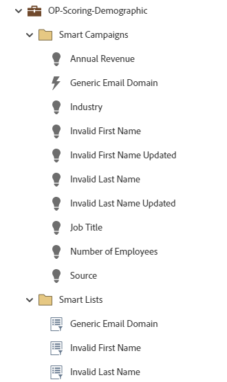

# OP-スコアリング-デモグラフィック {#op-scoring-demographic}

これは、デモグラフィックスコアリングにMarketo Engageのデフォルトプログラムを活用した、高度な（トークン化された）運用プログラムの例です。 プログラムの「マイトークン」タブでスコアリング値を表示および編集します。 「デモグラフィックスコア」というカスタムスコアフィールドが必要です。

詳しい戦略支援またはプログラムのカスタマイズについては、Adobe アカウントチームにお問い合わせいただくか、[Adobe Professional Services](https://business.adobe.com/jp/customers/consulting-services/main.html){target="_blank"} ページをご覧ください。

## チャネルサマリ {#channel-summary}

<table style="table-layout:auto">
 <tbody>
  <tr>
   <th>チャネル</th>
   <th>メンバーシップステータス</th>
   <th>アナリティクス動作</th>
   <th>プログラムのタイプ</th>
  </tr>
  <tr>
   <td>オペレーショナル</td>
   <td>01 - メンバー</td>
   <td>オペレーショナル</td>
   <td>デフォルト</td>
  </tr>
 </tbody>
</table>

## 前提条件フィールド {#prerequisite-fields}

<table style="table-layout:auto">
 <tbody>
  <tr>
   <th>タイプ</th>
   <th>フレンドリ名</th>
   <th>API 名</th>
  </tr>
  <tr>
   <td>スコア</td>
   <td>デモグラフィックスコア</td>
   <td>DemographicScore</td>
  </tr>
 </tbody>
</table>

## プログラムには、次のAssetsが含まれています {#program-contains-the-following-assets}

<table style="table-layout:auto">
 <tbody>
  <tr>
   <th>タイプ</th>
   <th>テンプレート名</th>
   <th>アセット名</th>
  </tr>
  <tr>
   <td>スマートキャンペーン</td>
   <td> </td>
   <td>汎用メールドメイン</td>
  </tr>
  <tr>
   <td>スマートキャンペーン</td>
   <td> </td>
   <td>名が無効です</td>
  </tr>
  <tr>
   <td>スマートキャンペーン</td>
   <td> </td>
   <td>無効な名が更新されました</td>
  </tr>
  <tr>
   <td>スマートキャンペーン</td>
   <td> </td>
   <td>姓が無効です</td>
  </tr>
  <tr>
   <td>スマートキャンペーン</td>
   <td> </td>
   <td>更新された姓が無効です</td>
  </tr>
  <tr>
   <td>スマートキャンペーン</td>
   <td> </td>
   <td>年間売上高</td>
  </tr>
  <tr>
   <td>スマートキャンペーン</td>
   <td> </td>
   <td>業界</td>
  </tr>
  <tr>
   <td>スマートキャンペーン</td>
   <td> </td>
   <td>役職</td>
  </tr>
  <tr>
   <td>スマートキャンペーン</td>
   <td> </td>
   <td>従業員数</td>
  </tr>
  <tr>
   <td>スマートキャンペーン</td>
   <td> </td>
   <td>ソース</td>
  </tr>
  <tr>
   <td>フォルダー</td>
   <td> </td>
   <td>汎用メールドメイン</td>
  </tr>
  <tr>
   <td>フォルダー</td>
   <td> </td>
   <td>名が無効です</td>
  </tr>
  <tr>
   <td>フォルダー</td>
   <td> </td>
   <td>姓が無効です</td>
  </tr>
 </tbody>
</table>

## マイトークンが含まれています {#my-tokens-included}

<table style="table-layout:auto">
 <tbody>
  <tr>
   <th>トークンのタイプ</th>
   <th>トークン名</th>
   <th>値</th>
  </tr>
  <tr>
   <td>スコア</td>
   <td><code>{{my.Annual Revenue - High}}</code></td>
   <td>+15</td>
  </tr>
  <tr>
   <td>スコア</td>
   <td><code>{{my.Annual Revenue - Low}}</code></td>
   <td>+5</td>
  </tr>
  <tr>
   <td>スコア</td>
   <td><code>{{my.Annual Revenue - Mid}}</code></td>
   <td>+10</td>
  </tr>
   <tr>
   <td>スコア</td>
   <td><code>{{my.Generic Email Domain}}</code></td>
   <td>-2</td>
  </tr>
  <tr>
   <td>スコア</td>
   <td><code>{{my.Industry - High}}</code></td>
   <td>+10</td>
  </tr>
  <tr>
   <td>スコア</td>
   <td><code>{{my.Industry - Low}}</code></td>
   <td>+6</td>
  </tr>
   <tr>
   <td>スコア</td>
   <td><code>{{my.Industry - Mid}}</code></td>
   <td>+8</td>
  </tr>
  <tr>
   <td>スコア</td>
   <td><code>{{my.Invalid First Name}}</code></td>
   <td>-5</td>
  </tr>
   <tr>
   <td>スコア</td>
   <td><code>{{my.Invalid First Name Updated}}</code></td>
   <td>+5</td>
  </tr>
  <tr>
   <td>スコア</td>
   <td><code>{{my.Invalid Last Name}}</code></td>
   <td>-5</td>
  </tr>
  <tr>
   <td>スコア</td>
   <td><code>{{my.Invalid Last Name Updated}}</code></td>
   <td>+5</td>
  </tr>
  <tr>
   <td>スコア</td>
   <td><code>{{my.Job Title - High}}</code></td>
   <td>+15</td>
  </tr>
   <tr>
   <td>スコア</td>
   <td><code>{{my.Job Title - Low}}</code></td>
   <td>+5</td>
  </tr>
  <tr>
   <td>スコア</td>
   <td><code>{{my.Job Title - Mid}}</code></td>
   <td>+10</td>
  </tr>
  <tr>
   <td>スコア</td>
   <td><code>{{my.Lead Source - High}}</code></td>
   <td>+20</td>
  </tr>
  <tr>
   <td>スコア</td>
   <td><code>{{my.Lead Source - Low}}</code></td>
   <td>+8</td>
  </tr>
  <tr>
   <td>スコア</td>
   <td><code>{{my.Lead Source - Mid}}</code></td>
   <td>+10</td>
  </tr>
  <tr>
   <td>スコア</td>
   <td><code>{{my.Number of Employees}}</code></td>
   <td>+5</td>
  </tr>
 </tbody>
</table>

## 競合ルール {#conflict-rules}

* **プログラムタグ**
   * このサブスクリプションでタグを作成 – _おすすめ_
   * 無視

* **同じ名前のランディングページテンプレート**
   * 元のテンプレートをコピー – _おすすめ_
   * インポート先のテンプレートの使用

* **同じ名前の画像**
   * 両方のファイルを保持 – _推奨_
   * このサブスクリプション内アイテムの置換

* **同じ名前のメールテンプレート**
   * 両方のテンプレートを保持 – _推奨_
   * 既存テンプレートの置換

## ベストプラクティス {#best-practices}

* 構築された各キャンペーンは、ユースケースに特化したものではなく、ベストプラクティスの構築の例となることを目的としています。 そのため、特定の課題やデータの課題に対処するために、スマートキャンペーンを忘れずに更新する必要があります。

* 命名規則に合わせて、このプログラムの例の命名規則を更新することを検討してください。
