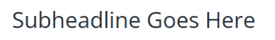
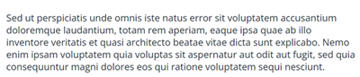
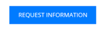
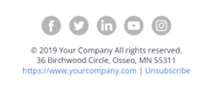

# クイックスタートメールテンプレート {#quick-start-email-template}

Marketo Engageリファレンスライブラリの一部のスタータープログラムには、シンプルで使いやすく、カスタマイズ可能なメールテンプレートが含まれており、さまざまなマーケティングのユースケースをまたいで、すばやくメールを作成できます。

Marketo Engageのメールエディターには、メールのレイアウトを変更したり、内容を編集したりするのに役立つ機能が搭載されています。

* **モジュール**: テンプレートにコード化された、ドラッグ可能/ドロップ可能なコンテンツブロック。 これらは再整理したり、複製したりできます。

* **テキスト要素**: エディターを使用して、コピーの更新、フォントスタイルの変更、リンクの追加を行うことができます。

* **画像要素**: テキスト要素と同様に、画像をスワップ アウト、リンク、サイズ変更できます。

* **変数**: モジュールを選択すると、変数がエディターの右側に表示されます。 これらは、画像またはテキスト要素を使用して簡単に編集できないモジュールの属性を調整するために使用できます。

詳しい戦略支援またはプログラムのカスタマイズに関するヘルプについては、Adobe アカウントチームにお問い合わせいただくか、[Adobe Professional Services](https://business.adobe.com/customers/consulting-services/main.html){target="_blank"} ページをご覧ください。

## モジュールの概要 {#modules-summary}

### ロゴモジュール {#logo-module}

* ロゴを更新するための画像要素が含まれています
* 制御する変数が含まれます。
   * モジュールの先頭パディング
   * モジュールの下部のパディング
   * モジュールの背景色
   * ロゴの整列
* 

### 画像モジュール {#image-module}

* 画像を更新する画像要素が含まれます
* 制御する変数が含まれます。
   * モジュールの先頭パディング
   * モジュールの下部のパディング
   * モジュールの背景色
* 

### Headline Module {#headline-module}

* 見出しを更新するテキスト要素が含まれています
* 制御する変数が含まれます。
   * モジュールの先頭パディング
   * モジュールの下部のパディング
   * モジュールの背景色
   * 見出しのフォントサイズ（リッチテキストエディターでも編集可能）
   * 見出しのフォントカラー（リッチテキストエディターでも編集可能）
   * 見出しテキストの整列（リッチテキストエディターでも編集可能）
* 

### 小見出しモジュール {#subheadline-module}

* 小見出しを更新するテキスト要素が含まれます
* 制御する変数が含まれます。
   * モジュールの先頭パディング
   * モジュールの下部のパディング
   * モジュールの背景色
   * 小見出しのフォントサイズ（リッチテキストエディターでも編集可能）
   * 小見出しのフォントカラー（リッチテキストエディターでも編集可能）
   * 小見出しテキストの整列（リッチテキストエディターでも編集可能）
* 

### 無料テキストモジュール {#free-text-module}

* テキスト要素を含めてテキストを更新します
* 制御する変数が含まれます。
   * モジュールの先頭パディング
   * モジュールの下部のパディング
   * モジュールの背景色
   * テキストのフォントサイズ（リッチテキストエディターでも編集可能）
   * テキストのフォントカラー（リッチテキストエディターでも編集可能）
   * テキストの整列（リッチテキストエディターでも編集可能）
* 

### CTA Module {#cta-module}

* 制御する変数が含まれます。
   * モジュールの先頭パディング
   * モジュールの下部のパディング
   * モジュールの背景色
   * CTAのテキストカラー
   * CTAの背景色
   * CTAの境界線カラー
   * CTAの境界線の半径（ボタンを丸くする場合 – **注意**：この機能はMicrosoft Outlook メールクライアントでは機能しません）
   * CTA URL
   * CTA text
   * CTAとの連携
* 

### ディバイダモジュール {#divider-module}

* 制御する変数が含まれます。
   * モジュールの先頭パディング
   * モジュールの下部のパディング
   * モジュールの背景色
   * 区切りカラー
   * 区切り記号の高さ（ピクセル単位）
   * 区切り線の幅（%）
* 

### フッターモジュール {#footer-module}

* ソーシャルアイコンのスワップまたはリンクに使用できるテキスト要素
* フッター言語を更新するテキスト要素
* 制御する変数が含まれます。
   * モジュールの先頭パディング
   * モジュールの下部のパディング
   * モジュールの背景色
   * テキストカラー
   * コンテンツの調整
* 
