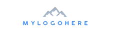

# クイックスタートメールテンプレート {#quick-start-email-template}

Marketo Engageリファレンスライブラリの一部のスタータープログラムには、シンプルで使いやすくカスタマイズ可能なメールテンプレートが含まれており、様々なマーケティングのユースケースにわたってメールを素早く作成できます。

Marketo Engageのメールエディターには、レイアウトを変更し、メールのコンテンツを編集するのに役立つ機能が備わっています。

* **モジュール**：テンプレートにコード化される、ドラッグ可能/ドロップ可能なコンテンツブロック。 再編成や複製が可能です。

* **テキスト要素**：エディターを使用して、コピーの更新、フォントスタイルの変更、リンクの追加を行うことができます。

* **画像要素**：テキスト要素と同様に、画像の入れ替え、リンク、サイズ変更を行うことができます。

* **変数**：モジュールを選択すると、エディターの右側に変数が表示されます。 これらは、画像やテキスト要素を使用して簡単に編集できないモジュールの属性を調整するために使用できます。

詳細な手順に関するサポートやプログラムのカスタマイズについては、Adobeアカウントチームに問い合わせるか、[Adobe Professional Services](https://business.adobe.com/customers/consulting-services/main.html){target="_blank"} のページを参照してください。

## モジュールの概要 {#modules-summary}

### ロゴ モジュール {#logo-module}

* ロゴを更新するための画像要素が含まれています
* 次の項目を制御する変数が含まれます。
   * モジュールの上部のパディング
   * モジュールの下のパディング
   * モジュールの背景色
   * ロゴの配置
* 

### 画像モジュール {#image-module}

* 画像を更新するための画像要素が含まれます
* 次の項目を制御する変数が含まれます。
   * モジュールの上部のパディング
   * モジュールの下のパディング
   * モジュールの背景色
* 

### ヘッドライン モジュール {#headline-module}

* ヘッドラインを更新するテキスト要素を含みます
* 次の項目を制御する変数が含まれます。
   * モジュールの上部のパディング
   * モジュールの下のパディング
   * モジュールの背景色
   * ヘッドラインのフォントサイズ （リッチテキストエディターでも編集できます）
   * ヘッドラインのフォントカラー（リッチテキストエディターでも編集できます）
   * 見出しテキストの配置（リッチテキストエディターで編集することもできます）
* 

### サブ見出しモジュール {#subheadline-module}

* サブ見出しを更新するテキスト要素を含みます
* 次の項目を制御する変数が含まれます。
   * モジュールの上部のパディング
   * モジュールの下のパディング
   * モジュールの背景色
   * サブヘッドラインのフォントサイズ （リッチテキストエディターでも編集できます）
   * サブ見出しのフォントカラー（リッチテキストエディターでも編集できます）
   * サブ見出しテキストの配置（これはリッチテキストエディターでも編集できます）
* 

### フリーテキスト モジュール {#free-text-module}

* テキストを更新するテキスト要素を含みます
* 次の項目を制御する変数が含まれます。
   * モジュールの上部のパディング
   * モジュールの下のパディング
   * モジュールの背景色
   * テキストのフォントサイズ （リッチテキストエディターでも編集できます）
   * テキストのフォントカラー（リッチテキストエディターでも編集できます）
   * テキストの配置（リッチテキストエディターで編集することもできます）
* 

### CTA モジュール {#cta-module}

* 次の項目を制御する変数が含まれます。
   * モジュールの上部のパディング
   * モジュールの下のパディング
   * モジュールの背景色
   * CTA テキストカラー
   * CTA の背景色
   * CTA 境界線のカラー
   * CTA 境界線の半径（ボタンを丸くする場合 – **注意**：この機能は、Microsoft Outlook メールクライアントでは機能しません）
   * CTA URL
   * CTA テキスト
   * CTA の整合性
* 

### ディバイダーモジュール {#divider-module}

* 次の項目を制御する変数が含まれます。
   * モジュールの上部のパディング
   * モジュールの下のパディング
   * モジュールの背景色
   * ディバイダーの色
   * ディバイダーの高さ（ピクセル単位）
   * ディバイダーの幅（%）
* 

### フッターモジュール {#footer-module}

* ソーシャルアイコンのスワップアウトまたはリンクに使用できるテキスト要素
* フッター言語を更新するテキスト要素
* 次の項目を制御する変数が含まれます。
   * モジュールの上部のパディング
   * モジュールの下のパディング
   * モジュールの背景色
   * テキストのカラー
   * コンテンツの整合性
* 
