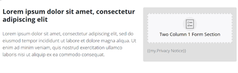

# クイックスタートランディングページテンプレート {#quick-start-landing-page-template}

Marketo Engageリファレンスライブラリの一部のスタータープログラムには、シンプルで使いやすくカスタマイズ可能なランディングページテンプレートが含まれており、様々なマーケティングユースケースにわたってランディングページをすばやく作成できます。

>[!TIP]
>
>詳しくは、[ ガイド付きランディングページテンプレート ](/help/marketo/product-docs/demand-generation/landing-pages/landing-page-templates/create-a-guided-landing-page-template.md){target="_blank"} を参照してください

詳細な手順に関するサポートやプログラムのカスタマイズについては、Adobeアカウントチームに問い合わせるか、[Adobe Professional Services](https://business.adobe.com/customers/consulting-services/main.html){target="_blank"} のページを参照してください。

## セクションの概要 {#sections-summary}

### ロゴセクション {#logo-section}

* 別の画像のロゴを入れ替えるための画像要素を含みます
* 編集する変数を含めます。
   * ロゴのサイズ
   * ロゴの配置
   * ロゴセクションの背景色
   * セクションを表示または非表示
   * セクションの上部パディング
   * セクションの下パディング
* 

### 画像セクション {#image-section}

* 別の画像のロゴを入れ替えるための画像要素を含みます
* 編集する変数を含めます。
   * バナー画像リンク
   * バナーの幅 – 右下のスイッチの 1 つを使用すると、コンテンツコンテナの幅またはブラウザー全体の幅のいずれかを指定して画像を作成できます
   * セクションを表示または非表示
* 

### 左側に 2 列のテキスト、右側にフォーム {#two-col-left-form-right}

* 見出しコピーを更新する見出しテキスト要素
* 段落コピーを更新する段落テキスト要素
* フォームに追加するフォーム要素
* プライバシーポリシーのテキストとリンクを編集するためのフォームのテキスト要素
* 編集する変数：
セクションの背景色
   * フォームのすぐ後ろの背景色
   * フォームの周りのボックスの境界線の半径（曲線のコーナーを持たせます。0 に設定した場合はコーナーの二乗になります）
   * セクション全体を表示または非表示にします
   * フォームのみを表示または非表示にします（フォームを非表示にすると、左列のテキストがページの幅に合わせて表示されます）。 これは、ありがとうページやフォームが存在しない確認ページに使用できます）。
   * プライバシーポリシーのテキストを表示または非表示にします
* 

### ビデオセクション {#video-section}

* 見出しテキストを更新するテキスト要素
* 編集する変数：
   * セクションの背景色
   * ビデオ埋め込みコード
   * ビデオのヘッドラインを表示/非表示
   * ビデオを表示/非表示
* 

### フッターセクション {#footer-section}

* 左列のコンテンツを編集するテキスト要素
* ソーシャルアイコンを更新するテキスト要素（アイコンは画像ではなく FontAwesome フォントを使用していますが、画像に置き換えることができます）。
* 編集する変数：
   * セクションの背景色
   * ソーシャルアイコンの色
   * セクションの表示/非表示
* 

### 追加変数 {#additional-variables}

* **ボタンの境界線の半径**：フォームボタンを丸みまたは長方形に調整します
* **ボタンカラー**：フォーム上のボタンの色を更新します
* **ボタンのホバーカラー**：フォーム上のボタンのホバーの状態の色を変更します
* **リンクの色**：ページ全体でのリンクの色を更新します
* **セクション上部のスペース**：ロゴ セクションを除く各セクションの上にスペースを追加します。
* **セクション下部のスペース**：ロゴ セクションを除く各セクションの下にスペースを追加します
