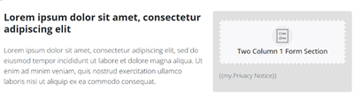
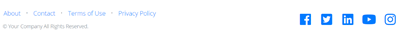

# クイックスタートランディングページテンプレート {#quick-start-landing-page-template}

Marketo Engageリファレンスライブラリの一部のスタータープログラムには、シンプルで使いやすく、カスタマイズ可能なランディングページテンプレートが含まれており、さまざまなマーケティングユースケースをまたいでランディングページをすばやく作成できます。

>[!TIP]
>
>[&#x200B; ガイド付きランディングページテンプレート &#x200B;](/help/marketo/product-docs/demand-generation/landing-pages/landing-page-templates/create-a-guided-landing-page-template.md){target="_blank"}の詳細

詳しい戦略支援またはプログラムのカスタマイズに関するヘルプについては、Adobe アカウントチームにお問い合わせいただくか、[Adobe Professional Services](https://business.adobe.com/jp/customers/consulting-services/main.html){target="_blank"} ページをご覧ください。

## セクションの概要 {#sections-summary}

### ロゴセクション {#logo-section}

* 別の画像のロゴを入れ替える画像要素を含む
* 編集する変数が含まれています。
   * ロゴサイズ
   * ロゴの配置
   * ロゴセクションの背景色
   * セクションの表示/非表示を切り替える
   * セクションの先頭パディング
   * セクションの下のパディング
* 

### 画像セクション {#image-section}

* 別の画像のロゴを入れ替える画像要素を含む
* 編集する変数が含まれています。
   * バナー画像リンク
   * バナーの幅 – 右下のスイッチの1つは、画像をコンテンツコンテナの幅またはブラウザ全体の幅にすることができます
   * セクションの表示/非表示を切り替える
* 

### 左に2-Col テキスト、右セクションにフォーム {#two-col-left-form-right}

* 見出しテキスト要素を更新して見出しコピーを更新する
* 段落コピーを更新する段落テキスト要素
* フォームに追加するフォーム要素
* プライバシーポリシーテキストとリンクを編集するためのフォームの下のテキスト要素
* 編集する変数：
セクションの背景色
   * フォームのすぐ後ろの背景色
   * フォームを囲むボックスの境界線の半径（曲線の角がある、または「0」に設定した場合は角が四角形になる）
   * セクション全体を表示または非表示にする
   * フォームだけを表示または非表示にします（フォームを非表示にすると、左側の列のテキストがページの幅を埋めます。 これは、フォームが存在しないサンキューページまたは確認ページに使用できます）。
   * プライバシーポリシーテキストの表示と非表示の切り替え
* 

### ビデオセクション {#video-section}

* 見出しのテキストを更新するテキスト要素
* 編集する変数：
   * セクションの背景色
   * ビデオ埋め込みコード
   * ビデオの見出しの表示/非表示
   * ビデオの表示/非表示
* 

### フッターセクション {#footer-section}

* 左列のコンテンツを編集するテキスト要素
* ソーシャルアイコンを更新するテキスト要素（アイコンは、画像の代わりにFontAwesome フォントを使用していますが、画像に置き換えることができます）。
* 編集する変数：
   * セクションの背景色
   * ソーシャルアイコンの色
   * セクションの表示/非表示
* 

### 追加変数 {#additional-variables}

* **ボタンの境界線の半径**：丸みを帯びた長方形になるようにフォームボタンを調整します
* **ボタンの色**：フォームのボタンの色を更新します
* **ボタンのホバーカラー**：フォーム上のボタンのホバーステートの色を変更します
* **リンクカラー**：ページ全体のリンクの色を更新します
* **Section Top Spacing**: ロゴセクション以外の各セクションの上にスペースを追加します
* **セクション下部間隔**: ロゴセクションを除く各セクションの下にスペースを追加します
