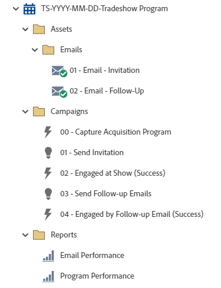

# TS-YYYY-MM-DD-展示会プログラム {#ts-yyyy-mm-dd-tradeshow-program}

これは、Marketo Engageイベントプログラムを利用した招待状とフォローアップメールを含む展示会プログラムの例です。

詳細な方法に関するサポートや、プログラムのカスタマイズに関するヘルプについては、Adobe アカウントチームに問い合わせるか、[Adobe Professional Services](https://business.adobe.com/jp/customers/consulting-services/main.html){target="_blank"} のページを参照してください。

## チャネルサマリ {#channel-summary}

<table style="table-layout:auto">
 <tbody>
  <tr>
   <th>チャネル</th>
   <th>メンバーシップのステータス</th>
   <th>アナリティクス動作</th>
   <th>プログラムのタイプ</th>
  </tr>
  <tr>
   <td>イベント</td>
   <td>01 – 招待
    02-Waitlisted
    03 – 登録
    04 – 来場ブース
    05 - Engaged at Show – 成功
    06-Engaged at Post Show – 成功</td>
   <td>包含</td>
   <td>イベント</td>
  </tr>
 </tbody>
</table>

## プログラムには、次のAssetsが含まれています {#program-contains-the-following-assets}

<table style="table-layout:auto">
 <tbody>
  <tr>
   <th>タイプ</th>
   <th>テンプレート名</th>
   <th>アセット名</th>
  </tr>
  <tr>
   <td>メール</td>
   <td><a href="/help/marketo/product-docs/core-marketo-concepts/programs/program-library/quick-start-email-template.md" target="_blank">クイックスタートメールテンプレート</a></td>
   <td>01-Email-Thank You</td>
  </tr>
   <tr>
   <td>メール</td>
   <td><a href="/help/marketo/product-docs/core-marketo-concepts/programs/program-library/quick-start-email-template.md" target="_blank">クイックスタートメールテンプレート</a></td>
   <td>02a- メール – 招待</td>
  </tr>
  <tr>
  <tr>
   <td>ローカル報告書</td>
   <td> </td>
   <td>メールの効果</td>
  </tr>
  <tr>
   <td>ローカル報告書</td>
   <td> </td>
   <td>プログラム効果</td>
  </tr>
  <tr>
   <td>スマートキャンペーン</td>
   <td> </td>
   <td>00 – 獲得プログラムのキャプチャ</td>
  </tr>
  <tr>
   <td>スマートキャンペーン</td>
   <td> </td>
   <td>01 – 招待の送信</td>
  </tr>
   <tr>
   <td>スマートキャンペーン</td>
   <td> </td>
   <td>02 - フォローアップメールの送信</td>
  </tr>
   <tr>
   <td>スマートキャンペーン</td>
   <td> </td>
   <td>03 - フォローアップメールによるエンゲージメント （成功）</td>
  </tr>
  <tr>
   <td>フォルダー</td>
   <td> </td>
   <td>Assets – すべてのクリエイティブアセットが格納されています
  （メールおよびランディングページ用のサブフォルダー）</td>
  </tr>
  <tr>
   <td>フォルダー</td>
   <td> </td>
   <td>キャンペーン – すべてのスマートキャンペーンを格納します。</td>
  </tr>
  <tr>
   <td>フォルダー</td>
   <td> </td>
   <td>レポート</td>
  </tr>
 </tbody>
</table>

## 含まれるマイトークン {#my-tokens-included}

<table style="table-layout:auto">
 <tbody>
  <tr>
   <th>トークンのタイプ</th>
   <th>トークン名</th>
   <th>値</th>
  </tr>
  <tr>
   <td>カレンダーファイル</td>
   <td><code>{{my.AddToCalendar}}</code></td>
   <td>ダブルクリックして詳細を表示</td>
  </tr>
  <tr>
   <td>テキスト</td>
   <td><code>{{my.Email-FromAddress}}</code></td>
   <td>PlaceholderFrom.email@mydomain.com</td>
  </tr>
  <tr>
   <td>テキスト</td>
   <td><code>{{my.Email-FromName}}</code></td>
   <td><code><--My From Name Here--></code></td>
  </tr>
  <tr>
   <td>テキスト</td>
   <td><code>{{my.Email-ReplyToAddress}}</code></td>
   <td>reply-to.email@mydomain.com</td>
  </tr>
  <tr>
   <td>テキスト</td>
   <td><code>{{my.Event-Date}}</code></td>
   <td><code><--My Event Date--></code></td>
  </tr>
   <tr>
   <td>リッチテキスト</td>
   <td><code>{{my.Event-Booth#}}</code></td>
   <td><code><--My Booth Number--></code></td>
  </tr>
   <tr>
   <td>テキスト</td>
   <td><code>{{my.Event-City}}</code></td>
   <td><code><--My Event City Here--></code></td>
  </tr>
  <tr>
   <td>テキスト</td>
   <td><code>{{my.Event-Date}}</code></td>
   <td><code><--My Event Date--></code></td>
  </tr>
  <tr>
   <td>テキスト</td>
   <td><code>{{my.Event-Time}}</code></td>
   <td><code><--My Event Time + TimeZone--></code></td>
  </tr>
  <tr>
   <td>テキスト</td>
   <td><code>{{my.Event-Title}}</code></td>
   <td><code><--My Event Title Here--></code></td>
  </tr>
  <tr>
   <td>テキスト</td>
   <td><code>{{my.Event-Type}}</code></td>
   <td>展示会</td>
  </tr>
 </tbody>
</table>

## 競合ルール {#conflict-rules}

* **プログラムタグ**
   * このサブスクリプションにタグを作成 – _推奨_
   * 無視

* **同じ名前のランディングページテンプレート**
   * 元のテンプレートのコピー
   * 宛先テンプレートの使用 – _推奨_

* **同じ名前の画像**
   * どちらのファイルも保持する
   * このサブスクリプションの項目を置き換える – _推奨_

* **同じ名前のメールテンプレート**
   * どちらのテンプレートも保持する
   * 既存のテンプレートを置換 – _推奨_

## ベストプラクティス {#best-practices}

* ウェビナープログラムを読み込んだ後、フォームをローカルアセットから Design Studio にあるグローバルアセットに移動します。
   * フォームの数を減らし、Design Studio からより多くのグローバルアセットを利用することで、プログラムの設計と管理ガバナンスの拡張性が向上します。 また、フィールド、オプトイン言語など、定期的なコンプライアンス更新を柔軟に行えます。

* 読み込んだプログラムでテンプレートを更新して現在のブランドのテンプレートを利用するか、スニペットまたは適切なロゴ/フッター情報を追加して、新しく読み込んだテンプレートを更新し、ブランドを反映させることを検討してください。

* 命名規則に合わせて、このプログラムの例の命名規則を更新することを検討してください。

>[!NOTE]
>
>必要に応じて、プログラムテンプレートとプログラムを使用するたびにマイトークン値を必ず更新してください。

>[!TIP]
>
>成功トラッキング用に「03 - フォローアップのメールでエンゲージメント （プログラム成功）」キャンペーンをアクティブ化することを忘れないでください。 メールを送信する前に _こ_ を行います。

>[!IMPORTANT]
>
>URL を参照するマイトークンにhttp://またはhttps://を含めることはできません。含めない場合、リンクがアセット内で適切に機能しません。
