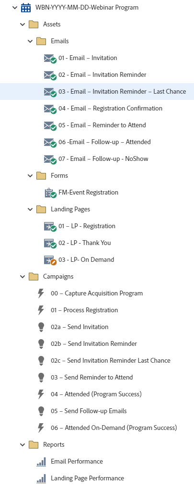

# WBN-YYYY-MM-DD-Webinar プログラム {#wbn-yyyy-mm-dd-webinar-program}

これは、Marketo Engageのイベントプログラムを活用した、登録管理、3通の招待状、出席のリマインダー、フォローアップメールなどのウェビナープログラムの例です。

詳しい戦略支援またはプログラムのカスタマイズについては、Adobe アカウントチームにお問い合わせいただくか、[Adobe Professional Services](https://business.adobe.com/customers/consulting-services/main.html){target="_blank"} ページをご覧ください。

## チャネルサマリ {#channel-summary}

<table style="table-layout:auto">
 <tbody>
  <tr>
   <th>チャネル</th>
   <th>メンバーシップステータス</th>
   <th>アナリティクス動作</th>
   <th>プログラムのタイプ</th>
  </tr>
  <tr>
   <td>イベント</td>
   <td>01 – 招待
    02 – キャンセル待ち
    03 – 登録済
    04 – 表示なし
    05 – 参加済み – 成功
    06 – 出席済みオンデマンド – 成功</td>
   <td>包含</td>
   <td>イベント
   
（統合：ウェビナー付きイベント）</td>
  </tr>
 </tbody>
</table>

## プログラムには、次のAssetsが含まれています {#program-contains-the-following-assets}

<table style="table-layout:auto">
 <tbody>
  <tr>
   <th>タイプ</th>
   <th>テンプレート名</th>
   <th>アセット名</th>
  </tr>
  <tr>
   <td>メール</td>
   <td><a href="/help/marketo/product-docs/core-marketo-concepts/programs/program-library/quick-start-email-template.md" target="_blank">クイックスタートメールテンプレート</a></td>
   <td>01 - メール – 招待</td>
  </tr>
   <tr>
   <td>メール</td>
   <td><a href="/help/marketo/product-docs/core-marketo-concepts/programs/program-library/quick-start-email-template.md" target="_blank">クイックスタートメールテンプレート</a></td>
   <td>02 - メール – 招待リマインダー</td>
  </tr>
   <tr>
   <td>メール</td>
   <td><a href="/help/marketo/product-docs/core-marketo-concepts/programs/program-library/quick-start-email-template.md" target="_blank">クイックスタートメールテンプレート</a></td>
   <td>03 – 電子メール – 招待リマインダー – ラストチャンス</td>
  </tr>
  <tr>
   <td>メール</td>
   <td><a href="/help/marketo/product-docs/core-marketo-concepts/programs/program-library/quick-start-email-template.md" target="_blank">クイックスタートメールテンプレート</a></td>
   <td>04 – 電子メール – 登録確認</td>
  </tr>
  <tr>
   <td>メール</td>
   <td><a href="/help/marketo/product-docs/core-marketo-concepts/programs/program-library/quick-start-email-template.md" target="_blank">クイックスタートメールテンプレート</a></td>
   <td>05 – 電子メール – 出席のリマインダー</td>
  </tr>
  <tr>
   <td>メール</td>
   <td><a href="/help/marketo/product-docs/core-marketo-concepts/programs/program-library/quick-start-email-template.md" target="_blank">クイックスタートメールテンプレート</a></td>
   <td>06 -Email - Follow-up - Attended</td>
  </tr>
  <tr>
   <td>メール</td>
   <td><a href="/help/marketo/product-docs/core-marketo-concepts/programs/program-library/quick-start-email-template.md" target="_blank">クイックスタートメールテンプレート</a></td>
   <td>07 – 電子メール – フォローアップ – いいえ表示 </td>
  </tr>
  <tr>
  <tr>
   <td>Form</td>
   <td> </td>
   <td>FM-Event登録</td>
  </tr>
  <tr>
   <td>ランディングページ</td>
   <td><a href="/help/marketo/product-docs/core-marketo-concepts/programs/program-library/quick-start-landing-page-template.md" target="_blank">クイックスタート LP テンプレート</a></td>
   <td>01 - LP – 登録</td>
  </tr>
  <tr>
   <td>ランディングページ</td>
   <td><a href="/help/marketo/product-docs/core-marketo-concepts/programs/program-library/quick-start-landing-page-template.md" target="_blank">クイックスタート LP テンプレート</a></td>
   <td>02 - LP - サンキュー</td>
  </tr>
  <tr>
   <td>ランディングページ</td>
   <td><a href="/help/marketo/product-docs/core-marketo-concepts/programs/program-library/quick-start-landing-page-template.md" target="_blank">クイックスタート LP テンプレート</a></td>
   <td>03 - LP - オンデマンド</td>
  </tr>
  <tr>
   <td>ローカルレポート</td>
   <td> </td>
   <td>メールの効果</td>
  </tr>
   <tr>
   <td>ローカルレポート</td>
   <td> </td>
   <td>ランディングページの効果</td>
  </tr>
  <tr>
   <td>スマートキャンペーン</td>
   <td> </td>
   <td>00 - キャプチャ取得プログラム</td>
  </tr>
  <tr>
   <td>スマートキャンペーン</td>
   <td> </td>
   <td>01 - プロセス登録</td>
  </tr>
   <tr>
   <td>スマートキャンペーン</td>
   <td> </td>
   <td>02a – 招待を送信</td>
  </tr>
   <tr>
   <td>スマートキャンペーン</td>
   <td> </td>
   <td>02b – 招待リマインダーを送信</td>
  </tr>
   <tr>
   <td>スマートキャンペーン</td>
   <td> </td>
   <td>02c – 招待リマインダーを最後のチャンスに送信</td>
  </tr>
  <tr>
   <td>スマートキャンペーン</td>
   <td> </td>
   <td>03 – 参加リマインダーを送信</td>
  </tr>
  <tr>
   <td>スマートキャンペーン</td>
   <td> </td>
   <td>04 - フォローアップメールの送信</td>
  </tr>
  <tr>
   <td>スマートキャンペーン</td>
   <td> </td>
   <td>05 - オンデマンド出席（プログラム成功）</td>
  </tr>
  <tr>
   <td>フォルダー</td>
   <td> </td>
   <td>Assets – すべてのクリエイティブアセットを格納
  （電子メール、ランディングページ、Formsのサブフォルダー）</td>
  </tr>
  <tr>
   <td>フォルダー</td>
   <td> </td>
   <td>Campaigns – すべてのスマートキャンペーンを格納</td>
  </tr>
  <tr>
   <td>フォルダー</td>
   <td> </td>
   <td>レポート</td>
  </tr>
 </tbody>
</table>

## マイトークンが含まれています {#my-tokens-included}

<table style="table-layout:auto">
 <tbody>
  <tr>
   <th>トークンのタイプ</th>
   <th>トークン名</th>
   <th>値</th>
  </tr>
  <tr>
   <td>カレンダーファイル</td>
   <td><code>{{my.AddToCalendar}}</code></td>
   <td>ダブルクリックして詳細を表示</td>
  </tr>
  <tr>
   <td>テキスト</td>
   <td><code>{{my.DownloadURL-PresentationSlides}}</code></td>
   <td>my.DownloadURL?without=http:// </td>
  </tr>
  <tr>
   <td>テキスト</td>
   <td><code>{{my.Email-FromAddress}}</code></td>
   <td>PlaceholderFrom.email@mydomain.com</td>
  </tr>
  <tr>
   <td>テキスト</td>
   <td><code>{{my.Email-FromName}}</code></td>
   <td><code><--My From Name Here--></code></td>
  </tr>
  <tr>
   <td>テキスト</td>
   <td><code>{{my.Email-ReplyToAddress}}</code></td>
   <td>reply-to.email@mydomain.com</td>
  </tr>
  <tr>
   <td>テキスト</td>
   <td><code>{{my.Event-Date}}</code></td>
   <td><code><--My Event Date--></code></td>
  </tr>
   <tr>
   <td>リッチテキスト</td>
   <td><code>{{my.Event-Description}}</code></td>
   <td>詳細はダブルクリック
 <code><--My Event Description Here--></code>
 このイベントの説明をプログラムレベルの「マイトークン」タブで編集します。
 次の項目について学習します。
<li>箇条書き1</li>
<li>箇条書き2</li>
<li>箇条書き3</li></td>
  </tr>
  <tr>
   <td>テキスト</td>
   <td><code>{{my.Event-Time}}</code></td>
   <td><code><--My Event Time + TimeZone--></code></td>
  </tr>
  <tr>
   <td>テキスト</td>
   <td><code>{{my.Event-Title}}</code></td>
   <td><code><--My Event Title Here--></code></td>
  </tr>
  <tr>
   <td>テキスト</td>
   <td><code>{{my.Event-Type}}</code></td>
   <td>ウェビナー</td>
  </tr>
  <tr>
   <td>テキスト</td>
   <td><code>{{my.PageURL-Download}}</code></td>
   <td>my.DownloadURL?without=http://</td>
  </tr>
  <tr>
   <td>テキスト</td>
   <td><code>{{my.PageURL-Registration}}</code></td>
   <td>my.RegistrationPageURL?without=http://</td>
  </tr>
   <tr>
   <td>テキスト</td>
   <td><code>{{my.PageURL-ThankYou}}</code></td>
   <td>my.ThankYouPageURL?without=http://</td>
  </tr>
  <tr>
   <td>テキスト</td>
   <td><code>{{my.Speaker1-Name}}</code></td>
   <td><code><--Speaker Name Here--></code></td>
  </tr>
  <tr>
   <td>テキスト</td>
   <td><code>{{my.Speaker1-Title}}</code></td>
   <td><code><--Speaker Title Here--></code></td>
  </tr>
  <tr>
   <td>テキスト</td>
   <td><code>{{my.Speaker2-Name}}</code></td>
   <td><code><--Speaker Name Here--></code></td>
  </tr>
  <tr>
   <td>テキスト</td>
   <td><code>{{my.Speaker2-Title}}</code></td>
   <td><code><--Speaker Title Here--></code></td>
  </tr>
  <tr>
   <td>テキスト</td>
   <td><code>{{my.Speaker3-Name}}</code></td>
   <td><code><--Speaker Name Here--></code></td>
  </tr>
 <tr>
   <td>テキスト</td>
   <td><code>{{my.Speaker3-Title}}</code></td>
   <td><code><--Speaker Title Here--></code></td>
  </tr>
 </tbody>
</table>

## 競合ルール {#conflict-rules}

* **プログラムタグ**
   * このサブスクリプションでタグを作成 – _おすすめ_
   * 無視

* **同じ名前のランディングページテンプレート**
   * 元のテンプレートのコピー
   * 宛先テンプレートを使用 – _おすすめ_

* **同じ名前の画像**
   * どちらのファイルも保持する
   * このサブスクリプションのアイテムを置き換える – _推奨_

* **同じ名前のメールテンプレート**
   * どちらのテンプレートも保持する
   * 既存のテンプレートを置き換える – _推奨_

## ベストプラクティス {#best-practices}

* 統合されたウェビナープロバイダーを使用している場合は、Marketo Engage プログラムをホスティングシステムのウェビナーに接続します。

* ウェビナープログラムを読み込んだら、フォームをローカルアセットからDesign Studioにあるグローバルアセットに移動します。
   * フォーム数を減らし、Design Studioからより多くのグローバルアセットを活用することで、プログラムの設計と管理ガバナンスにおいて、よりスケーラビリティを高めることができます。 また、フィールドやオプトイン言語など、定期的なコンプライアンス更新の柔軟性も提供します。

* インポートしたプログラムのテンプレートを更新して、現在ブランド化されているテンプレートを利用するか、新しくインポートしたテンプレートを更新して、スニペットや適切なロゴ/フッター情報を追加することで、ブランドを反映させることを検討してください。

* 命名規則に合わせて、このプログラムの例の命名規則を更新することを検討してください。

>[!NOTE]
>
>必要に応じて、プログラムテンプレートおよびプログラムを使用するたびに、マイトークン値を更新することを忘れないでください。

>[!TIP]
>
>メールが送信される前に、成功を追跡するために「05 – 出席（プログラムの成功）」キャンペーンをアクティブにします。

>[!IMPORTANT]
>
>URLを参照するマイトークンにhttp://またはhttps://を含めることはできません。そうしないと、アセット内でリンクが適切に機能しません。
