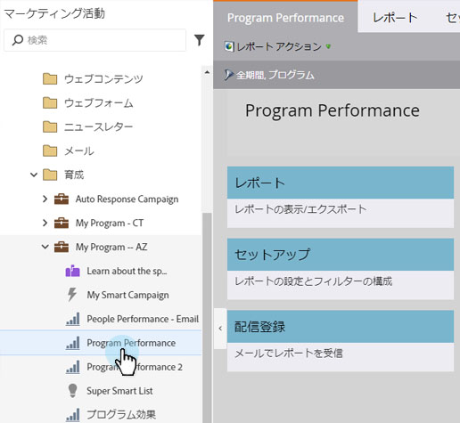
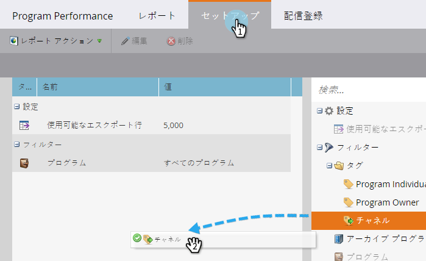
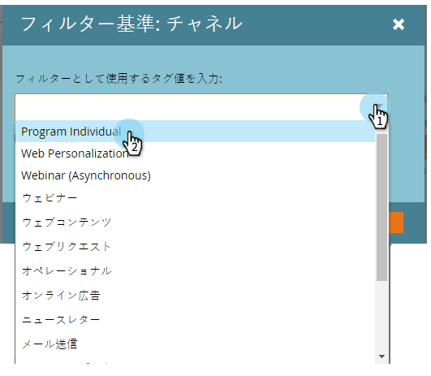
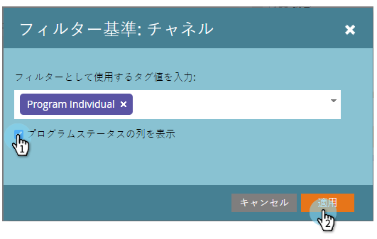
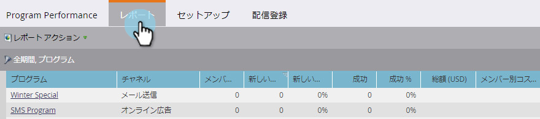

# プログラムレポートへのプログラムステータス列の追加 {#add-program-status-columns-to-a-program-report}

[プログラム効果レポート](/help/marketo/product-docs/core-marketo-concepts/programs/program-performance-report/create-a-program-performance-report.md)にプログラムステータスに関する統計を追加しましょう。

1. 「マーケティング活動」（または「分析」）に移動します。

   

1. レポートを選択します。

   

1. 「**セットアップ**」タブをクリックして、「チャネル」タグをドラッグします。

   

1. フィルターするチャネルを 1 つ選択します。

   

   >[!TIP]
   >
   >プログラムステータス列を表示するには、チャネル _1 つのみ_&#x200B;でレポートをフィルターする必要があります。

1. 「プログラムステータス列を表示」オプションにチェックを入れます。「**適用**」をクリックします。

   

1. これで完了です。「レポート」タブをクリックすると、レポートにプログラムステータス列が表示されています。

   

>[!NOTE]
>
>プログラムの各ステータスの列が表示されない場合は、レポートに[表示する列を選択したこと](/help/marketo/product-docs/reporting/basic-reporting/editing-reports/select-report-columns.md)を確認してください。

>[!MORELIKETHIS]
>
>[プログラムレポートをタグでフィルター](/help/marketo/product-docs/core-marketo-concepts/programs/program-performance-report/filter-a-program-report-by-tag.md)
