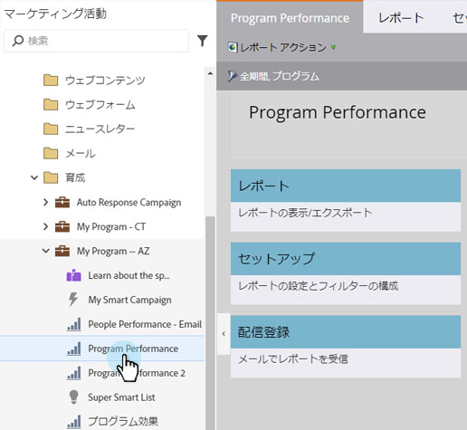
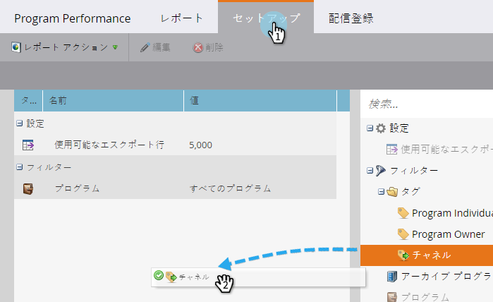
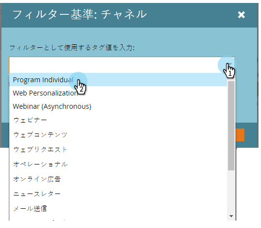
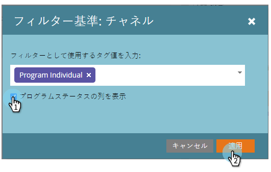
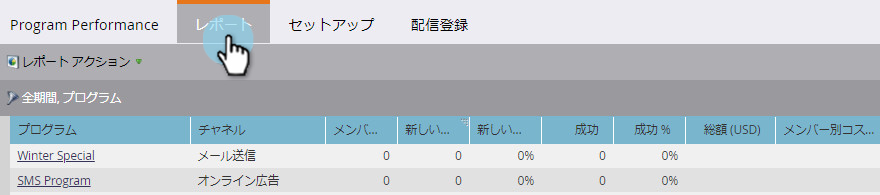

# プログラムレポートへのプログラムステータス列の追加 {#add-program-status-columns-to-a-program-report}

[プログラム効果レポート](/help/marketo/product-docs/core-marketo-concepts/programs/program-performance-report/create-a-program-performance-report.md){target="_blank"}にプログラムステータスに関する統計を追加しましょう。

1. 「**[!UICONTROL マーケティング活動]**」（または「**[!UICONTROL 分析]**」）に移動します。

   

1. レポートを選択します。

   

1. 「**[!UICONTROL 設定]**」タブをクリックし、**[!UICONTROL チャネル]** タグにドラッグします。

   

1. フィルターするチャネルを 1 つ選択します。

   

   >[!TIP]
   >
   >プログラムステータス列を表示するには、チャネル _1 つのみ_&#x200B;でレポートをフィルターする必要があります。

1. 「プログラムステータス列を表示」オプションにチェックを入れます。 「**[!UICONTROL 適用]**」をクリックします。

   

1. 「[!UICONTROL &#x200B; レポート &#x200B;]」タブをクリックして、プログラムのステータス列を含むレポートを表示します。

   

>[!NOTE]
>
>プログラムの各ステータスの列が表示されない場合は、レポートに[表示する列を選択したこと](/help/marketo/product-docs/reporting/basic-reporting/editing-reports/select-report-columns.md){target="_blank"}を確認してください。

>[!MORELIKETHIS]
>
>[プログラムレポートをタグでフィルター](/help/marketo/product-docs/core-marketo-concepts/programs/program-performance-report/filter-a-program-report-by-tag.md){target="_blank"}
