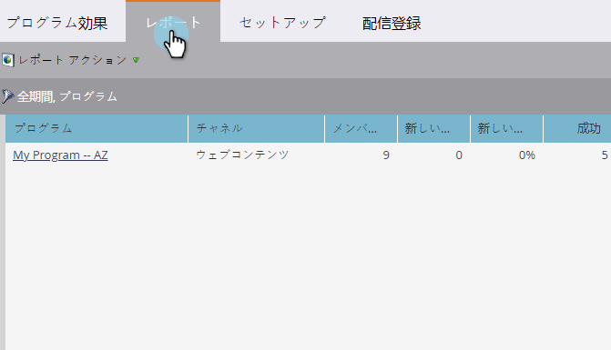

# プログラムパフォーマンスレポートの作成{#create-a-program-performance-report}

このレポートを含むプログラムに関する詳細な統計を表示します。

1. [プ](/help/marketo/product-docs/reporting/basic-reporting/creating-reports/create-a-report-in-a-program.md) ログラムでレポートを作成し、 **プログラム** [パフォーマンスレポートタイプを選択します](/help/marketo/product-docs/reporting/basic-reporting/report-types/report-type-overview.md)。
1. 「**レポート**」タブをクリックします。
1. そこだ！ レポートを表示して、プログラムの状況を確認します。

   

>[!TIP]
>
>*成功ごとのコスト*&#x200B;が最も低いプログラムを検索するには、例えば[その列でレポート](/help/marketo/product-docs/reporting/basic-reporting/editing-reports/sort-report-on-columns.md)を並べ替え、**並べ替え**&#x200B;を昇順選択します。

プログラムパフォーマンスレポートの列には、次の項目が含まれます。

<table> 
 <thead> 
  <tr> 
   <th>列</th> 
   <th>説明</th> 
  </tr> 
 </thead> 
 <tbody> 
  <tr> 
   <td>チャネル</td> 
   <td>プログラムのチャネルタイプ。</td> 
  </tr> 
  <tr> 
   <td>新しい名前</td> 
   <td>プログラムが獲得した新人。</td> 
  </tr> 
  <tr> 
   <td>成功</td> 
   <td>プログラムのステータスで定義された、成功を達成したメンバーの数。 </td> 
  </tr> 
  <tr> 
   <td>合計コスト</td> 
   <td>
プログラム内の全期間原価の合計。
</td> 
  </tr> 
 </tbody> 
</table>
