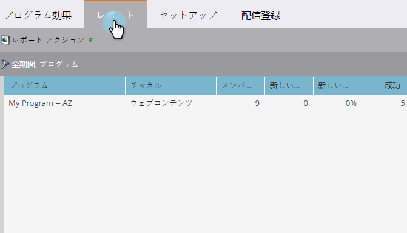

# プログラム効果レポートの作成 {#create-a-program-performance-report}

このレポートを使用して、プログラムの有益な統計を表示します。

1. [プログラムでレポートを作成](/help/marketo/product-docs/reporting/basic-reporting/creating-reports/create-a-report-in-a-program.md){target="_blank"}し、**[!UICONTROL プログラム効果]**&#x200B;[レポートタイプ](/help/marketo/product-docs/reporting/basic-reporting/report-types/report-type-overview.md){target="_blank"}を選択します。
1. 「**[!UICONTROL レポート]**」タブをクリックします。
1. キミはそこにいる！ レポートを参照して、プログラムの効果を確認します。

   

>[!TIP]
>
>例えば、*成功あたりの原価*&#x200B;が最も低いプログラムを見つけるには、その列で[レポートの並べ替え](/help/marketo/product-docs/reporting/basic-reporting/editing-reports/sort-report-on-columns.md){target="_blank"}を実行し、「**[!UICONTROL 昇順に並べ替え]**」を選択します。

プログラム効果レポートの列は次のとおりです。

<table>
 <thead>
  <tr>
   <th>列</th>
   <th>説明</th>
  </tr>
 </thead>
 <tbody>
  <tr>
   <td>チャネル</td>
   <td>プログラムのチャネルタイプ。</td>
  </tr>
  <tr>
   <td>新しい名前</td>
   <td>プログラムで新規獲得した人物。</td>
  </tr>
  <tr>
   <td>成功</td>
   <td>プログラムのステータスで定義された成功を達成したメンバーの数。 </td>
  </tr>
  <tr>
   <td>総コスト</td>
   <td>
プログラム内の全期間原価の合計。
</td>
  </tr>
 </tbody>
</table>
