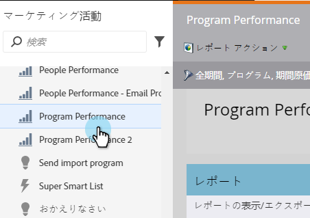
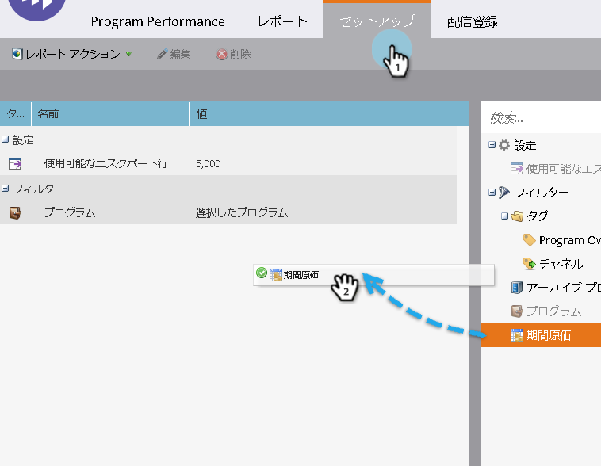
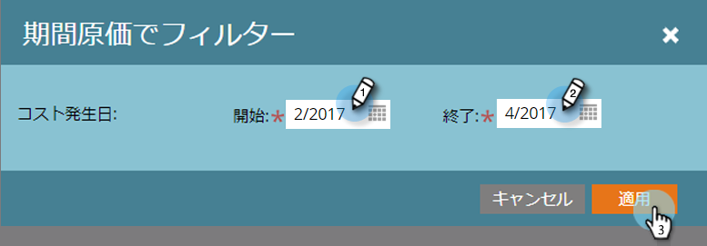
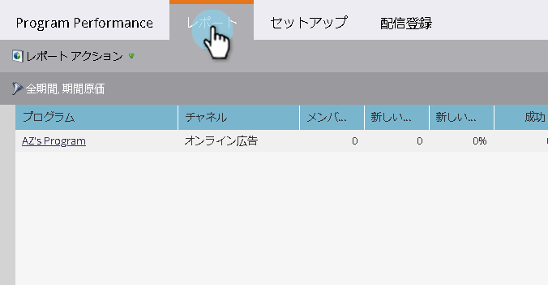

# 期間コストによるプログラムレポートのフィルタリング {#filter-a-program-report-by-period-cost}

特定の期間のコスト枠に対する [プログラムの実績レポート](create-a-program-performance-report.md) に焦点を当てます。

1. 「 **Marketing****アクティビティ** (または **Analytics**)」に移動します。

   

1. プログラムのパフォーマンスレポートを選択します。

   

1. 「 **設定** 」タブをクリックし、「 **期間原価**」をドラッグします。

   

1. 発生原価の **開始日** と **終了日を入力し、「** 適用 ****」をクリックします。

   

1. 終わった！ 「 **レポート** 」タブをクリックすると、指定した期間のコスト期間内のプログラムのみが表示されます。

   

   >[!NOTE]
   >
   >**関連記事**
   >
   >    
   >    
   >    * [プログラムによるプログラムレポートのフィルタリング](filter-a-program-report-by-program.md)

   >[!NOTE]
   >
   >**ディープダイブ**
   >
   >
   >レポートに関するすべての情報は、 [基本レポートで説明します](http://docs.marketo.com/display/docs/basic+reporting)。

