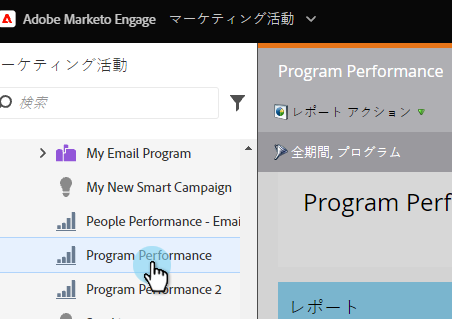
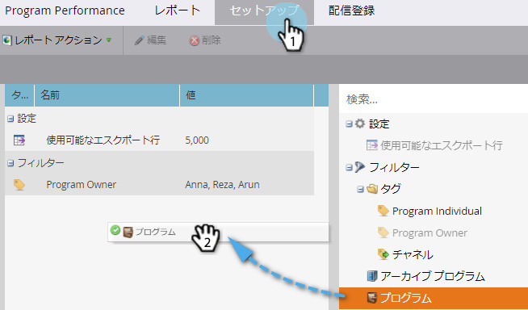
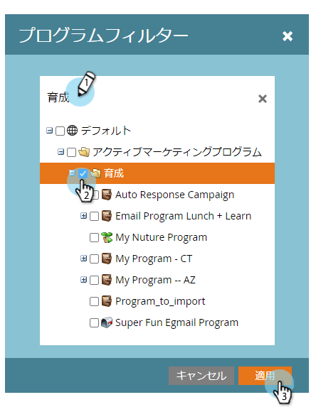
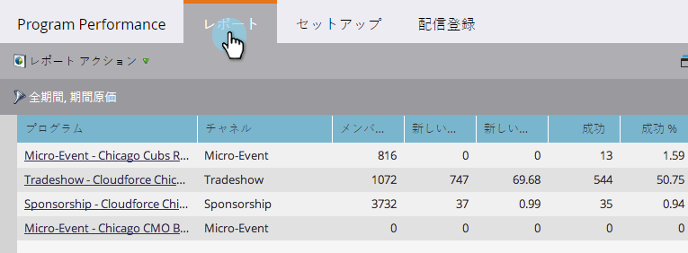

# プログラム{#filter-a-program-report-by-program}でプログラムレポートをフィルター

[プログラムのパフォーマンスレポート](create-a-program-performance-report.md)を特定のプログラムに絞って、そのパフォーマンスを比較します。

1. **マーケティング** **アクティビティ** （または&#x200B;**Analytics**）に移動します。

   

1. プログラムのパフォーマンスレポートを選択します。

   

1. 「**セットアップ**」タブをクリックし、**プログラム**&#x200B;の上にドラッグします。

   

1. レポートに含めるフォルダーと特定のプログラムを選択します。

   

   >[!TIP]
   >
   >フォルダーを選択した場合、レポートの実行時に、フォルダーに含まれるすべてのフォルダーがレポートに含まれます。

1. それだけだ！ 「**レポート**」タブをクリックすると、レポート内で選択したプログラムの&#x200B;*のみ*&#x200B;が表示されます。

   

   >[!NOTE]
   >
   >**関連記事**
   >
   >    
   >    
   >    * [タグによるプログラムレポートのフィルタリング](filter-a-program-report-by-tag.md)

   >[!NOTE]
   >
   >**ディープダイブ**
   >
   >
   >[基本レポート](http://docs.marketo.com/display/docs/basic+reporting)のレポートについてすべて説明します。

