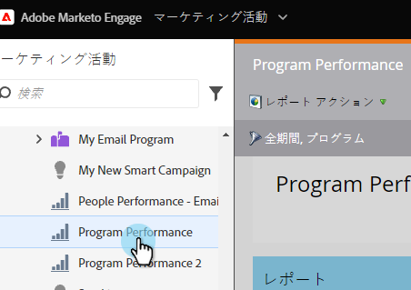
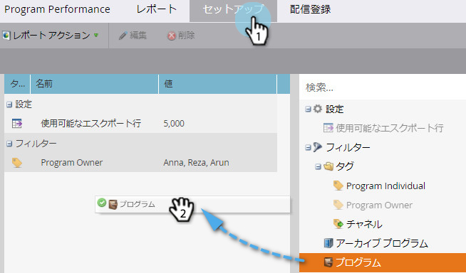
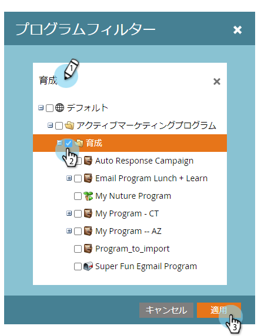
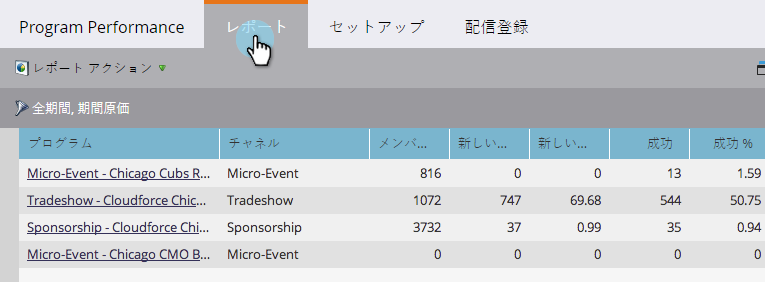

# プログラムレポートをプログラムでフィルター {#filter-a-program-report-by-program}

特定のプログラムの[プログラム効果レポート](/help/marketo/product-docs/core-marketo-concepts/programs/program-performance-report/create-a-program-performance-report.md){target="_blank"}をフォーカスして、パフォーマンスを比較します。

1. 「**[!UICONTROL マーケティング活動]**」（または「**[!UICONTROL 分析]**」）に移動します。

   

1. プログラム効果レポートを選択します。

   

1. 「**[!UICONTROL セットアップ]**」タブをクリックし、「**[!UICONTROL プログラム]**」の上にドラッグします。

   

1. レポートに含めるフォルダーと特定のプログラムを選択します。

   

   >[!TIP]
   >
   >フォルダーを選択すると、レポートの実行時にフォルダーに含まれるすべての項目がレポートに含まれます。

1. 以上です。 「**[!UICONTROL レポート]**」タブをクリックして、レポートで選択したプログラム&#x200B;_のみ_&#x200B;を表示します。

   

>[!NOTE]
>
>[プログラムレポートをタグでフィルター](/help/marketo/product-docs/core-marketo-concepts/programs/program-performance-report/filter-a-program-report-by-tag.md){target="_blank"}
