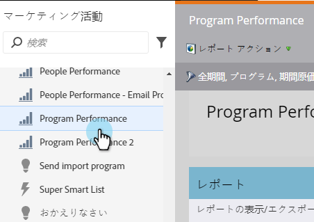
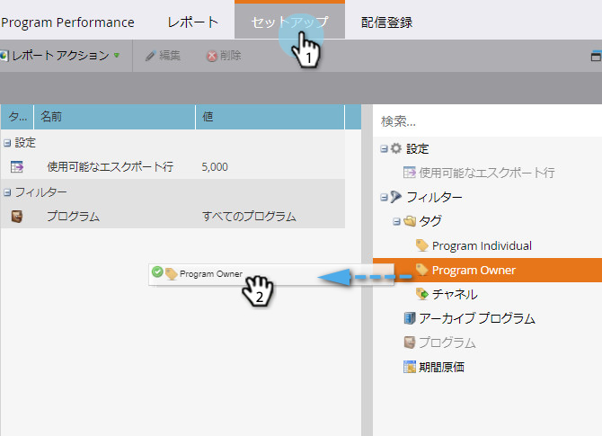
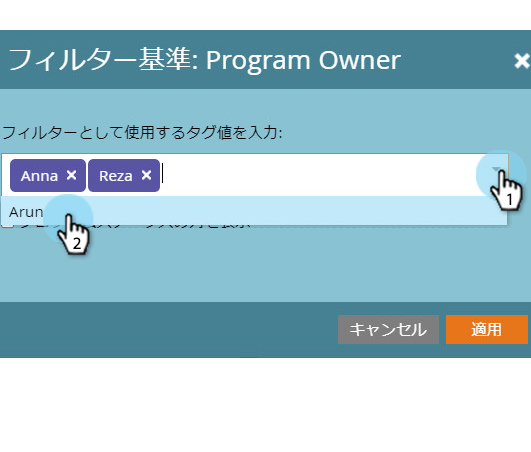
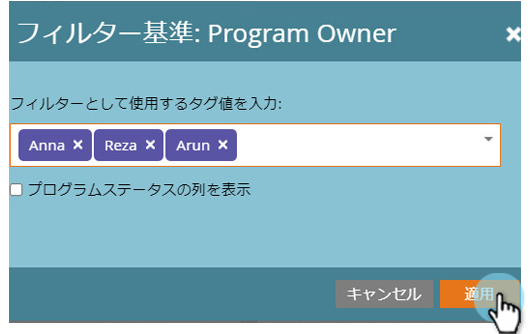
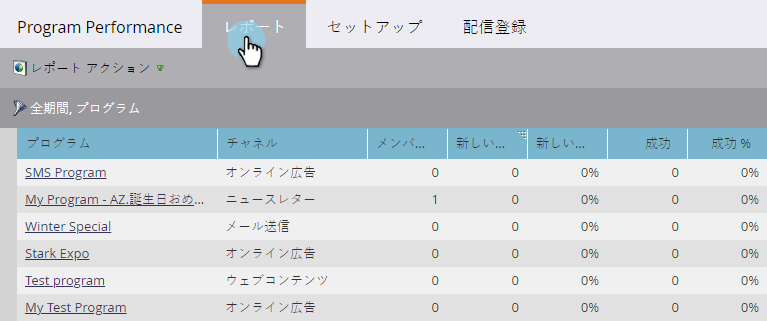

# タグ{#filter-a-program-report-by-tag}でプログラムレポートをフィルター

特定の[タグ](/help/marketo/product-docs/core-marketo-concepts/programs/working-with-programs/understanding-tags.md)に対する[プログラムのパフォーマンスレポート](/help/marketo/product-docs/core-marketo-concepts/programs/program-performance-report/create-a-program-performance-report.md)の焦点を絞ります。

1. **マーケティング** **アクティビティ** （または&#x200B;**Analytics**）に移動します。

   

1. **プログラムパフォーマンス**&#x200B;レポートを選択します。

   

1. 「**セットアップ**」タブをクリックし、**タグ**&#x200B;フィルターの1つにドラッグします。

   

1. レポートに含めるタグ値を選択します。

   

1. 「**適用**」をクリックします。

   

1. 完了！ 「**レポート**」タブをクリックすると、レポート内で選択したタグに一致するプログラムが&#x200B;__&#x200B;のみ表示されます。

   

   >[!NOTE]
   >
   >[期間コストによるプログラムレポートのフィルタリング](/help/marketo/product-docs/core-marketo-concepts/programs/program-performance-report/filter-a-program-report-by-period-cost.md)
