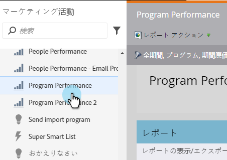
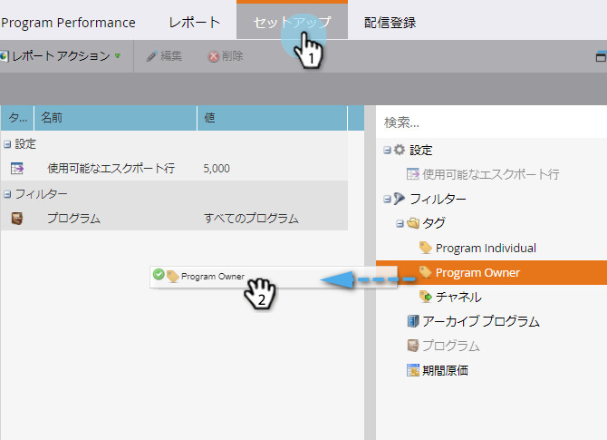
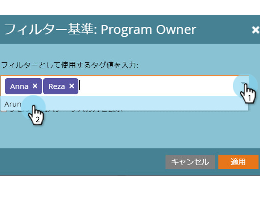
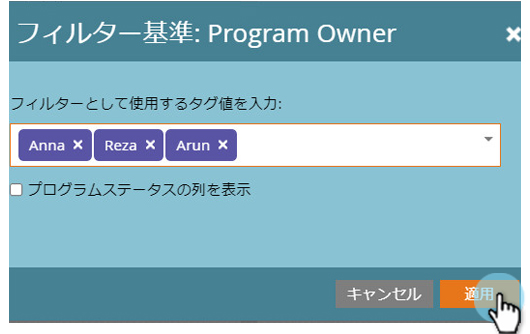
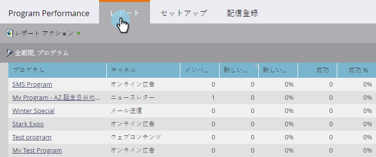

# プログラムレポートをタグでフィルター {#filter-a-program-report-by-tag}

[プログラム効果レポート](/help/marketo/product-docs/core-marketo-concepts/programs/program-performance-report/create-a-program-performance-report.md)を特定の[タグ](/help/marketo/product-docs/core-marketo-concepts/programs/working-with-programs/understanding-tags.md){target="_blank"}に絞り込みます。

1. 「**[!UICONTROL マーケティング活動]**」（または「**[!UICONTROL 分析]**」）に移動します。

   

1. **[!UICONTROL プログラム効果]**&#x200B;レポートを選択します。

   

1. 「**[!UICONTROL セットアップ]**」タブをクリックし、**[!UICONTROL タグ]**&#x200B;フィルターの 1 つをドラッグします。

   

1. レポートに含めるタグ値を選択します。

   

1. 「**[!UICONTROL 適用]**」をクリックします。

   

1. 完了です。 「**[!UICONTROL レポート]**」タブをクリックすると、レポートで選択したタグに一致する&#x200B;_プログラムのみ_&#x200B;表示されます。

   

>[!NOTE]
>
>[プログラムレポートを期間原価でフィルター](/help/marketo/product-docs/core-marketo-concepts/programs/program-performance-report/filter-a-program-report-by-period-cost.md){target="_blank"}
